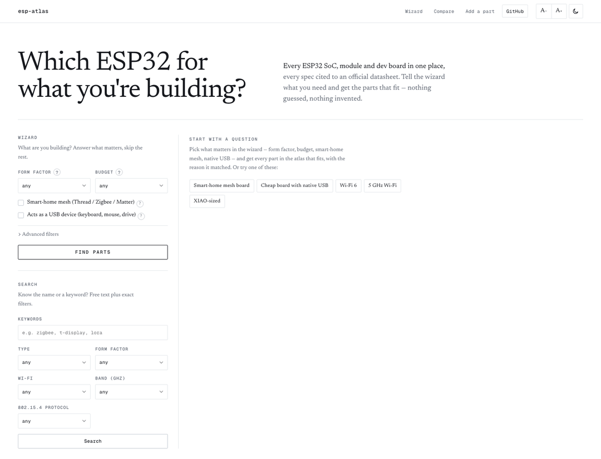
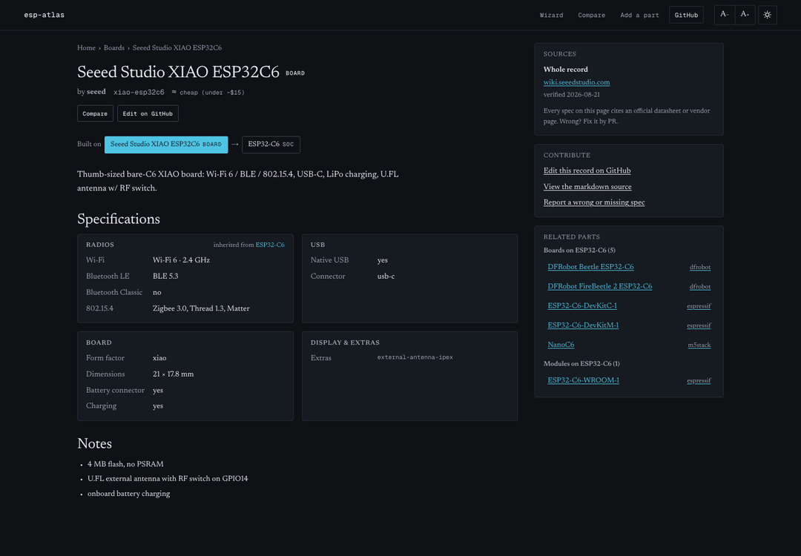
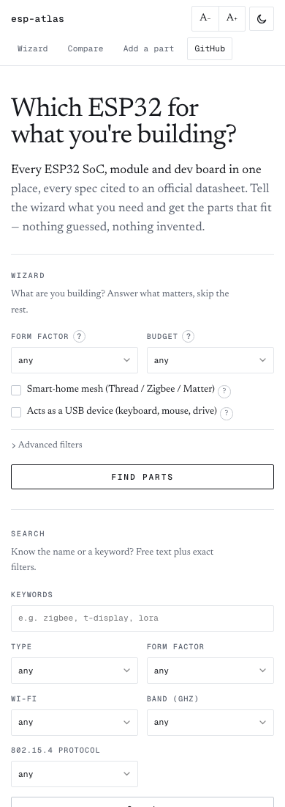

# esp-atlas.com — Technical SEO, Growth & Analytics Audit

**Date:** 2026-08-22 · **Property:** https://esp-atlas.com (production `main` @ `db10804`, restyle live) · **Scope:** the whole public site and its codebase (rendering, routing, metadata, structured data, content architecture, internal linking, performance, analytics, acquisition) · **Author:** builder session (Claude), reviewed by the author session per `docs/handovers/2026-08-22-seo-audit-and-restyle/`.

**How to read this document.** Sections follow the audit specification in the handover appendix, in order (1–13), with one sub-heading per requested point. Every finding and recommendation carries a priority tag — **[Critical]**, **[High]**, **[Medium]**, **[Low]** — and, where code changes apply, the file path and the pull request it belongs to (PR-F1 … PR-F7 are the approved "ship now" series; see §13). Each section ends with **Data limitations**: what was not measurable today and the cheapest way to get it. No paid SEO tooling was used; there are no search volumes, rank positions or authority scores anywhere in this document — every number is either measured on the live site/codebase on 2026-08-22 or labelled with the research brief's confidence (V = verified, S = sampled, I = inferred).

**Evidence base (all collected 2026-08-22, after the restyle deploy):** a full crawl of the 96 sitemap URLs plus the internal-link graph (SSR HTML); PageSpeed Insights (Lighthouse 13.4.1) mobile + desktop on `/`, a board page, a SoC page and a `/compare` URL; two load bursts (32 concurrent pages, plain and Googlebot user agents) after an idle period; GA4 Admin + Data API and Search Console API reads through the project service account; SERP sampling of 16 target queries, a benchmark of 17 competitor pages, brand-mention/backlink sweeps (HN, Lobsters, Bing, GitHub, Wayback, Common Crawl) and ~140 Google-autocomplete stems; the repository at `main` (`db10804`) including `COVERAGE.md`, schemas and every record. Screenshots: `assets/2026-08-22/`.

**Decisions that bound the recommendations (do not re-litigate here):** data logic lives in `esp_atlas_core` and the API — the Next.js app only fetches and renders; `price_tier` is editorial and is never marked up as a spec or an offer; the site is not a shop and carries no affiliate links; changes to `data/` records require datasheet citations. Launch/visibility, domain aliases, monetisation, paid tools, newsletters/social accounts, which growth experiments get built and any data additions **are Felipe's call** — they are proposed, ranked and costed here, never assumed.

## Contents

1. [Executive Summary](#1-executive-summary)
2. [Technical SEO & Rendering Architecture](#2-technical-seo-rendering-architecture)
3. [On-Page SEO Evaluation](#3-on-page-seo-evaluation)
4. [Content Strategy & Programmatic Growth](#4-content-strategy-programmatic-growth)
5. [Off-Page SEO, Authority & Growth Loops](#5-off-page-seo-authority-growth-loops)
6. [Analytics & Tracking Infrastructure](#6-analytics-tracking-infrastructure)
7. [User Experience & Engagement Metrics](#7-user-experience-engagement-metrics)
8. [Local SEO & International Considerations](#8-local-seo-international-considerations)
9. [Competitive Analysis](#9-competitive-analysis)
10. [Risks & Penalty Exposure](#10-risks-penalty-exposure)
11. [Performance Tracking & KPIs](#11-performance-tracking-kpis)
12. [Growth Experiments](#12-growth-experiments)
13. [Action Plan & Roadmap](#13-action-plan-roadmap)

---

## 1. Executive Summary

This summary condenses sections 2–13. Every number is from the 2026-08-22 evidence set (crawl, linkgraph, PageSpeed Insights, burst tests, GA4/GSC API reads, the repository at `main` = `db10804`) or carries the research brief's confidence label (V = verified, S = sampled, I = inferred). No paid SEO tool was used: there are no search volumes, rank positions or authority scores anywhere in this document, and none are invented here. The site has been on production for less than a day (domain created 2026-08-22T01:05Z [research brief C.1, V]; public launch is a future milestone, SPEC v3 — FACTS), so the visibility numbers are a t = 0 baseline, not a verdict. Decisions on launch/visibility, domain aliases, monetisation, paid tools, newsletters/social, which experiments get built, and every change to `data/` records are **FELIPE'S CALL**; the audit ranks and sizes them.

### Purpose of the product and the search intent it should capture

esp-atlas.com is a datasheet-cited knowledge base of the ESP32 family: **94 records — 11 SoCs, 6 modules, 77 boards across 11 brands** — stored as markdown + YAML in `data/` (CC-BY-SA; code MIT), indexed by `esp_atlas_core` (SQLite FTS5) and served by a FastAPI API that a thin Next.js client renders (FACTS; INTERFACE-SPEC.md line 8: web/CLI/bots are "thin front-ends"). Every spec cites an official source with a "verified YYYY-MM-DD" date — 104 source entries, 0 uncited records [research brief E.6, V]. The product is explicitly **not a shop, not affiliate bait, not tutorials, not a forum** (SPEC.md anti-goals), and `price_tier` is an editorial bucket that must never be marked up as a spec or an offer (FACTS). Three public surfaces exist: `/` (wizard + keyword search, results client-only), `/parts/<id>` ×94 (SSR), `/compare?ids=` (client-only) (FACTS routes).

Search intent the product is shaped to capture, mapped to the nine clusters the research identified [research brief D.1, V unless marked]:

| Intent (cluster) | Example queries [D.2, V] | Surface today | Fit |
|---|---|---|---|
| Per-part specs by name (3) — informational/navigational | "xiao esp32c6 specs", "lilygo t-display specs", "esp32-s3 devkitc-1 pinout" | `/parts/<board>` ×77 | **matches** — the only indexable template; "pinout" modifier unserved (§3, §4) |
| Per-SoC capability questions (4) — question/PAA | "does esp32 c3 have bluetooth", "is esp32 c6 dual core", "esp32 5ghz" | `/parts/<soc>` ×11 | partial — facts are `<dl>` rows, no explicit negatives, no PSRAM row on C6 (§4) |
| Selector / which-to-buy (1) — commercial-investigation, tool | "which esp32 should I buy", "best esp32 for home assistant", "esp32 board selector" | `/` wizard (client-only, not URL-addressable) | partial — the tool exists but nothing about it is crawlable or linkable (§4, §7) |
| X-vs-Y SoC comparison (2) — informational | "esp32-c3 vs esp32-c6", "esp32-c6 vs esp32-h2" | `/compare?ids=` (SSR body "Loading parts…") | **unserved** — every sampled "vs" SERP is won by a static table page [A.3, V] (§4, §9) |
| Family comparison chart / variants (5) | "esp32 comparison chart", "esp32 variants" | none | **unserved** — largest cluster fillable from existing data (§4) |
| Feature-driven board search (6) | "esp32 with lora / display / zigbee / native usb" | `/` filters only (no URL state) | **unserved** — data exists (display 24, battery 45, lora 7 boards [V]) but not filterable for display/extras/power (§4) |
| Form-factor hubs (7) | "esp32 feather", "xiao esp32", "esp32 super mini" | `/` form facet | **unserved** — 32 `form_factor` strings, 19 singletons (§4, §9) |
| Brand hubs (8) | "lilygo esp32", "adafruit esp32 boards" | none; `/search` has no `brand` filter (FACTS) | **unserved** → PR-F5 (approved) |
| Data / API / dataset (9) — developer | "esp32 board list", "esphome board list" | `/api/docs` (robots-blocked), GitHub | low via Google; reach via GitHub topics, `/llms.txt`, Dataset markup (§5) |

- [High] **Intent alignment is right for cluster 3 and wrong for everything else** (§4). Impact: the sitemap exposes only `/`, `/compare` and `/parts/<id>` — none of the list, pair or hub URL shapes the sampled SERPs reward [research brief A.3, I] — so even well-indexed part pages leave clusters 2, 5, 6, 7 and 8 unserved. Fix order by effort: PR-F4 (SoC hub heading) → PR-F5 (brand hubs) → roadmap `/socs` matrix, feature hubs, curated pairs (§13).
- [Medium] **Intent the site should not chase.** Retail intent is heavy even on spec-looking queries — Amazon on 5/16, AliExpress 3/16, Walmart 2/16, retailers on 9/16 sampled queries [research brief A.2, V] — and "best/which" queries are owned by freshly dated affiliate listicles [A.3, V]. Impact: with no shop and no affiliates, esp-atlas targets the informational/tool slot (tables, explicit yes/no capability statements, selector), not the listicle slot; "best …" pages without hands-on testing are exactly what Google's reviews-system guidance discourages (§9, §10).
- [Medium] **Two weak-incumbent intents match the positioning exactly**: "esp32 board selector" (Espressif's selector is a 3-word SPA; the rest are forums and generic lists) and "esp32 datasheet specs database" (PDF mirrors + alldatasheet) [research brief A.3, S]. Impact: the cheapest head-term openings, but the differentiator ("datasheet-cited", open CC-BY-SA data) appears in no title or description except the home page [D, V] (§3, §5) and the wizard's state is not linkable (§4).
- [Low] **Developer/agent intent is the most defensible link source** even though it is low-demand via Google (cluster 9). Impact: a CC-BY-SA dataset with per-field citations is unique in the benchmarked set [research brief B.3, I]; it becomes discoverable through `Dataset` JSON-LD (PR-F2), a served `/llms.txt` (PR-F3) and GitHub topics/licence metadata (Felipe) (§5).

### Current SEO health score and visibility metrics

**Scorecard method.** Seven dimensions, each scored 0–100 by the auditor against the evidence named in the row (these are rubric judgements, not a tool's metric), weighted by how much each dimension currently decides whether Google finds, understands and trusts the 94 pages. Weights sum to 100.

| # | Dimension | Weight | Score | What earns points (evidence) | What loses points (evidence) |
|---|---|---|---|---|---|
| 1 | Lighthouse SEO (lab) | 5 % | **100** | 100/100 on all four PSI URLs, mobile and desktop (psi-summary.txt, Lighthouse 13.4.1, 2026-08-22) | Weighted low on purpose: LH13's output here lacked the `viewport`/`font-size`/`tap-targets` audits and says nothing about index state, structured data or the link graph (§2) |
| 2 | Technical hygiene (transport, redirects, robots, sitemap, canonicals, rendering, lab CWV) | 20 % | **65** | 96/96 sitemap URLs 200 (crawl); HTTPS, HSTS 2 y, http→https 308, trailing-slash 308 (FACTS); real 404 + noindex; valid robots.txt; parts self-canonical; Googlebot-UA bursts 64/64 with blocking `<head>` metadata (burst-test*.json); CLS 0 on `/` and part pages; desktop perf 99–100 (PSI) | www→apex **307** (FACTS); no canonical on `/` and `/compare` (crawl); ≥94 indexable `/compare?ids=` duplicate shells (crawl); sitemap has no `lastmod` and fails open to 2 URLs on an upstream error (`app/sitemap.ts`); 3 s `TIMEOUT_MS` with a 3.13 s worst post-idle sample and a slug-title/no-canonical error path (FACTS; §10); `/api/` disallow makes every client fallback invisible to Google's renderer (§2); non-bot streaming left 47/94 heads empty in the crawl; mobile lab LCP 4.8 s; compare CLS 0.591 and clipped at 390 px (PSI; FACTS) |
| 3 | On-page | 15 % | **55** | Unique titles 96/96, 1 H1 96/96, descriptions on all parts (crawl); entity-rich anchors, 30+ sibling links per part (§3); per-field citations with dates (104 entries [V]); editorial tier labelled as such | Part pages carry the **home page's Twitter card** (47/47 measured, mechanism universal — FACTS); og:image 0/96, `/opengraph-image` 404; no og:url/og:site_name on parts; 22/94 titles > 60 chars with the folder slug as brand (§3, repo-derived); descriptions "No Wi-Fi." (9 chars) and "The original." (13 chars) on two SoC pages (§3, crawl.json derived); four footer `<h2>`s per page; unlinked middle crumb; 0 ``; record prose median 18 words, 93/94 < 50 [E.4, V]; E-E-A-T "who/how" lives on GitHub, not on the site |
| 4 | Structured data | 10 % | **0** | — | 0/96 pages with JSON-LD or microdata (crawl); vendors ship Product/Offer, blogs Article + BreadcrumbList, espboards FAQPage [B.1, V] (§2, §9) |
| 5 | Discoverability / index state | 25 % | **20** | Sitemap lists all 96 URLs; `/` is "Submitted and indexed" (GSC, last crawl 2026-08-22T15:08Z); SoC pages are already de-facto hubs (uncapped, SSR `related` lists — FACTS) | **48/96 URLs unreachable by links from `/`, 5 orphans, home links only 4 sitemap members** (linkgraph.json); **sitemap never submitted**; 4/4 sampled deep URLs "URL is unknown to Google" (GSC API); Bing not indexed, WMT not set up [V]; 0 hub routes vs espboards' 118 [V]; share of voice 0/16 [V] |
| 6 | Off-page | 10 % | **5** | Outbound citation hygiene (official sources only, no affiliates) (§5) | 0 third-party backlinks or mentions with free tooling; HN/Lobsters 0; no Wayback or Common Crawl capture; GitHub 0 stars / 0 forks, topics `[]`, licence read as NOASSERTION [research brief C.1, V]; brand query "esp atlas" resolves to Atlas Scientific/Atlassian [A.3, V]. Expected at t = 0, but real |
| 7 | Analytics readiness | 15 % | **70** | GA4 live via `@next/third-parties`, typed 22-event taxonomy in code; **33 event-scoped dimensions + 7 metrics registered — zero unregistered parameters except `url` (by design)**; key events `result_click`, `outbound_click`; wizard/search funnels buildable today; GSC DNS-verified; no GTM needed (ga4-admin-snapshot.json; §6) | GSC Search Analytics 0 rows and no sitemap submitted; GSC↔GA4 link not done; Bing WMT absent; owner traffic unfiltered and previews can write to the production property (§6); no field CWV/INP; `rel="noreferrer"` blocks GitHub-side attribution; data retention not measured |

**Overall: (100×0.05) + (65×0.20) + (55×0.15) + (0×0.10) + (20×0.25) + (5×0.10) + (70×0.15) = 42.25 → 42 / 100.** Read it as: the transport and template hygiene is better than most benchmarked competitors (§9: titles, canonicals, 404s, descriptions), but Google currently knows one page, can reach only half the site by links, sees no structured data and no authority, and the share-loop previews are broken.

*Rubric arithmetic if the ship-now list in §13 lands as specified (not a forecast of Google's response — index-state points stay unearned until GSC shows them): technical hygiene ≈ 85, on-page ≈ 75, structured data ≈ 85 (no rich result beyond breadcrumb is expected by design), discoverability ≈ 45 (link graph and hubs fixed; index state unknown), off-page ≈ 10, analytics ≈ 90 → (100×0.05) + (85×0.20) + (75×0.15) + (85×0.10) + (45×0.25) + (10×0.10) + (90×0.15) = 67.5 ≈ 68 / 100. The remaining gap is data (prose, fields, coverage) and authority — both Felipe's calls.*

Visibility metrics, t = 0 (2026-08-22):

| Metric | Value | Source |
|---|---|---|
| Share of voice across 16 target queries | **0 / 16** | [research brief A.1, V] |
| Google index | `/` indexed (last crawl 2026-08-22T15:08Z); `/parts/xiao-esp32c6`, `/parts/esp32-c6`, `/compare`, `/parts/m5stack-cores3` "URL is unknown to Google"; sitemaps submitted: none | GSC API, ga4-gsc-summary.txt |
| Bing index / Webmaster Tools | not indexed / not set up | [research brief A.4, C.2, V] |
| GSC clicks / impressions / queries | 0 rows | ga4-gsc-baseline.json |
| Backlinks / third-party mentions (free tools) | 0 / 0 (Reddit, X, Bluesky, esp32.com not checkable) | [research brief C.1, V] |
| GitHub repo | 0 stars / 0 forks / 0 watchers; topics `[]`; licence NOASSERTION; 6th of 34 for "esp-atlas" search | [research brief C.1, V] |
| GA4 since 2026-08-20 | 3 users, 3 sessions, 10 page views — all the owner's tests; `wizard_submit` 2 → `wizard_results` 2 → `result_click` 1; `outbound_click` 2 | ga4-gsc-baseline.json; FACTS |
| Domain age at audit | ~19 h (WHOIS 2026-08-22T01:05Z) | [research brief C.1, V] |
| Historical trends | N/A — single data point | §11 |

### Target audiences, primary keyword clusters, and competitive positioning overview

**Audiences** — inferred from the query clusters and the wizard's own facets (form, budget, 802.15.4, USB, Wi-Fi standard, band, type); no audience behaviour has been measured (GA4 = 3 owner sessions) [research brief D, V for the query stems; audience grouping is I]:

| Audience | What they search | Clusters | Where they land today | Conversion (GA4 key event) |
|---|---|---|---|---|
| A. Makers choosing a board for a project (home-assistant, WLED, ESPHome, low-power, beginners) | "which esp32 …", "esp32 with lora/display/zigbee", "esp32 feather/xiao/super mini" | 1, 6, 7 | `/` wizard (client-only) | `result_click` origin=wizard |
| B. Engineers verifying a named part or comparing chips | "xiao esp32c6 specs", "does esp32 c3 have bluetooth", "esp32-c6 vs h2", "esp32 comparison chart" | 2, 3, 4, 5 | `/parts/<id>` (only cluster 3 has a matching page) | `outbound_click` link_type=source (claim verified) |
| C. Developers, dataset reusers, AI agents | "esp32 board list", API/CLI/llms.txt, CC-BY-SA reuse | 9 | `/api/docs` (robots-blocked), GitHub | `outbound_click` link_type=data_folder/llms_txt/api_docs |
| D. Contributors (the UGC loop) | — (arrive from A/B) | — | "Edit on GitHub", Contribute card | `outbound_click` link_type=github_edit/new_issue (§5, §6) |

**Primary keyword clusters** and their demand labels (relative judgements from ~140 autocomplete stems and ~25 SERP samples — no volumes) [research brief D.1, V]: cluster 1 selector HIGH · 2 X-vs-Y HIGH · 3 per-board specs/pinout HIGH head + long tail · 4 SoC capability Q&A MED-HIGH · 5 family matrix HIGH · 6 feature search HIGH (lora/display/camera/battery) / MED (zigbee/eth) · 7 form-factor HIGH (feather/xiao/super-mini/devkit) · 8 brand MED-HIGH · 9 data/API LOW. The only citable interest proxies: en.wikipedia "ESP32" user pageviews 34,491 → 25,270 per month, Jan → Jul 2026; GitHub repositories matching SoC names s3 12,339 · c3 4,416 · c6 1,788 · p4 917 · s2 875 · c5 257 · h2 194 · c2 72 · c61 10 · h4 9 [research brief D.3, V]. Prioritisation implication (I from V proxies): S3 and C3 content first, C6 next; H2/C5/C61/H4 are long tail (§9).

**Competitive positioning** (one-day, US-only SERP sample; share of voice = presence, not rank [research brief F.3]):

| Competitor | Presence (queries of 16 / URLs) | What they are | What decides the match-up |
|---|---|---|---|
| **espboards.dev** | **9 / 14** | Independent catalogue: "282 boards · 74 manufacturers" (their claim); 305 board pages + 118 hubs in an 819-URL sitemap; per-board pinout + 42-row spec tables, ~1,888 words/page; affiliate/Etsy promos; no JSON-LD on board pages; relative canonical [research brief A.2, B.1, V] | The direct structural competitor: 8.5× the indexable URLs, hubs by chip/manufacturer/type, blog "X vs Y" posts — exactly the URL shapes the SERPs reward |
| espressif.com (+docs/products) | 5 / 6 | Official SoC pages and datasheets; product selector is an uncrawlable SPA (3 words of HTML) [V] | Authority and the datasheet PDFs; weak on per-devkit pages (one page/title for all devkits) |
| Retail (Amazon, AliExpress, Walmart, eBay, thepihut, botland, mouser) | on 9 / 16 | Listings and "wiki" comparison articles | Commercial intent esp-atlas will not compete for |
| Vendor wikis (Seeed, LilyGO, M5Stack docs, Adafruit) | 3 / 3 (Seeed) + product-spec queries | First-party docs with Product/Offer markup and photos [B.1, V] | Own their own product names; esp-atlas wins cross-brand and neutrality |
| Affiliate/media guides (makeradvisor, acfc, howtogeek, DroneBot, esp32.co.uk) | 2 / – each | Dated "best of 2026" listicles, 2.7–11.7k words [B.1, V] | Own "best/which"; not a slot for a non-shop |

What esp-atlas does better than every benchmarked page [research brief B.3, I from V metrics]: per-field provenance with verified dates (no competitor exposes citations); one SoC → module → board graph with inheritance and 30+ sibling links per page; clean brand-and-type-qualified titles, self-canonicals, real 404s; open CC-BY-SA data + public API + CLI; no affiliate clutter. What it does worse, by likely impact [B.4, I]: zero JSON-LD; thin pages (544 vs 1,888 words; no pinout, flash/PSRAM, GPIO counts, tables or images); no hub pages (0 vs 118); compare is client-side `?ids=` state with no static "A vs B" page; discovery and serving hygiene (home links 4 of 96, no og:image, www 307, no lastmod, `/llms.txt` 404, TTFB 0.35–0.47 s vs espboards 0.22 s [A.4, V]).

- [High] **Positioning, stated plainly** (§9): "not a shop / no affiliates" forfeits Product+Offer rich results, shopping-grid presence and the listicle economics that fund competitors' fresh "best of" pages; in exchange esp-atlas is the only neutral, citable source in the set — the right shape for informational/tool intents (clusters 2, 4, 5, and the two weak-incumbent queries) and for citation by AI answers and dataset catalogues. Impact: the strategy should double down on what cannot be copied cheaply (provenance, inheritance graph, open data) and surface it in metadata, hubs and matrix/pair pages — not chase retail or review intents.
- [High] **Brand-name collision** (§5, §10): "esp atlas" / "esp-atlas.com esp32" resolve to Atlas Scientific, Atlas OS and Atlassian; "espboards" already autocompletes to "espboards dev" [research brief A.3, V]. Impact: navigational demand for the brand leaks to other entities until consistent naming (`og:site_name`, PR-F1), an `Organization` entity with `sameAs` (PR-F2) and mentions co-occurring with "ESP32" exist — the latter are visibility actions, FELIPE'S CALL.

### Key opportunities and critical issues identified

Top 8, ranked by how much of the outcome they gate; each traces to the section that holds the evidence and the fix.

| # | Tag | Finding | Evidence | Impact | Fix → owner |
|---|---|---|---|---|---|
| 1 | **[Critical]** | **Half the site has no link path from `/` and the sitemap was never submitted.** 48/96 URLs unreachable by links, 5 orphan SoC pages (`esp32-c2/-c5/-c61/-h4/-p4`), home links 4 sitemap members; 4/4 sampled deep URLs unknown to Google | linkgraph.json, crawl-summary.txt; GSC API (§2, §3, §6) | The sitemap is the only discovery path for half the corpus and it has never been handed to Google; the indexing ladder in §11 cannot start | GSC sitemap submission (UI — the service account is Restricted) → **Felipe**; PR-F4 "Browse by chip" (11 SoC links, ISR) → 96/96 at depth ≤ 2 |
| 2 | **[Critical]** | **Visibility is zero**: 0/16 share of voice, only `/` indexed, Bing not indexed, GSC 0 rows | [research brief A.1, C.2, V]; GSC API (§9) | Nothing to compare yet; every competitive conclusion is about the *shape* of what ranks. Expected at t = 0, but it sets the order: hygiene and discovery before content bets | PR-0 → F1 → F3 → sitemap → then measure (§13) |
| 3 | **[High]** | **≥94 indexable duplicate shells on `/compare?ids=`** — every part page links its own `?ids=` URL; all render the same 23,533-byte shell, no canonical, no robots meta, `og:url` = home | crawl.json (§2, §3, §10) | Google can index N "Compare · esp-atlas" pages and pick a canonical at random; "Consolidate duplicate URLs" guidance wants an explicit signal. Ship **before** the sitemap is submitted | PR-F1: `robots: {index:false, follow:true}` + canonical `/compare` (approved) |
| 4 | **[High]** | **Zero structured data on 96/96 pages** | crawl; PSI `structured-data` not run (§2, §9) | No breadcrumb rich result, no Dataset Search presence for an openly licensed dataset, no machine-readable entity to disambiguate the brand | PR-F2: WebSite + Organization + Dataset on `/`; TechArticle (nested Product without offers) + citation + dateModified + BreadcrumbList on parts; ItemList on SoC hubs (approved) |
| 5 | **[High]** | **The share loop is broken at the preview layer**: part pages carry the home page's `twitter:title`/description (47/47 measured; Next metadata-merge mechanism), og:image 0/96, `/opengraph-image` 404, compare unfurls as the home page | crawl; FACTS (§3, §5) | Sharing is the one growth loop that works without an audience; today a pasted part URL advertises the site, not the part, with no image | PR-F1 (explicit `twitter`/`openGraph` on parts, static OG image) → PR-F6 (per-part `next/og` image, no price) |
| 6 | **[High]** | **One render path can silently change what Google indexes**: `TIMEOUT_MS = 3000`, worst post-idle Googlebot sample 3.13 s, index rebuilt per cold start, no CDN copy (`x-vercel-cache MISS`); on timeout `generateMetadata` emits a slug title, the root description and no canonical; the client fallback cannot run for Google because `/api/` is robots-disallowed | burst-test*.json; FACTS; `lib/api-server.ts`, `app/parts/[id]/page.tsx` (§2, §10) | 0/158 fallbacks observed, but the margin is 0.13 s; a cold-start hit by Googlebot could index `lilygo-t-beam · esp-atlas` as a near-duplicate of the home page | New, FELIPE'S CALL: raise `TIMEOUT_MS` to 5 s + emit canonical/`noindex` on the error path (S); 503 with `Retry-After` or ISR/pre-built index later (§10 options) |
| 7 | **[High]** | **Thin, templated content by design**: record prose median 18 words, 93/94 < 50; page totals 313–518 words with ~10–20 % record-specific; 5 chip-only SoC pages render "No other parts on this chip yet"; the board schema cannot express flash/PSRAM/GPIO/pinout ("pinout" is cluster 3's dominant modifier) | [research brief E.3–E.5, V]; crawl (§3, §4, §10) | Under "Creating helpful, reliable, people-first content" the 94 pages are judged as a group; they are cited and unique in values but narrow. The only lever that changes words-per-page is `data/` | PR-F2/F4 make provenance and hub context machine-readable; richer prose, new fields and backlog boards are **FELIPE'S CALL** (E6 cohort test in §12) |
| 8 | **[High]** | **The highest-demand clusters have no page** — X-vs-Y (2), family matrix (5), feature (6), form-factor (7), brand (8); three of them (2, 5, 8) are fillable from existing records with no new data | [research brief D.1, V]; FACTS (`/search` has no `brand` filter) (§4, §9) | esp-atlas cannot rank for "esp32 comparison chart", "esp32-c3 vs esp32-c6" or "adafruit esp32 boards" however well part pages do | PR-F5 brand hubs (approved, core filter first); `/socs` matrix and curated pairs = roadmap, scope **FELIPE'S CALL** (§13) |

Also high-priority, carried in their sections: the compare page is **clipped at 390 px** and has **CLS 0.591 mobile / 0.278 desktop** from the footer jumping under the Suspense fallback (§2, §7 — CSS, S); inputs at 11.25 px trigger iOS focus-zoom (§2 — design-scale call); the `/api/` robots block also hides the most LLM-friendly surface (§2); the **brand collision** (§5, §10); `rel="noreferrer"` makes the contribute loop unmeasurable on GitHub's side (§5, §6); and the **GA4 registry is now complete** — 13 dimensions and 1 metric registered this session, key events created — a positive to protect (§6).

Already right — protect it in every future PR (§3, §9): one H1 and a unique, type-qualified title on every page; self-canonicals on parts; real 404s with noindex; http→https and trailing-slash 308s; typed analytics taxonomy in code (GA4 names are contracts); every spec cited; `price_tier` never rendered as a spec; no affiliate links.

### Expected impact and prioritized recommendations

Impact is stated as the **measurable state change** each item produces on the evidence used in this audit (crawl, link graph, PSI, GSC, GA4) and as milestones. No traffic or ranking forecast is made — there are no volumes, positions or history to forecast from, and inventing them would be theatre (§11). The full tables with files, effort and success metrics are in §13.

**Ship now (0–30 days) — approved PR series, in order** (PLAN-r1 + REVIEW-r1; merge on Felipe's go):

| Order | Item | Expected, measurable impact | Owner |
|---|---|---|---|
| PR-0 | `ci: run validate on every pull request` (#4, open, green) | Docs-only and web-only PRs can merge; required checks report on every PR | Felipe (merge) |
| PR-F1 | Metadata hygiene: canonical on `/`; `/compare` canonical + `noindex,follow`; explicit `twitter`/`openGraph` (siteName, url, images) on parts; static `app/opengraph-image.png`; root card → `summary_large_image`; footer `<h2>` → `<p class="footer-title">`; badge contrast | Duplicate shells drop out of the index; 94/94 part unfurls show the part's title and an image; canonical coverage 96/96 by design; part-page a11y 93 → 100 | builder · Felipe merge |
| PR-F2 | JSON-LD (`components/JsonLd.tsx`) | 96/96 pages with valid structured data; breadcrumb rich-result eligibility; Dataset Search eligibility; `Organization` entity for the brand | builder · Felipe merge |
| PR-F3 | Sitemap `lastModified` = max(`sources[].verified`); `/llms.txt` served (`force-static`) | 96/96 `<lastmod>` Google can use (Search Central: lastmod must be accurate); `/llms.txt` 200 on the domain | builder · Felipe merge |
| PR-F4 | Home "Browse by chip" (11 SoC links, ISR `revalidate = 300`, never-throwing `fetchFacets()`); SoC page `<h2>Boards and modules on {name} ({n})</h2>` + ItemList | 0 orphans, 0 unreachable, every page at depth ≤ 2; the 5 chip-only SoCs get their first inbound link | builder · Felipe merge |
| PR-F5 | Core `brand` filter (+ API `/search?brand=`, CLI `--brand`, tests ×3) → `/brands`, `/brands/[brand]` SSR | 12 new indexable hub URLs; a second depth-1 path to every board; cluster 8 has a landing page | builder · Felipe merge |
| PR-F6 | Per-part `opengraph-image.tsx` via `next/og` (no price) | Unique preview per part URL | builder · Felipe merge |
| PR-F7 (optional) | `@vercel/speed-insights` | Field LCP/INP/CLS before CrUX exists — the only INP source | Felipe's go |

**Ship now — owner actions (no code)**: submit `sitemap.xml` in GSC (after F1 merges); link GSC ↔ GA4; Bing Webmaster Tools import + IndexNow; www → apex **308** in Vercel → Domains; GitHub topics + a licence layout GitHub can read + README link to the site; Wayback "Save Page Now" on `/`, the sitemap and 2–3 parts; GA4 internal-traffic rule + Developer-traffic filter. **Ship now — web fixes outside the PR series**: compare clipping (`.compare-layout { grid-template-columns: minmax(0, 1fr) }`) + CLS skeleton for the Suspense fallback; iOS 16 px input floor under `(pointer: coarse)` (design call); `TIMEOUT_MS` 3 s → 5 s plus canonical/`noindex` on the error path (Felipe's call).

**Milestones that replace a forecast** (§11): D+7 after sitemap submission — ≥ 1 `/parts/*` URL "Indexed"; D+30 — ≥ 90 % of sitemap URLs indexed (≥ 87/96), otherwise the cause is technical (timeout/streaming, §2) and the ladder is blocked; D+60 — first part-page impressions for non-brand queries in GSC; D+90 — first meaningful week-over-week comparison and the first "outcomes per hour" ROI read from the cost ledger.

**Roadmap, gated on Felipe's decisions** (§13): `/socs` family matrix and curated "X vs Y" pages (which pairs, editorial text); feature hubs on existing API filters, then display/extras/power columns in core; form-factor hubs after taxonomy normalisation; cited-prose enrichment cohort and schema fields (flash/PSRAM/GPIO/pinout/status); coverage backlog ordered XIAO ESP32S3 Sense → ESP32-CAM → Arduino Nano ESP32 → Super Mini → Waveshare Zero family → C5/P4 devkits → Olimex PoE; render-path hardening (ISR on parts / pre-built SQLite / 503); shareable wizard URLs; About/method page; GitHub outreach (esp-pinout-explorer cross-link, dataset listings). Launch posts, social accounts, newsletters, paid tools and any monetisation remain outside this audit's recommendations.

### Data limitations

- **No volumes, ranks, authority or backlink counts** anywhere (no paid tool) [research brief F]; demand labels are relative; share of voice is one WebSearch pass per query, US-only, one day; SERP features are inferred by archetype, not observed. Cheapest upgrades: GSC after indexation (~2 weeks), Keyword Planner on a zero-spend account, a 20–30-minute manual incognito pass over the 16 queries, Ahrefs Webmaster Tools (free, GSC-verified) and Bing WMT — account set-up is Felipe's call.
- **Index state is a 5-URL sample** (URL Inspection); Google `site:` was not checkable from the research environment; the GSC Pages report needs crawl history that does not exist yet.
- **GA4 is 3 owner sessions** over 3 days — no behaviour is inferred; audience segments are derived from query clusters (I). No field CWV/INP (no CrUX); lab = one PSI run per URL.
- **The scorecard is a rubric**: weights and scores are auditor judgements explained per row; the "after ship-now" figure is arithmetic on the same rubric under the stated assumption that the listed items land as specified — it is not a prediction of Google's response.
- **Crawl caveats**: SSR HTML with a non-bot UA (47/94 part heads streamed into `<body>`; head-level counts are "47/94 measured" unless the code mechanism makes them universal); cold-start distribution of the Python function not measured; hydration was checked with console capture during the restyle QA (clean); `X-Robots-Tag`/security headers not captured. Cheapest: a Googlebot-UA re-crawl, a timed `/api/health` after ≥ 15 min idle, a headless-Chrome DOM dump of `/compare` as Google's renderer would see it, `curl -sI` on five URLs.
- All data additions, template/schema changes, prose rewrites, hub/pair/matrix builds, robots allowances, locale, channel and tool decisions are **FELIPE'S CALL**; the audit ranks and sizes them only.

## 2. Technical SEO & Rendering Architecture

Scope: the production deployment of esp-atlas.com as crawled on 2026-08-22 after the restyle merge (main = db10804), the repo at that commit (`apps/web`, `apps/api`, `apps/core`, read-only), PageSpeed Insights (Lighthouse 13.4.1, same day), two SSR burst tests, and the GSC/GA4 API pulls. Evidence is cited inline as (crawl), (linkgraph.json), (PSI), (burst-test*.json), (GSC via API), (FACTS) or [research brief, V/S/I]. Anything not in those files is marked "not measured" with the cheapest way to get it.

**Headline.** Nothing blocks Google from fetching and indexing the 94 part pages today: 96/96 sitemap URLs return 200, robots allows them, and in two Googlebot-UA bursts (32 + 32 requests) every response carried blocking `<title>`/description/canonical in `<head>` (burst-test.json, burst-test-postidle.json). So there is **no Critical finding in this section**. The High findings are about *what* Google finds (a 48-page half of the site reachable only through the sitemap, ≥94 indexable `/compare?ids=` duplicates, zero structured data) and about *fragility* (a single 3 s upstream budget, robots-blocked `/api/` that makes every client-side fallback invisible to Google's renderer, a sitemap that silently shrinks to 2 URLs on an upstream error).



### Rendering/delivery strategy (SSR / SSG / CSR / hybrid) and justification from a crawlability standpoint

The site is a **hybrid Next.js 16.3.2 App Router app on Vercel** with a Python FastAPI backend deployed as a single serverless function at `/api` (`apps/web/api/index.py`, rewrite in `apps/web/vercel.json`); the SQLite FTS5 index is rebuilt in `/tmp` at every cold start of that function (FACTS; `apps/web/api/index.py`). Per route, what a crawler actually receives:

| Route | Render mode (code) | In the SSR HTML | Not in the SSR HTML | Caching observed | Crawlability verdict |
|---|---|---|---|---|---|
| `/` | Static shell, prerendered at build (`app/page.tsx` has no data fetch; the research brief's HTTP check observed `x-nextjs-prerender: 1` [V]) | H1 tagline, intro paragraph, wizard + search **forms** (SSR'd client components), header, footer; 372 words (crawl, 2026-08-22, post-restyle; the brief's pre-restyle figure was 388 [V]) | Facet options (client `getFacets()` in `components/HomeView.tsx`), wizard/search **results**, any part link except the 3 footer SoC links | `Cache-Control: public, max-age=0, must-revalidate` (FACTS) | Indexable, but it is a 4-link page: links to `/compare`, `/parts/esp32-c6`, `/parts/esp32-s3`, `/parts/esp32-h2` only (linkgraph.json) |
| `/parts/[id]` | Dynamic SSR per request: `generateMetadata` + page each call `fetchPartDetail()` (`lib/api-server.ts`, 1 h Next fetch cache, `TIMEOUT_MS = 3000`); on fetch error the page swaps to `PartDetailClient` (browser fetch) | Full record: breadcrumb, H1, "Built on" chain links, prose, spec groups, notes, sources, related-parts links (uncapped), 313–518 visible words (crawl) | Nothing on the happy path | `x-vercel-cache: MISS` on every hit, HTML `max-age=0` (FACTS); an earlier pre-restyle fetch saw `private, no-cache, no-store` [research brief, V] — either way never CDN-cached; TTFB 0.35–0.47 s by curl [research brief, V] | Fully crawlable when the upstream answers within 3 s (64/64 Googlebot-UA samples) |
| `/compare` and `/compare?ids=…` | Static shell + `"use client"` `CompareView` under `<Suspense>` (`app/compare/page.tsx`) | H1 "Compare", one lead sentence, the Suspense fallback `<p class="muted">Loading parts…</p>` | The picker, the table, every part link; all `?ids=` variants are byte-identical shells (23,533 bytes for `/compare` and for `/compare?ids=esp32-c6,esp32-h2`, crawl) | static | Indexable duplicate shell with no canonical and no robots meta (crawl) |
| `/sitemap.xml` | `export const dynamic = "force-dynamic"`; calls `fetchAllParts()` (`app/sitemap.ts`) | 96 `<loc>` entries, `changeFrequency`/`priority`, **no `lastmod`** (crawl; FACTS) | — | dynamic | Works; see the 2-URL failure mode under Indexation |
| `/robots.txt` | `app/robots.ts`, static | 83 bytes (crawl) | — | static | Fine |
| `/api/*` | Python serverless function; `/api/docs` Swagger 200 (crawl) | JSON | — | not measured | Disallowed in robots (by design) |
| 404 (`/parts/nope`, `/llms.txt`, `/opengraph-image`) | `app/not-found.tsx` | real 404 + `<meta name="robots" content="noindex">` (crawl) | — | — | Correct |

Justification from a crawlability standpoint:

- [Medium] **The architecture choice is right for this corpus; the fragile part is the data path, not the rendering mode.** Per-request SSR for `/parts/[id]` is what makes 94 datasheet pages crawlable without running the Python API at build time (the build cannot reach it — `app/sitemap.ts` comment; PLAN-r1 C4). The cost is that every crawler hit on a part page is a Next function invocation plus a Python function call behind a 3 s abort, with no CDN layer in between (`x-vercel-cache: MISS`, FACTS). Impact: crawl throughput and metadata integrity depend on the warm state of one serverless function. Recommendation (new, effort S, **Felipe's go** — not in PR-F1…F7): evaluate `export const revalidate = 3600` (ISR) on `app/parts/[id]/page.tsx` so HTML is served from the Vercel cache between data deploys — **but only coupled with a change to the error path**. Main trade-off: `serverFetch` never throws (`lib/api-server.ts` returns `{ status: "error" }` on the 3 s `AbortSignal.timeout`), and on that status `generateMetadata` returns `{ title: id }` while the body renders the `PartDetailClient` skeleton; nothing throws, so under ISR Next would cache that degraded render and serve it for up to 3,600 s to everyone, Googlebot included — amplifying the [High] timeout finding two bullets below. So ship ISR only together with either (a) throwing / answering 503 on `status: "error"` so a failed upstream is never cached, or (b) a guard on the error path that opts that response out of caching (`revalidate: 0` / no-store). **Assumption, not verified**: that every `data/` change reaches production via a Vercel deploy, which would invalidate the ISR cache and bound staleness by the deploy rather than by the hour — no evidence file records the Vercel build trigger for data-only merges (cheapest: check the project's Ignored Build Step setting and the deployment list after a data-only merge). Further trade-offs: the first request after each deploy still pays the cold path, and `generateMetadata` and the page body must agree on the same cached fetch (verify on a preview before merging). The same ISR pattern is already approved for `/` in PR-F4 (REVIEW-r1 answer 11).
- [Medium] **`/` is a 4-link static shell.** The only part links Google can follow from the home page are the three footer "Explore" SoC links (linkgraph.json, `components/SiteFooter.tsx`); everything the wizard and search produce is client-only and is never in HTML. Impact: home page authority does not flow to 91 of the 94 part pages. Fix: PR-F4 (`app/page.tsx` ISR + never-throwing `fetchFacets()` in `lib/api-server.ts`; "Browse by chip" with 11 SoC links; SoC page `<h2>` hub section + `ItemList` JSON-LD). Constraint respected: counts come from the existing `/facets` endpoint (`soc_ref`), no derivation in the web app; note that `soc_ref` counts include the SoC itself and modules, so the label must say "N parts on this chip", not "N boards" (PLAN-r1 C4).
- [Low] Two upstream calls per part render are possible: `generateMetadata` and `PartPage` each call `fetchPartDetail(id)` with a fresh `AbortSignal.timeout()`; whether Next's fetch memoization collapses them into one upstream request when the `signal` option differs is **not measured** (cheapest: count `/api/parts/{id}` hits in the Vercel function log for one page load). Impact: if not deduped, cold-start latency is paid twice and the 3 s budget is effectively stricter for the body than for the head.

### Rendering issues blocking indexation (client-side-only content, broken hydration, blocked resources)

- [High] **Client-only fallbacks are dead for Googlebot because `/api/` is disallowed in robots.txt.** Google's renderer obeys robots.txt for every sub-resource it fetches during rendering (Google Search Central, "JavaScript SEO basics" and "Robots.txt introduction"). Every client-side data path on the site fetches `/api/*` (`components/HomeView.tsx` → `/api/facets`, `/api/wizard`, `/api/search`; `components/compare/CompareView.tsx` → `/api/parts`; `components/part/PartDetailClient.tsx` → `/api/parts/{id}`). Consequences, in order of weight: (1) the part-page timeout fallback can never be rendered by Google — if the 3 s budget is missed, Google keeps a page whose body is the `Loading {id}…` skeleton; (2) `/compare` stays "Loading parts…" in Google's rendered DOM for every `?ids=` URL; (3) the home page's wizard never populates for Google (harmless once PR-F4 ships SSR browse links). Impact: today's "never throws, degrades to the client" design protects humans but not indexation. Fix options, all **Felipe's call** because they touch the API or the deploy glue: (a) keep `Disallow: /api/` and remove the dependency on the fallback for bots — on `status: "error"` in `app/parts/[id]/page.tsx` return a 503 with `Retry-After` instead of the client shell, which Google treats as "temporarily unavailable, retry later" and does not index (Google Search Central, "HTTP status codes, and network and DNS errors") — effort S, new; trade-off: humans lose the client fallback on that request (they get `error.tsx`), so pair it with warming; (b) allow crawling of the read-only GET endpoints (`/api/facets`, `/api/parts`, `/api/parts/{id}`) in `app/robots.ts` and add `X-Robots-Tag: noindex` to API responses via a FastAPI middleware in `apps/api/src/esp_atlas_api/main.py` (with tests) so the renderer can fetch them but Google does not index JSON — effort M, core/API change; (c) both. Do not choose "allow `/api/` wholesale": `/api/docs` and raw JSON would become indexable without the header.
- [High] **Metadata is streamed into `<body>` for non-bot user agents under load.** In the main crawl (generic UA "esp-atlas-audit/1.0", 8 parallel requests, right after the deploy) **47 of 94 part pages had a `<head>` with no `<title>`, no description, no canonical and no `og:*` at all** (crawl.json; this is the "no canonical / no description" list in crawl-summary.txt). The main crawl parsed only the text before `</head>` and did not record whether that metadata appeared later in the body, so the cause of those 47 is an **inference**: it is consistent with the streaming behaviour observed directly in the post-idle burst, where 2/30 generic-UA requests had title/description/canonical in `<body>` (`esp32-c2` at 0.86 s, `esp32-c5` at 0.95 s) — cheapest confirmation: re-run crawl.py with the burst test's title_body/desc_body/canon_body checks — while the Googlebot-UA burst was 32/32 blocking-head with a maximum total response time of 3.13 s (burst-test-postidle.json; FACTS). Mechanism: Next's streaming metadata ships the shell first and the resolved metadata later for user agents it does not classify as bots; for bot UAs it waits. Impact: Google is fine (verified), but any crawler or tool that uses a generic UA and parses only `<head>` — third-party SEO crawlers, link-preview fetchers not on Next's bot list, and the AI agents the project addresses via `llms.txt` (e.g. GPTBot, ClaudeBot, PerplexityBot) — may record the page as title-less and canonical-less. Which of those UAs Next's default bot list already covers is **not measured** (cheapest: read the default `htmlLimitedBots` regex in `node_modules/next/dist`, then repeat the burst with each target UA). Fix (new, effort S, **Felipe's go** because `next.config.ts` is treated as deploy-critical glue in PLAN-r1 constraint 2): add the missing UAs to `htmlLimitedBots` in `apps/web/next.config.ts`; the structural fix is the ISR/warm-path work above, which shrinks the window in which streaming kicks in.
- [High] **The 3 s `TIMEOUT_MS` error path degrades metadata, not just content.** When `fetchPartDetail()` returns `status: "error"` (abort after 3,000 ms or any non-404 HTTP error), `generateMetadata` returns only `{ title: id }` — raw slug as title, no description, no canonical, no `robots` — and the body is the client skeleton (`app/parts/[id]/page.tsx`, `lib/api-server.ts`). Measured margin: API warm latency ~0.31 s, first hit after idle 0.53 s, and the slowest Googlebot-UA page response 3.13 s *without* the fallback triggering (FACTS; burst-test-postidle.json) — so the upstream call on that request finished within a few hundred milliseconds of the abort (inference from those two numbers). The client fallback never fired in 3 bursts of 30–32 requests, but the cold-start duration of the Python function (index build at import) was **not measured** (cheapest: `time curl https://esp-atlas.com/api/health` after ≥15 min idle, or read the function's cold-start duration in the Vercel log). Impact: a cold start hit by Googlebot could index `/parts/xiao-esp32c6` under the title "xiao-esp32c6 · esp-atlas" with no canonical. Fixes (new, effort S each, **Felipe's call**): (1) on the error path still emit `alternates.canonical` and a templated description from the id (both known without data) so a degraded render cannot create a canonical-less duplicate; (2) raise `TIMEOUT_MS` modestly (5 s) — Googlebot tolerates it, humans on a cold start still get full SSR instead of a skeleton, trade-off is a slower p99 TTFB; (3) a warming cron (`crons` in `apps/web/vercel.json` hitting `/api/health`) — touches the deploy glue, Felipe's go; (4) the 503 option described above.
- [High] **`/compare?ids=` is a client-only, uncanonicalised, indexable duplicate.** Every part page links `/compare?ids=<id>` from its Compare button (`components/part/PartHeader.tsx`), and `CompareView` ships 3 preset comparisons, so Google will discover at least 94 parameter URLs that all render the same 23,533-byte shell with `og:url` pointing at the home page (crawl). Impact: duplicate-shell indexing and wasted fetches; no ranking upside since the table is never in HTML. Fix: PR-F1 — `app/compare/page.tsx` `alternates: { canonical: "/compare" }` + `robots: { index: false, follow: true }` (approved, REVIEW-r1 answer 2). `follow` keeps the link equity flowing back out of the page. Curated static "X vs Y" SSR pages are roadmap and **which pairs exist is Felipe's call** (FACTS).
- [Low] **Hydration**: measured clean. The restyle QA ran headless Chrome with console capture (`--enable-logging=stderr`) on `/`, `/parts/xiao-esp32c6`, `/parts/esp32-c6`, `/compare?ids=…` and a 404 route, in light and dark mode, against the production build: zero hydration warnings, zero React errors, zero failed resource loads; the only console line is the pre-existing `@next/third-parties: GA dataLayer does not exist` notice from `components/part/PartViewTracker.tsx` (fires on mount when GA is blocked). Code patterns are the safe ones: `suppressHydrationWarning` on `<html>` for `next-themes`, a pre-hydration inline script that only sets a CSS custom property (`app/layout.tsx`), and `HeaderControls` keeps the `mounted` gate (REVIEW-r1 answer 7). Impact: none.
- [Low] **Blocked resources beyond `/api/`**: none. Scripts, the single stylesheet and both fonts are same-origin `/_next/*`; the only third-party request is GA `gtag.js` (PSI). Zero `` elements on any page (crawl).

### Site architecture, URL structure, routing, and crawlability assessment (text or ASCII diagram of page hierarchy and link flow)

URL structure (all lowercase, hyphenated, no trailing slash, case-sensitive — `/parts/XIAO-ESP32C6` is a 404 [research brief, V]):

| Pattern | Count | Purpose | Notes |
|---|---|---|---|
| `/` | 1 | wizard + search | static shell |
| `/compare` (+ `?ids=a,b,…`, 1–6 ids — single-id URLs come from every part page's Compare button, `parseIds` caps at 6 with no minimum; the UI asks for 2–6) | 1 + ≥94 discovered variants | side-by-side tool | client-only; noindex pending (PR-F1) |
| `/parts/<id>` | 94 (11 SoCs, 6 modules, 77 boards) | one record each | flat namespace; type is carried in the title ("— Board specs", "— SoC specs", "— Module specs") and breadcrumb, not in the path |
| `/parts`, `/brands/*`, `/socs`, `/form/*` | 0 | hubs | **404 — do not exist** [research brief, V]; PR-F5 adds `/brands` + `/brands/[brand]` |
| `/sitemap.xml`, `/robots.txt`, `/icon.svg` | 3 | infra | `/llms.txt` 404 until PR-F3 |
| `/api/*` | — | JSON API, `/api/docs` | robots-disallowed |

Page hierarchy and link flow, SSR HTML only, over the 96 sitemap URLs (linkgraph.json, crawl 2026-08-22; "depth" = shortest link path from `/`):

```
esp-atlas.com — 96 sitemap URLs; in-degree min 0 / median 26 / max 95

[header, every page]   /  ·  /compare  ·  Add a part (GitHub)  ·  GitHub
[footer, every page]   /  ·  /compare  ·  /parts/esp32-c6 · /parts/esp32-s3 · /parts/esp32-h2
                       · /api/docs · 7 GitHub links · CC-BY-SA · MIT
                       (this is why /, /compare and those 3 SoC pages have in-degree 95)

depth 0   /   static shell — H1 + intro + wizard/search forms; results client-only
          │   SSR links into the sitemap set: 4, all in the footer "Explore" block
          │
          ├──► /compare                      static shell; body "Loading parts…"; 0 part links in HTML
          │
          ├──► /parts/esp32-s3 ──► 33 boards + 1 module (esp32-s3-wroom-1)   depth 2 ─┐
          ├──► /parts/esp32-c6 ──►  6 boards + 1 module (esp32-c6-wroom-1)   depth 2  ├─ 43 pages reachable
          └──► /parts/esp32-h2 ──►  1 board  + 1 module (esp32-h2-mini-1)    depth 2 ─┘

          ┌─ NOT reachable by any link path from /  (48 pages; sitemap is their only discovery) ─┐
          │  /parts/esp32     ◄──► 24 boards + 2 modules (esp32-wroom-32e, esp32-wrover-e)        │
          │                        in-degree 26 = only its own children link up to it             │
          │  /parts/esp32-c3  ◄──►  7 boards + 1 module (esp32-c3-mini-1)        in-degree 8     │
          │  /parts/esp32-s2  ◄──►  6 boards                                      in-degree 6     │
          │  /parts/esp32-c2 · esp32-c5 · esp32-c61 · esp32-h4 · esp32-p4                          │
          │        0 children, in-degree 0  →  ORPHANS; 313–373 visible words each; body says     │
          │        "No other parts on this chip yet" (components/part/RelatedParts.tsx)            │
          └──────────────────────────────────────────────────────────────────────────────────────┘

Link flow inside one part page (e.g. /parts/xiao-esp32c6, 12 internal links + /api/docs, robots-disallowed):
  breadcrumb   Home (link) › Boards (plain <span>, not a link) › XIAO ESP32C6
  "Built on"   board → [module] → SoC        upward links (components/part/ChipChain.tsx)
  aside        "Boards on ESP32-C6 (5)", "Modules on ESP32-C6 (1)" — every sibling except itself, uncapped
  actions      Compare → /compare?ids=xiao-esp32c6   Edit/View/Issue → GitHub (external)
  footer       the same 5 internal links as everywhere
```

Reading of the graph: a **SoC page is already a hub** (its `related` list is uncapped and server-rendered — `apps/core/src/esp_atlas_core/search.py` `get_part()`, `components/part/RelatedParts.tsx`), and boards link up to their SoC, so each SoC cluster is internally dense. What is missing is the **top of the tree**: `/` links to 3 of 11 SoC hubs, so the ESP32-classic cluster (27 pages), the C3 cluster (9) and the S2 cluster (7) — 43 pages — plus the 5 chip-only SoCs hang off nothing but the sitemap. Google does discover sitemap-only URLs, but with zero internal links they receive no internal PageRank and are the first candidates for "Discovered – currently not indexed" on a domain with no external links yet (0 third-party backlinks found [research brief, V]).

- [High] **48/96 pages unreachable from the home page by links; 5 true orphans** (linkgraph.json; crawl-summary.txt). Impact: half the corpus is discoverable only via the sitemap and carries no internal link signal. Fix: PR-F4 "Browse by chip" (11 SoC links from `/`, fed by `/facets.soc_ref`) takes every page to depth ≤ 2 and gives the 5 chip-only SoCs their first inbound link. For those five, a link from the home page is the only internal link they can get until boards exist for them — adding boards is a **data change and Felipe's call** (ecosystem boards exist for C5, P4, C61 [research brief, V]).
- [High] **No hub routes.** Google rewards "ESP32-S3 boards", "Adafruit ESP32 boards", "Feather ESP32" list pages (competitor URL shapes `/esp32/microcontroller/esp32s3/`, `/esp32/manufacturer/lilygo/` [research brief, V]). Fix: SoC hub = enrich the existing `/parts/<soc>` (PR-F4, no new route, no duplicate content); brand hub = PR-F5 (`brand` filter in core `search.py` `_EXACT_FILTERS` + `/search?brand=` + CLI `--brand` + tests in all three suites, then `/brands` + `/brands/[brand]` SSR, sitemap + footer). Form-factor and feature hubs are roadmap (32 mostly vendor-specific `form_factor` strings; feature filters already exist in the API) — scope is **Felipe's call**.
- [High] **Breadcrumb's middle crumb is plain text** (`components/part/PartHeader.tsx`: `<span>{typePlural(part.type)}</span>`), so "Boards" links nowhere and there is no `/parts` index to link it to. Impact: one lost structural link per page; also caps `BreadcrumbList` at 2 levels because Google requires the markup to mirror the visible crumb (Google Search Central, "Breadcrumb structured data"). Recommendation (effort S, High/low-effort per REVIEW-r1 answer 5): make the middle crumb the SoC page link (`part.chain.soc`) and emit a 3-level list — a visible change; default in PR-F2 is 2-level, no visual change; shipping the 3-level variant is **Felipe's call** (REVIEW-r1 answer 5).
- [Medium] **94 `?ids=` parameter URLs enter the crawl from the Compare button** (`PartHeader.tsx`). Impact: see the duplicate-shell finding; resolved by PR-F1's `noindex,follow`. Do not add a `Disallow: /compare?` line — Google must be able to crawl the URL to see the `noindex` (Google Search Central, "Block search indexing with noindex").
- [Low] **Header/footer dominate the link graph**: 5 URLs have in-degree 95, the next tier is 34 (linkgraph.json). Impact: fine for a 96-URL site; becomes a dilution problem only if the footer grows. PR-F5 adds brand links to the footer — keep it to the index page, not 11 brand links.

### Page speed and Core Web Vitals performance (LCP, INP, CLS) and ranking impact

Lab data only — PageSpeed Insights, Lighthouse 13.4.1, 2026-08-22 after the restyle; mobile = simulated slow 4G; **no CrUX field data** for any URL or for the origin (PSI `loadingExperience` carries only `initial_url`; site too new). **INP is not measured** — it is a field-only metric; the cheapest proxies are Vercel Speed Insights (PR-F7, a dependency, **Felipe's go**) or waiting for CrUX once the origin has enough Chrome traffic.

| URL | Mobile: perf / a11y / BP / SEO | Mobile LCP / FCP / CLS / TBT / SI | Desktop: perf / LCP / CLS |
|---|---|---|---|
| `/` | 75 / 100 / 100 / 100 | 4.8 s / 2.7 s / 0 / 100 ms / 4.5 s | 100 / 0.5 s / 0 |
| `/parts/xiao-esp32c6` | 77 / 93 / 100 / 100 | 4.8 s / 2.8 s / 0 / 20 ms / 3.3 s | 100 / 0.6 s / 0 |
| `/parts/esp32-c6` | 77 / 100 / 100 / 100 | 4.8 s / 2.8 s / 0 / 20 ms / 3.3 s | 99 / 0.6 s / 0 |
| `/compare?ids=esp32-c6,esp32-h2,xiao-esp32c6` | 54 / 96 / 100 / 100 | 4.6 s / 2.5 s / **0.591** / 180 ms / 3.0 s | 86 / 0.5 s / **0.278** |

(PSI, psi-summary.txt; metrics rounded as PSI displays them. Google's "good" thresholds: LCP ≤ 2.5 s, CLS ≤ 0.1, INP ≤ 200 ms.)

What the lab numbers are made of (psi-details.txt): total weight 497–555 KB over 24–30 requests; GA `gtag.js` 168 KB is the largest single asset with 93–134 KB flagged as unused JS; the main Next chunk 73 KB; Newsreader woff2 65 KB + 59 KB (both preloaded) and Geist Mono 23 KB; 1 stylesheet; 12–14 scripts; server response time 0–10 ms as seen from PSI's vantage; no render-blocking resources and no `font-display` issue flagged; LH13 does not expose the LCP element, but with zero images on the page the LCP candidate is the Newsreader `<h1>` once fonts and CSS arrive (FACTS).

- [Medium] **Mobile LCP 4.6–4.8 s in the lab on every URL.** Impact: if field data ever matched the lab, the origin would sit in "poor" for the page-experience signal; in practice Google's CWV signal is a tie-breaker-level ranking input (Google Search Central, "Understanding page experience in Google Search results") and the simulated slow-4G profile is pessimistic for a 500 KB, 1-stylesheet page. Levers, in order of cost: (1) nothing to do on the server side — response time is already 0–10 ms for the shell; (2) GA is the largest script and is required by the analytics plan; it is already `afterInteractive` via `@next/third-parties` (`app/layout.tsx`) — moving it to `lazyOnload` would trade data fidelity for ~170 KB later in the waterfall, not recommended; (3) the two serif woff2 files (124 KB) are the restyle's cost; `display: "swap"` plus `next/font`'s size-adjusted fallback keep CLS at 0 on part pages (REVIEW-r1 answer 1 threshold of 0.1 met), so there is no layout penalty, only paint delay. Recommendation: measure the field before optimising the lab — PR-F7 Speed Insights (**Felipe's go**) or CrUX after launch.
- [High] **Compare page CLS 0.591 mobile / 0.278 desktop — a single mechanism.** Lighthouse attributes the entire shift to `body > footer.site-footer` (psi-compare-mobile.json: one shift, score 0.5905; desktop: two shifts on the same node, 0.209 + 0.069). Cause: the static shell renders the Suspense fallback `<p class="muted">Loading parts…</p>` (`app/compare/page.tsx`), so the footer paints a few hundred pixels below the H1; when `CompareView` resolves on the client it inserts the picker and the spec table and pushes the footer down by the full height of the tool. Impact: the only URL on the site with a failing CWV; since PR-F1 makes it `noindex`, the ranking impact disappears, but `/compare` is a conversion surface (`compare_view` is the secondary key-event candidate, PLAN-r1 §7) and a 0.59 shift is a real usability defect. Fix (new, effort S, web-only CSS/markup, not in PR-F1…F7): give the Suspense fallback the layout's footprint — render the `.compare-layout` grid with a skeleton picker and a `min-height` on the table area (e.g. `min-height: 60vh` on the fallback wrapper) so the footer does not move when the real content lands. Measure again with PSI after the change; target CLS < 0.1 on both form factors.
- [Medium] **Part-page accessibility 93** is one rule: `color-contrast` on `.chip-chain-item--current .badge` — `#cee2e8` on `#0b6e8c` at 4.32:1 for 10.2 px text, caused by `opacity: 0.8` in `app/globals.css` (line 1356–1359); opacity 1 gives 5.8:1 (FACTS; psi-details.txt). Impact: Lighthouse a11y is not a ranking factor, but the current-chip badge is the first thing a reader sees on every board page. Fix: PR-F1 (approved) — `.chip-chain-item--current .badge { opacity: 1 }`.
- [Low] **TBT 20–180 ms mobile** (PSI) is within "good" (< 200 ms); the compare page is the highest because the client does the picker filtering over the full `/parts` list. Impact: none today; if INP in the field turns out high on `/compare`, the picker's per-keystroke filter over 94 records (`components/compare/ComparePicker.tsx`) is the first suspect. Not measured.
- [Low] **Unused JS 93–134 KB** is almost entirely `gtag.js` plus, on part pages, a 40 KB chunk (psi-details.txt). Impact: marginal; no action beyond what is said about GA.

### Mobile responsiveness and usability


Lighthouse SEO is 100/100 on all four URLs on mobile (PSI), but LH13's output here did not include the `viewport`, `font-size` or `tap-targets` audits, so that score says little about mobile usability; the restyle QA at 390 px via CDP is the real evidence (FACTS, "Mobile usability").

- [High] **Compare page is clipped at 390 px — pre-existing, not introduced by the restyle.** `.compare-layout { grid-template-columns: 1fr }` (`app/globals.css` ~line 1565) lets the spec table's min-content width (150 px label column + 3 × 160 px part columns) widen the single grid column to ~686 px inside a 360 px content box; `html, body { max-width: 100vw; overflow-x: hidden }` (globals.css ~line 88) then clips instead of scrolling, and because the wrapper's width equals its scroll width, `.compare-table-wrap { overflow-x: auto }` never gets a scrollbar. Result: picker input and type tabs cut, the Clear button off-screen, table columns 2–3 unreachable (FACTS). Impact: the comparison tool does not work on phones; on a site whose GA baseline is 3/3 mobile sessions (ga4-gsc-summary.txt — the owner's own tests, but still the only data) that is the device class that matters; Google's mobile-first indexing also renders this viewport, though the clipped content is client-only and invisible to the renderer anyway. Fix (new, effort S, web-only): `.compare-layout { grid-template-columns: minmax(0, 1fr) } .compare-layout > * { min-width: 0 }` so the table wrapper becomes the scroll container (FACTS). Bundle with the CLS fix above as one "compare UX" PR.
- [Medium] **Form controls render at 11.25 px (0.75 rem on the restyle's 15 px root)** — `input[type=text]`, `input[type=search]`, `select` in `app/globals.css` (~lines 504–522) — and iOS Safari zooms the page on focus for any control under 16 px (FACTS). Impact: every wizard/search interaction on an iPhone triggers a zoom-and-snap; restyle-introduced, so the fix is a **design-scale decision, Felipe's call**. Suggested rule: `@media (pointer: coarse) { input[type=text], input[type=search], select { font-size: 16px } }` — keeps desktop typography untouched.
- [Low] Footer gutter 18.75 px vs 15 px for header/main below 600 px; smallest UI text ~10.3 px (`.btn--sm`, `.footer-bottom`) (FACTS). Impact: cosmetic; the 10.3 px text is below the 12 px Lighthouse legibility heuristic but the audit did not flag it in LH13's output (the `font-size` and `tap-targets` audits are absent from the PSI JSON — **not measured**; cheapest: Chrome DevTools mobile emulation with the Lighthouse "SEO" category run locally).
- [Low] Header at 390 px wraps the nav to a second row without horizontal overflow; `/` and part pages have no horizontal overflow; light/dark parity holds (FACTS). No action.

### Indexation status, XML sitemap, crawl budget, and indexation controls

Indexation status (GSC via API, 2026-08-22, property `sc-domain:esp-atlas.com`, service account added as Restricted user):

| Check | Result |
|---|---|
| `/` | "Submitted and indexed"; last crawl 2026-08-22T15:08:06Z; Google canonical = `https://esp-atlas.com/`; robots ALLOWED; fetch SUCCESSFUL |
| `/parts/xiao-esp32c6`, `/parts/esp32-c6`, `/compare`, `/parts/m5stack-cores3` | "URL is unknown to Google" (never crawled) |
| Search analytics (queries, pages) | 0 rows |
| Sitemaps submitted | **none** (`sitemaps.list` empty) |
| Bing Webmaster Tools | not set up [research brief, V] |
| Bing index / WebSearch backend | not indexed [research brief, V]; Google `site:` not checkable from the research environment [research brief] |

- [High] **The sitemap has never been submitted and 4/4 sampled deep URLs are unknown to Google.** GSC shows `/` as "Submitted and indexed" (GSC via API) — consistent with Google having read the sitemap referenced in robots.txt or with a manual Request-indexing; which one is **not measured** (cheapest: GSC UI → Sitemaps report, or Felipe confirms whether he requested indexing). No sitemap has been submitted through GSC (`sitemaps.list` empty — only GSC-submitted sitemaps appear there, robots.txt-discovered ones do not). The domain is ~19 h old [research brief, V], and the sitemap is the only discovery path for 48 of the 96 pages (see architecture). Impact: until submission or external links exist, indexation of the part corpus depends on Google following 4 links from `/` and the footer. Action: submit `https://esp-atlas.com/sitemap.xml` in the GSC UI — the service account is Restricted and cannot do it (FACTS) — and, if Felipe wants Bing/IndexNow coverage, set up Bing Webmaster Tools with the one-click GSC import. Both invite crawling of a pre-launch site, so **timing is Felipe's call** (visibility/launch are his decisions, FACTS).
- [Medium] **Sitemap lacks `<lastmod>`; `priority`/`changefreq` are set but ignored.** `app/sitemap.ts` emits `changeFrequency` and `priority` for all 96 URLs and no `lastModified`; Google states it ignores `<priority>` and `<changefreq>` and uses `<lastmod>` only when it is consistently accurate (Google Search Central, "Build and submit a sitemap"). Impact: Google cannot prioritise re-crawling the records that actually changed. Fix: PR-F3 — `lastModified` = max(`sources[].verified`) per part (already in the `/parts` payload, no core change) and the global max for `/` and `/compare`. Trade-off to state in the PR: `verified` dates move when a source is re-verified even if no value changed; that is an acceptable proxy, but never bulk-bump all dates — Google discounts sitemaps whose `lastmod` is always "now".
- [Medium] **Sitemap silently degrades to 2 URLs on an upstream failure.** `fetchAllParts()` returns `[]` on any error or timeout (`lib/api-server.ts`), and `app/sitemap.ts` then serves a valid sitemap containing only `/` and `/compare`. Impact: if Google fetches the sitemap during a Python cold start that exceeds 3 s, it records a 2-URL sitemap and may re-evaluate the 94 part URLs as no longer listed (whether a failed upstream response is retained by the 1 h fetch cache is not verified). Fix (new, effort S, web-only): in `app/sitemap.ts`, when the parts fetch is not `ok`, throw — Next answers with an error status, so Google records a fetch error and retries rather than ingesting a 2-URL list — instead of emitting the truncated list — consistent with keeping the route `force-dynamic` (REVIEW-r1 answer 11). Not observed in the crawl (96/96 URLs present), but the code path is unguarded.
- [Low] **Crawl budget is not a constraint at 96 URLs** (Google Search Central, "Crawl budget management for large sites" applies to sites with many thousands of URLs). The two real sinks are the `/compare?ids=` permutations (≥94, growing with every shared comparison) and per-request function invocations on part pages; Googlebot lowers its crawl rate automatically if the server slows ("crawl capacity limit"), so the risk is slower discovery, not penalties. PR-F1 (`noindex,follow`) and the ISR idea above address both.
- [Low] **`/api/docs` is linked from the footer and robots-disallowed** (`components/SiteFooter.tsx`, `app/robots.ts`). Google can index a disallowed URL as a bare URL when it is linked (Google Search Central, "Robots.txt introduction": robots.txt is not a mechanism for keeping a page out of Google). Impact: a possible "esp-atlas.com/api/docs" result with no snippet. Options: leave it, or serve `X-Robots-Tag: noindex` from the API (see the rendering finding). **Felipe's call.**
- [Low] `/llms.txt` 404 on the domain while the footer links to the GitHub blob (crawl; `components/SiteFooter.tsx` `llmsTxtUrl()`). Not a Google indexation matter, but the AI-crawler discovery surface the project explicitly wants. Fix: PR-F3 (`app/llms.txt/route.ts`, `force-static`, reads `../../llms.txt` at build time; footer link → `/llms.txt`).

### Robots.txt and meta robots implementation

`https://esp-atlas.com/robots.txt` (200, 83 bytes, crawl; source `app/robots.ts`):

```
User-Agent: *
Allow: /
Disallow: /api/
Sitemap: https://esp-atlas.com/sitemap.xml
```

Meta robots as served (crawl): none on any 200 page; `noindex` on every 404 (`/parts/nope`, `/llms.txt`, `/opengraph-image`) — Next's default for `not-found`. `app/parts/[id]/page.tsx` additionally sets `robots: { index: false }` only for the `not_found` status, which already 404s. `X-Robots-Tag` response headers were **not captured** by the crawl (cheapest: `curl -I` on a part page, `/api/parts` and `/api/docs`).

- [High] The `/api/` disallow is correct for keeping JSON out of the index but it also blocks Google's renderer from every client-side data fetch on the site — the consequences and options are in the rendering section above. Impact: restated here because the fix lives in this file (`app/robots.ts`) plus an API header. **Felipe's call.**
- [Medium] **`/compare` needs `noindex,follow` via metadata, not via robots.** PR-F1 adds `robots: { index: false, follow: true }` in `app/compare/page.tsx`. Do not add `Disallow: /compare` — a disallowed URL cannot show Google its `noindex` and can still be indexed URL-only (Google Search Central, "Block search indexing with noindex").
- [Low] **AI crawler policy is "allow all"** (no rules for GPTBot, ClaudeBot, CCBot, PerplexityBot, Google-Extended). That matches the CC-BY-SA data licence and the `llms.txt` intent; any narrowing is a licensing/visibility decision, **Felipe's call**. Note that `Disallow: /api/` already hides the most LLM-friendly surface (`/api/parts`, `/api/docs`) from those agents too.
- [Low] Lighthouse `robots-txt` and `is-crawlable` audits pass on all four URLs (PSI). No syntax issues; `Sitemap:` is absolute as required.

### Schema markup and structured data evaluation (JSON-LD / schema.org types present or missing)

- [High] **Zero structured data on 96/96 pages** — no JSON-LD, no microdata (crawl `jsonld: 0` on every page; repo grep 0 [research brief, V]; PSI's `structured-data` audit did not run). Competitors ship `Product`/`Offer` (Adafruit, Seeed, LilyGO), `Article`/`BlogPosting` with `Organization`/`Person` (RNT, MakerAdvisor, LME), `BreadcrumbList` (RNT, MakerAdvisor, DroneBot — per the brief's B.1 table), `FAQPage` on espboards' list page [research brief, V]. Impact: no breadcrumb rich result, no Dataset-search presence for an openly licensed dataset, no machine-readable disambiguation of "esp-atlas" from Atlas Scientific, which currently owns the brand query [research brief, V]. Fix: PR-F2 (approved), all rendered server-side from data `fetchPartDetail()` already returns — no new API:

| Page | Types (PR-F2) | Rich-result eligibility (Google Search Central, "Structured data general guidelines" and feature docs) | Notes |
|---|---|---|---|
| `/` | `WebSite` + `Organization` (publisher); `Dataset` (CC-BY-SA 4.0, `distribution` → GitHub `data/` + `/api/parts`, `isAccessibleForFree`) | `Dataset` → Google Dataset Search; `WebSite` → entity only | **No `SearchAction`** — the sitelinks search box was retired (announced 2024-10-21, removed 2024-11-21) and `/` accepts no `?q=` anyway |
| `/parts/<id>` | `TechArticle` (headline = name, `citation` = each `sources[].url`, `dateModified` = max `sources[].verified`, `isPartOf` WebSite) with `about` → nested `Product` carrying only `name`, `brand`/`manufacturer`, `model`, `category`; `BreadcrumbList` (2-level Home › part) | `BreadcrumbList` → breadcrumb rich result; `TechArticle`/`Product` without offers → **no rich result** (stated honestly) | **No `offers`, price, rating** — `price_tier` is editorial and the site is not a shop (constraint). Top-level `Product` was rejected because without offers/reviews it earns nothing and collects "missing field" warnings |
| `/parts/<soc>` | + `ItemList` of the boards/modules on the chip (PR-F4) | list semantics for the hub | mirrors the new visible `<h2>` section |

- [High] **Breadcrumb markup must match the visible trail.** The visible crumb is Home › Boards (text) › name (`PartHeader.tsx`); a `ListItem` without an `item` URL is only allowed in last position, so PR-F2 defaults to 2 levels (no visual change). A 3-level list with the SoC page in the middle is better for both users and linking — effort S, listed as High/low-effort per REVIEW-r1 answer 5 — but it is a visible change, so shipping it is **Felipe's call**.
- [Low] **Do not chase `FAQPage`.** Since August 2023 Google shows FAQ rich results only for authoritative government and health sites (Google Search Central blog, "Changes to HowTo and FAQ rich results", August 2023); the Q&A *content* (e.g. "Does ESP32-C3 have Bluetooth Classic?") is still worth adding for snippets (section 4), but the markup will not produce a rich result.
- [Low] **Validation is not yet possible** — nothing to validate until PR-F2 ships. After merge: Rich Results Test on `/`, one board, one SoC; Schema Markup Validator for the `Dataset`; then GSC "Enhancements" reports. `components/JsonLd.tsx` must escape `<` in `JSON.stringify` output (PLAN-r1 C2) to avoid script-injection through record prose.

### HTTPS, security, canonicalization, and redirect handling

Redirect and canonical matrix (FACTS for redirect codes and HSTS; crawl for canonicals; research brief where noted):

| Request | Response | Final URL | Canonical in HTML | Assessment |
|---|---|---|---|---|
| `http://esp-atlas.com/` | 308 | `https://esp-atlas.com/` | — | Correct, permanent (FACTS) |
| `https://www.esp-atlas.com/` | **307** | `https://esp-atlas.com/` | — | Temporary redirect for the host alias; Google treats 301/308 as the strong canonical signal and 302/307 as weak (Google Search Central, "Redirects and Google Search"). GSC already reports the apex as canonical for `/`; see the [Low] bullet under Transport and headers |
| `http://www.esp-atlas.com/` | not measured | — | — | cheapest: `curl -sI http://www.esp-atlas.com/` and confirm a ≤2-hop chain |
| `https://esp-atlas.com/parts/xiao-esp32c6/` | 308 | `…/parts/xiao-esp32c6` | self | Correct; trailing slash policy consistent (FACTS) |
| `https://esp-atlas.com/` | 200 | — | **none** | PR-F1 adds `alternates.canonical: "/"` (`app/page.tsx`) |
| `https://esp-atlas.com/compare` | 200 | — | **none**; `og:url` = home | PR-F1 adds canonical `/compare` + `noindex,follow` |
| `https://esp-atlas.com/compare?ids=esp32-c6,esp32-h2` | 200 | — | **none** (identical shell) | same as above |
| `https://esp-atlas.com/parts/xiao-esp32c6` | 200 | — | self, absolute (`metadataBase` set in `app/layout.tsx`) | Correct when the head resolves; 47/94 generic-UA fetches in the 8-parallel crawl had an empty head — consistent with streaming, body placement not recorded by the crawl (see rendering) |
| `/parts/XIAO-ESP32C6` | 404 + noindex | — | — | Case-sensitive ids [research brief, V]; acceptable — no mixed-case internal hrefs exist (crawl.json: 0 across 102 fetched pages) |
| `/parts/nope` | 404 + noindex | — | — | Correct real 404 (crawl) |
| `/opengraph-image` | 404 + noindex | — | — | PR-F1 adds `app/opengraph-image.png`; PR-F6 per-part images via `next/og` |
| `/llms.txt` | 404 + noindex | — | — | PR-F3 |
| `/api/docs` | 200, robots-disallowed | — | — | see indexation controls |
| `/sitemap.xml` | 200 | — | — | dynamic; 2-URL failure mode above |
| `https://<project>.vercel.app/` (deployment alias) | **not measured** | — | — | If the production alias answers 200 without `X-Robots-Tag: noindex`, it is a full duplicate of the site; cheapest: `curl -sI` the alias. Domain aliases are **Felipe's call** (FACTS); the usual fix is a host-based redirect to the apex |

Transport and headers:

- [Low] **HTTPS everywhere, HTTP/2, Let's Encrypt wildcard certificate, HSTS `max-age=63072000`** (2 years) without `preload` (FACTS; [research brief, V]). `includeSubDomains` was **not captured** (cheapest: `curl -sI https://esp-atlas.com/ | grep -i strict`). Impact: HSTS preload is a hardening nicety, not an SEO signal; PLAN-r1 C13 leaves it out. No action.
- [Low] **www → apex is a 307 (temporary) redirect** (FACTS). Impact: Google treats 301/308 as the strong canonicalisation signal and 302/307 as weak (Google Search Central, "Redirects and Google Search"); GSC already reports the apex as Google's canonical for `/` (GSC via API) and the web app emits no `www.` hrefs (repo grep of `apps/web`: 0 hits; the crawl captures root-relative hrefs only), so the practical effect today is small — it matters once external links to `www.` appear. Fix: Vercel → Domains, redirect type 308 — a dashboard setting, not code, **Felipe** (PR-F1 note).
- [Low] **Security headers (CSP, `X-Content-Type-Options`, `Referrer-Policy`, `Permissions-Policy`) were not measured** (cheapest: `curl -sI` or securityheaders.com). SEO relevance is indirect; if a CSP is added later it must allow `https://www.googletagmanager.com` for `gtag.js` and inline the pre-hydration font-scale script's hash (`app/layout.tsx`).
- [Low] **No mixed content observed**: zero ``, all scripts/styles/fonts same-origin, one third-party script over HTTPS (PSI `is-on-https` pass on all four URLs; crawl). DNS has no AAAA record and DNSSEC is unsigned [research brief, V] — neither is a ranking factor.
- [Medium] **Canonical coverage is 94/96 by design but 47/94 by delivery** (crawl). The two missing-by-design canonicals (`/`, `/compare`) are fixed in PR-F1; the delivery gap is consistent with the streaming-metadata behaviour for non-bot UAs described above (observed directly in 2/30 post-idle generic-UA requests; the main crawl did not record body placement, so the 47 are inferred), which Googlebot did not experience (64/64 blocking heads). Part pages also lack `og:url` and `og:site_name` because `generateMetadata`'s `openGraph` object replaces the root one wholesale (Next merge semantics; FACTS) — PR-F1 sets `siteName`, `url`, `images` explicitly and fixes the inherited root `twitter:title`/`twitter:description` on all part pages (47/47 measured heads showed the root title, crawl).
- [Low] **`metadataBase` and absolute canonicals are correct** (`app/layout.tsx` `new URL(SITE_URL)`, `lib/site.ts` falls back to `https://esp-atlas.com`). If `NEXT_PUBLIC_SITE_URL` is ever set on a preview deployment, canonicals would point at the preview host — keep it unset except in production.

### Data limitations

- **No field CWV**: no CrUX for the origin or any URL; INP cannot be measured in the lab. Single PSI run per URL/form factor, simulated slow 4G; LH13 does not expose the LCP element. Cheapest upgrades: Vercel Speed Insights (PR-F7, Felipe's go) or CrUX after launch traffic; a second PSI run per URL to check variance.
- **Cold-start behaviour of the Python function was not measured** (only warm 0.31 s and post-idle 0.53 s first hits; the client fallback never fired in 3 bursts). Cheapest: Vercel function log for cold-start duration, or a timed `/api/health` after ≥15 min idle. Whether `generateMetadata` and the page body share one upstream fetch is also unverified.
- **Streaming metadata was tested with two UAs only** (a generic audit UA and Googlebot). Bingbot, GPTBot, ClaudeBot, PerplexityBot and link-preview bots were not tested; Next's default bot list was not inspected. Cheapest: read `htmlLimitedBots` in `node_modules/next/dist`, repeat the burst per UA. The main crawl (crawl.py) parsed only the text before `</head>` and did not record body placement of title/description/canonical, so the 47/94 head-less responses are inferred — not confirmed — to be streamed metadata; only the 2/30 post-idle burst cases were measured in the body. Cheapest: re-run crawl.py with the burst test's title_body/desc_body/canon_body checks.
- **The crawl is server HTML only**; no rendered-DOM diff (headless Chrome dump) was run, so the rendered state of `/compare` and what Google's renderer sees with `/api/` blocked are reasoned from code, not observed (hydration itself was checked with console capture during the restyle QA — clean). Cheapest: headless Chrome `--dump-dom` with console capture on the three route types, and GSC URL Inspection "Test live URL → View tested page" once pages are crawled.
- **Headers not captured**: `X-Robots-Tag`, HSTS `includeSubDomains`, CSP and other security headers, cache headers on `/api/*`, and the `.vercel.app` alias status. Cheapest: `curl -sI` on five URLs.
- **Index coverage is a 5-URL sample** via URL Inspection; the GSC Pages report needs days of crawl history and the sitemap has not been submitted. Google `site:` could not be checked from the research environment; Bing absence is verified [research brief].
- **Mobile usability** comes from the restyle QA at one viewport (390 px, CDP) plus Lighthouse; LH13's `font-size` and `tap-targets` audits were absent from the PSI output. Cheapest: local Lighthouse run with the SEO category, and a physical iPhone check of the focus-zoom behaviour.
- All numbers are from 2026-08-22, less than a day after the domain was created; there are no trends, only this baseline.

## 3. On-Page SEO Evaluation

Scope of the evidence: the 96 sitemap URLs plus 6 extras were fetched server-side (SSR HTML, non-bot user agent) on 2026-08-22 after the restyle deploy (`crawl.json`, `crawl-summary.txt`, `linkgraph.json`); Lighthouse 13.4.1 via PSI scored the SEO category 100/100 on all four sampled pages (`psi-*.json`). One caveat applies throughout: for 47 of the 94 part pages the crawl saw no `<title>`, description or canonical inside `<head>` — that is the non-bot streaming-metadata behaviour FACTS documents (Googlebot UA had blocking head metadata 32/32 in the burst test), so head-level statements below are "47/94 measured" unless the mechanism in code makes them universal. Repo paths are relative to `/Users/fcavalcanti/dev/esp-atlas/apps/web` unless stated.

### Title tags, meta descriptions, Open Graph, and Twitter card implementation

What ships today (crawl, 2026-08-22; code in `app/layout.tsx`, `app/parts/[id]/page.tsx`, `app/compare/page.tsx`, `lib/format.ts`):

| Page | `<title>` | Meta description | Canonical | Open Graph | Twitter |
|---|---|---|---|---|---|
| `/` | `esp-atlas — Which ESP32 for what you're building?` | site description, 179 chars | **none** | title/description/url/site_name/type=website, **no image** | card=summary, root title/description, no image |
| `/compare` (+ every `?ids=` variant) | `Compare · esp-atlas` | 82 chars, static | **none** | inherits root → **og:url = home** [research brief A.4, V], no image | root title/description |
| `/parts/<id>` ×94 | `{Name} ({brand-slug}) — {Board\|SoC\|Module} specs · esp-atlas` | `firstSentence(body)` capped at 200 chars | self (47/47 measured) | og:title/og:description/og:type=article only — **no og:url, og:site_name, og:image** (47/47 measured) | **root** twitter:title/description (47/47 measured), card=summary |
| `/parts/nope` | id | — | — | — | noindex (real 404) |

- **[High] Part pages carry the home page's Twitter card.** 47/47 head-measured part pages have `twitter:title = "esp-atlas — Which ESP32…"` (crawl). Mechanism, not sampling noise: `generateMetadata` returns `openGraph` but no `twitter`, and Next's metadata merge replaces nested objects wholesale, so the layout's `twitter` block is emitted verbatim (FACTS; `app/parts/[id]/page.tsx` lines 25–31 vs `app/layout.tsx` lines 37–41). Impact: every X/Slack/Discord unfurl of a part URL advertises the site, not the part — the single biggest leak for the share-driven growth loop the no-ads model depends on. Fix: explicit `twitter: { card, title, description, images }` per part → **PR-F1**, effort S.
- **[High] No `og:image`/`twitter:image` on any of 96 pages; `/opengraph-image` is a 404** (crawl extras). Impact: text-only previews everywhere; competitor CircuitPython board pages ship og:image [research brief B.1, V]. Fix: static `app/opengraph-image.png` (**PR-F1**, S) then per-part `app/parts/[id]/opengraph-image.tsx` via `next/og` with name/brand/SoC/3 spec chips and no price (**PR-F6**, S). Note F6 must drop the explicit `images` F1 adds, since a segment-local image file merges after the page's own `openGraph` (PLAN-r1 C6).
- **[Medium] Part pages lack `og:url` and `og:site_name`** (crawl: OG keys on parts are exactly og:title, og:description, og:type). Same merge mechanism. Impact: unfurls carry no canonical URL or site name for the part, so scrapers fall back to the fetched URL and omit attribution. → **PR-F1** (`openGraph: { siteName, url, images }`), S.
- **[Medium] `/compare` reports `og:url` = home and has no canonical** [research brief A.4, V; crawl]. Impact: a shared `/compare?ids=` link unfurls as the home page, and the duplicate variants carry no canonical signal until F1. PR-F1 adds the canonical and `robots: {index:false, follow:true}`; `openGraph.url: "/compare"` is not in F1 as written — a one-line addition to `app/compare/page.tsx` in the same PR, S.
- **[Medium] Meta descriptions are the record's first sentence, verbatim, with no template** (`firstSentence()` in `lib/format.ts`; 200-char cap). On the 47 measured heads (crawl.json derived): 9–193 chars, median 105; 2 under 70 chars — `/parts/esp32-h2` = **"No Wi-Fi."** (9 chars) and `/parts/esp32` = **"The original."** (13 chars); 4 over 160 chars (`sparkfun-esp32-thing` 193, `sparkfun-iot-redboard-esp32` 193, `soldered-inkplate-6` 188, `sparkfun-micromod-esp32-processor` 186). Duplicates among the 47 measured: 0 — the crawl summary's "1 duplicated description" is the empty bucket of the 47 streamed pages, not a real pair (crawl.json derived). Impact: two high-interest SoC pages (H2 is the Thread/Zigbee chip in cluster 2's "c6 vs h2" queries [research brief D.2, V]) offer Google a 2-word snippet; Google rewrites snippets it judges unhelpful (Search Central, "Control your snippets in search results"), but it needs page text to do so. Fix, two layers: (a) web, presentation only: when the first sentence is shorter than ~40 chars, fall back to a field-built description from data already in the `/parts/{id}` payload (`{name}: {type} — Wi-Fi {wifi_standard}, BLE {ble_version}, 802.15.4 {yes/no} · datasheet-cited specs on esp-atlas`) in `generateMetadata` — new, S; (b) data: rewrite the first sentence of `data/socs/esp32-h2/chip.md` and `data/socs/esp32/chip.md` — **FELIPE'S CALL** (prose, no spec change, but it is a `data/` edit).
- **[Medium] Title template repeats the brand and exposes the folder slug.** Titles are unique by construction (template + unique ids; 49/96 head-measured in the crawl — the other 47 part pages streamed their `<title>` into `<body>`). Over all 94 records (repo `data/**` + the `page.tsx` line 22 template, computed 2026-08-22): 40–111 chars, median 53; 22 exceed 60 chars and 14 exceed 70 (the 47 head-measured part titles alone: 41–111, median 56, 16 >60, 11 >70, crawl.json derived). The parenthesised brand is `vendor_or_brand`, i.e. the lower-case folder slug (`(adafruit)`, `(seeed)`, `(unexpected-maker)`), and 35/94 record names already contain the brand word (repo `data/**`, read 2026-08-22), giving e.g. `Adafruit QT Py ESP32-S3 WiFi Dev Board with STEMMA QT (8MB Flash No PSRAM) (adafruit) — Board specs · esp-atlas` (111 chars, the longest). Impact: Google replaces title links it judges long or repetitive with its own (Search Central, "Control your title links"); a slug in parentheses reads as a typo. Fix: (a) new, web-only, S: omit the parenthesised brand when `name` already contains it (a string check is presentation, not derivation; `app/parts/[id]/page.tsx`), keeping it for the 59 names that need it (`T-Deck (lilygo)`, `Inkplate 6 (soldered)`, `Atom-Lite (m5stack)`); (b) proper: brand display names as `data/brands/` records (the folder exists and is empty) flowing core → API → web — a data addition, **FELIPE'S CALL**, M. Do **not** add "pinout" to titles to chase cluster 3's dominant modifier [research brief D.1 #3, V]: no pinout content exists, and a title must describe the page.
- **[Low] The differentiator is invisible in part metadata.** "datasheet-cited / every spec cites an official source" appears only in the home title/description [research brief D, V]. Impact: the site's one positioning claim is absent from the 94 URLs most likely to rank, so part snippets read like any spec page. A short description suffix (" · datasheet-cited specs") when length allows is S in `generateMetadata`; trade-off: pushes long descriptions past typical SERP truncation (industry rule of thumb ~155–160 chars; Google publishes no fixed limit).
- **[Low] Root `twitter.card` is `summary`** (`app/layout.tsx`). Impact: none today — `summary` without a `twitter:image` is the correct card. F1 switches to `summary_large_image` once an image exists (**PR-F1**, S).
- **[Low] Streaming caveat for previews:** under slow SSR Next streams title/description/canonical into `<body>` for non-bot UAs (47/94 in this crawl; 2/30 in the post-idle burst; 0/32 for Googlebot UA) (FACTS). Impact: a social scraper not on Next's bot-UA list could read a `<head>` without the card tags and render a bare link — unmeasured, hence Low. Whether Next's bot-UA list includes the Slack/Discord/Twitter link expanders was **not measured**; cheapest check: `curl -A "Twitterbot/1.0"` and `-A "Slackbot-LinkExpanding"` against a part URL after ~10 min idle and confirm the card tags sit inside `<head>`. If not, the 3 s `TIMEOUT_MS` margin (`lib/api-server.ts`) is the lever — new, S.

### Header structure (H1–H6) and keyword targeting



Outline as rendered (crawl counts + code):

| Page | H1 | H2 | H3 | Notes |
|---|---|---|---|---|
| `/` | "Which ESP32 for what you're building?" | 7 | 0 | Wizard, Search, "Start with a question" (client) + 4 footer (`components/HomeView.tsx`, `ResultsPanel.tsx`, `SiteFooter.tsx`) |
| `/compare` | "Compare" | 4 | 0 | all 4 are footer; "Pick 2–6 parts to compare" is client-only (`CompareView.tsx`) |
| `/parts/<id>` ×94 | part name (`PartHeader.tsx`) | 9 on 94/94 | 6 on 58, 5 on 26, 4 on 5, 7 on 5 | Specifications, Notes (94/94 records have `notes`, repo), Sources, Contribute, Related parts + 4 footer; h3 = spec groups (Radios, USB, Board, Display & extras / Module / CPU, Memory, Interfaces, Security — empty groups vanish, `SpecGroups.tsx`) + related groups ("Boards on ESP32-C6 (6)", `RelatedParts.tsx`) |

- 1 H1 on 96/96 pages (crawl); Lighthouse `heading-order` passes on all four PSI pages (`psi-*.json`). Structure is sound; the issues are semantic, not mechanical.
- **[Medium] Four footer `<h2>`s on every page** ("Why esp-atlas", "Contribute", "Data & code", "Explore", `components/SiteFooter.tsx`): 4 of 9 H2s on a part page are chrome, and "Contribute" appears twice as an H2 (aside + footer). Impact: outline noise for screen readers and for any engine weighting headings; no ranking penalty per se. Approved fix: `<p className="footer-title">` with the same styling → **PR-F1** (REVIEW-r1 answer 10), S.
- **[Medium] Headings target entities, never the query shape.** H1 = product name (right for cluster 3 "xiao esp32c6 specs"-type queries [research brief D.1, V]); H2s are generic labels. SoC pages list every board on the chip but the only heading saying so is an aside `<h3>` ("Boards on ESP32-C6 (6)"), while the sampled queries want "esp32-s3 boards list", "esp32-c6 boards" [research brief D.2, V]. Impact: list-intent queries find no heading that names the list, so the SoC page competes as a spec page rather than a hub. Approved fix: main-column `<h2>Boards and modules on {name} ({n})</h2>` + ItemList JSON-LD → **PR-F4**, S.
- **[Low] Spec groups render as `<h3>` + `<dl>`** (`SpecGroups.tsx`) — semantically correct for key/value data and accessible (`list`/`landmark-one-main` pass, PSI). Impact: none negative — a keep-as-is finding; the trade-off is that `<dl>` rows are poor candidates for table snippets. Keep it on part pages; use real `<table>` markup on the future SoC matrix and curated compare pages, where tabular snippets are the target (cluster 5 [research brief D.1]).
- **[Low] Home H1 is the brand tagline**, which happens to match the "which esp32 …" autocomplete stems [research brief D.2 #1, V]. Impact: the H1 is the home page's only query-shaped text; the intro is where a second phrasing can live without touching data. The intro paragraph (`app/page.tsx`) could carry "board selector" wording for the weak-incumbent query [research brief A.3, S] — copy, **FELIPE'S CALL**, no data change.

### Content quality, relevance, and E-E-A-T signals

| Signal | Present? | Evidence |
|---|---|---|
| Per-field source with host + "verified YYYY-MM-DD" | yes, every record | `SourcesList.tsx`; 104 source entries, 0 uncited records [research brief E.6, V] |
| Whole-record vs field-level provenance | 86/94 records cite one `"*"` source; 6 have 2, 2 have 3 | [research brief E.6, V] |
| Unique prose per record | median 18 words; 93/94 < 50 words | [research brief E.4, V]; `templates/board.template.md` says "one or two sentences" |
| Visible words per part page | 313–518, median 452; SoC pages 313–464, boards 345–518 | crawl.json derived |
| Editorial price tier labelled as editorial | yes | `PRICE_TIER_NOTE` in `lib/format.ts`; pill has `title=` |
| Who / how / why on-site | partial: footer "We — Felipe and his coding agent…" | `SiteFooter.tsx`; no About/method page; rules live in `CONTRIBUTING.md`/`AGENTS.md` on GitHub |
| Organization / Person entity markup | none | JSON-LD 0/96 (crawl) → **PR-F2** adds WebSite + Organization publisher |
| Correction loop | yes | "Edit on GitHub", "Report a wrong or missing spec" with an issue body asking for the official source (`PartDetailView.tsx`) |
| External authority | none yet | 0 third-party mentions in 9 WebSearch queries [research brief C.1, S]; backlinks only self-owned, HN/Lobsters 0, not in Bing, domain ~19 h old (WHOIS) [research brief C.1, V] |

- **[High] Thin, templated unique content by design.** ~10–20% of a part page's visible words are record-specific; the rest is labels, values and chrome [research brief E.4, V]. The six thinnest SoC pages are 313–373 words (crawl.json derived: c2 313, h2 320, c61 325, h4 345, c5 363, p4 373); five of them — c2, c5, c61, h4, p4 — are chip-only and render "No other parts on this chip yet" [research brief E.3, V] (H2 has one board [research brief E.3, V]). Benchmark: espboards.dev board pages ~1,888 words with 3 tables; vendor pages 1.5–1.9k [research brief B.1, V]. Impact: under Google's helpful-content guidance ("Creating helpful, reliable, people-first content") the question is whether each page adds substantial value over other results; today the value is real (cited, structured, cross-linked) but narrow. In-scope mitigations: **PR-F2** (TechArticle + `citation` + `dateModified` per page), **PR-F4** (hub context on SoC pages). Richer prose per record is `data/` and needs no new citations only when it restates cited fields — still **FELIPE'S CALL**. Do not fill with generated boilerplate; that converts "thin but honest" into the scaled-content pattern Section 10 covers.
- **[High] The schema cannot say what buyers ask.** `board.schema.json` has no flash / PSRAM / GPIO / ADC / antenna fields; Flash/PSRAM render only for modules, so 74/77 board pages never show them; the ESP32-C6 page has 0 "PSRAM" hits although `soc.schema.json` has `memory.in_package_psram_mb` / `psram_external` [research brief E.5, V]. "pinout" is cluster 3's dominant modifier and is unserved [research brief D.1, V]. Impact: "ESP32-S3 N16R8"-type queries cannot be answered by any page. The web already renders SoC memory rows when the record has them (`SpecGroups.tsx` memory group) — so the C6 gap is a data omission; board-level flash/PSRAM/pinout is a schema extension + per-field citations → **FELIPE'S CALL**, L.
- **[Medium] E-E-A-T "who/how/why" is off-site.** The source-or-omit rule, the liveness CI, the license and the maintainer are documented in GitHub markdown, not on esp-atlas.com; the only on-page statement is the footer standfirst. Impact: Google's quality-rater framing asks who is responsible for the content and why it should be trusted; today that answer lives on another domain. Recommend a static `/about` (or `/method`) route describing the rule, the CI gates, the license and who maintains it, linked from the footer and from `SourcesList`'s "Every spec on this page cites…" note — new route, S; copy is Felipe's. Pair with F2's Organization entity.
- **[Medium] AI-assisted authorship is disclosed** ("his coding agent"; data commits such as `feat(data): oracle-loop wave 1` in the repo log). Google's guidance on AI-generated content judges helpfulness and intent, not the tool; the exposure is the combination "automation + 94 near-identical pages + 18 words of prose". Impact: neutral today; it becomes a liability only if the pages look auto-generated with no visible method behind them. The defence is already structural (schema validation, citation requirement, CI) — make it visible (About page) rather than hide the disclosure.
- **[Low] Trust details are right:** real 404 with noindex, HTTPS/HSTS, CC-BY-SA data + MIT code stated in the footer, editorial tier never presented as a spec. Impact: nothing to fix; listed so the constraint stays visible in future PRs. Keep `price_tier` out of all markup (constraint).

### Internal linking structure, anchor text distribution, orphan pages, and broken links

Link graph over the 96 sitemap URLs, SSR HTML only (`linkgraph.json`, `crawl-summary.txt`):

| Metric | Value |
|---|---|
| In-degree | min 0 · median 26 · max 95 |
| Pages at 95 in-links (header/footer on every page) | `/`, `/compare`, `/parts/esp32-c6`, `/parts/esp32-s3`, `/parts/esp32-h2` |
| Home out-links to sitemap members | 4 (`/compare`, esp32-c6, esp32-h2, esp32-s3 — all via the footer "Explore" block) |
| Depth from home | 1 → 4 pages · 2 → 43 · **unreachable → 48** |
| Orphans (0 inbound) | 5: `/parts/esp32-c2`, `-c5`, `-c61`, `-h4`, `-p4` (sitemap is their only path) |
| Out-degree per page | min 4 · median 31 · max 38 (linkgraph.json derived) |
| Internal links per part page (crawl) | boards median 32 (7–39), modules median 23 (7–39), SoCs median 8 (6–40) |
| External links per part page (crawl) | 13–15 (GitHub edit/view/issue/contribute, sources, license) |

SoC pages as de-facto hubs (linkgraph.json derived; board counts [research brief E.3, V]):

| SoC page | Boards on chip | Out-links to sitemap members | In-links | Depth |
|---|---|---|---|---|
| esp32-s3 | 33 | 38 | 95 | 1 |
| esp32 | 24 | 31 | 26 (own boards + 2 modules) | unreachable |
| esp32-c3 | 7 | 13 | 8 | unreachable |
| esp32-s2 | 6 | 11 | 6 | unreachable |
| esp32-c6 | 6 | 11 | 95 | 1 |
| esp32-h2 | 1 | 6 | 95 | 1 |
| esp32-c2 / c5 / c61 / h4 / p4 | 0 | 5 each (header/footer only) | **0** | orphan |

- **[Critical] Half the site is unreachable by links.** 48/96 sitemap URLs have no link path from home, including the entire ESP32-classic cluster (24 boards + the SoC + WROOM-32E/WROVER-E modules), the C3 and S2 clusters, and the 5 chip-only SoCs (linkgraph). These clusters are closed components: `/parts/esp32` receives 26 in-links, all from the 24 boards and 2 modules (WROOM-32E, WROVER-E) in its own cluster, which link only each other and the SoC — every classic-cluster page has in-degree 26 (linkgraph.json). Impact: Google's URL Inspection already shows `/parts/xiao-esp32c6`, `/parts/esp32-c6`, `/parts/m5stack-cores3` as "URL is unknown to Google" with no sitemap submitted (FACTS, GSC 2026-08-22); Search Central's crawling guidance is explicit that links are the primary discovery and importance signal — sitemap-only pages are crawled late and valued low. Fix: **PR-F4** "Browse by chip" on `/` (11 SoC links labelled "N parts on this chip", ISR `revalidate = 300`, never-throwing `fetchFacets()`), then **PR-F5** `/brands` index + footer links. Effort S (F4) / M (F5, core `brand` filter + API + CLI + tests first).
- **[High] Link equity is concentrated on three SoCs by chrome, not by merit.** Header/footer give 95 in-links to C6/S3/H2 and `/compare`; all other pages sit at ≤34 (S3 boards) / 26 (classic) / 6 (S2) / 0 (chip-only SoCs). The classic ESP32 — 24 boards, the largest cluster after S3 — has no home link. Impact: crawl priority and link-based importance follow these links, so the chrome decides which three chips Google values most. → **PR-F4**/**PR-F5** at their approved scope. Rotating the footer "Explore" trio to the 11-chip list is a visible change outside F4's approved scope (REVIEW-r1 binding note) → new, S (`SiteFooter.tsx`), **FELIPE'S CALL**.
- **[High] No SoC-to-SoC navigation.** A reader on `/parts/esp32-c6` cannot reach `/parts/esp32-c5` or `-c61` (the "c6 vs c5/c61" query family [research brief D.2 #2, V]). The data path exists: `GET /search?type=soc` (`apps/api/src/esp_atlas_api/main.py`, `_EXACT_FILTERS` in `apps/core/src/esp_atlas_core/search.py`). Impact: the "vs" query family lands on one SoC page with no path to the sibling it is compared against, and the 5 chip-only SoCs gain only the home link from F4. Recommend an "Other ESP32 SoCs" strip on SoC pages (and/or all 11 in the footer) — thin-client compliant via the existing `GET /search?type=soc`; a visible change outside PR-F4's approved scope ("Browse by chip" links + SoC-page `<h2>` hub section + ItemList JSON-LD, REVIEW-r1 binding note) → new, S, **FELIPE'S CALL**. The 3-level breadcrumb (Home › ESP32-C6 › part) adds one more SoC in-link per board and is **FELIPE'S CALL** (visible change; REVIEW-r1 answer 5).
- **[Medium] 94 distinct `/compare?ids=<id>` URLs are linked site-wide** (the "Compare" `<Link>` in `PartHeader.tsx` line 39; the 3 preset comparisons in `CompareView.tsx` lines 116–126 are client-only `<button onClick>` elements, not links — they yield shareable `?ids=` URLs only after a click). Each is the same 191-word SSR shell with the same title (crawl) and no canonical or robots directive (FACTS). Impact: 94 indexable near-empty duplicates reachable from every part page. → **PR-F1** `noindex,follow` + canonical `/compare`, S. After F1 they still consume crawl requests; acceptable at this scale.
- **[Medium] Anchor text** (derived from components — the crawl did not extract anchors): `RelatedParts.tsx` anchors = part name **plus the brand slug inside the `<a>`** ("Seeed Studio XIAO ESP32C6 seeed"); `ChipChain.tsx` = "{name} SoC/Module"; `SpecGroups.tsx` inherited note = SoC name; breadcrumb = "Home" only; footer = "ESP32-C6 · ESP32-S3 · ESP32-H2", "Compare parts", "Wizard & search"; header = "Wizard", "Compare", "Add a part", "GitHub". Distribution is entity-rich and descriptive (Lighthouse `link-text` and `crawlable-anchors` pass 4/4, PSI) and at ~11.8 words per internal link the pages are denser in links than editorial competitors (42–80) [research brief B.3, I]. Impact: anchors already carry the entity names that describe their targets; the only defect is cosmetic slug text. Minor: the slug text inside related anchors is lower-case and sometimes non-English-looking (`unexpected-maker`); a brand display name (see titles) fixes both places at once — **FELIPE'S CALL** (data) or move the brand `<span>` outside the `<a>` (S, presentation).
- **[Low] Client-only links are invisible to the SSR graph**: wizard/search result cards (`PartResultCard.tsx`) and compare tables link parts only after JS and after a user action; the research brief notes the client wizard was not executed [research brief F.14]. Google renders JS, but nothing is linked until a query is submitted, so this adds no discovery. Impact: none on discovery; noted so wizard/compare links are not counted as internal linking. Not a fix target; F4/F5 replace it with server-rendered links.
- **[Low] Broken links: none found.** 96/96 sitemap URLs → 200; the only 404s are intended (`/parts/nope` with noindex) or unlinked (`/opengraph-image`, `/llms.txt` — the footer "llms.txt" link goes to the GitHub blob, **PR-F3** repoints it to the served `/llms.txt`, S). Impact: no crawl waste from internal 404s; the llms.txt footer link merely points off-site instead of at the served file. External source URLs were not crawled in this audit; CI job `sources-live` (`scripts/check_sources_live.py`, `continue-on-error: true`, PR/push only) covers reachability, not content drift.

### Image optimization and alt text implementation

- **[Medium] Zero `` elements on 96 pages** (crawl: `imgs` total 0); the only image asset is `app/icon.svg`; Lighthouse `image-alt` is N/A on all four PSI pages. No product photos, no pinout diagrams, no board renders, no OG image. Impact: (a) no presence in Google Images or in the product/image panels that product-spec SERPs display [research brief A.1, I — feature column inferred]; (b) text-only link previews (covered above); (c) part pages give no visual confirmation of "is this the board I have" (cluster 1's "which esp32 board do i have" [research brief D.1, V]). Fixes by layer: generated OG cards via `next/og` (**PR-F1/F6**, no licensing, S); vendor product photos need licensing/attribution and per-record image fields → roadmap, **FELIPE'S CALL**; pinout diagrams = data + licensing, same call.
- **[Low] When images arrive, do it once, right:** `next/image` with explicit `width`/`height` (no CLS — CLS is 0 on part pages today, PSI), descriptive file names and `alt="{name} ({brand}) {type}, top view"`, served from the repo/Vercel (no hotlinking vendor CDNs), weight budget inside the current ~500–555 KB page total (PSI). Follow Search Central "Google Images best practices" (semantic ``, alt, structured filenames). Do not reuse the OG card as an in-page image — one extra request for no ranking value. Impact: prevents the CLS and hotlinking regressions that would cost more than the images gain.

### URL structure and breadcrumb navigation

- **[Low] URL shape is flat and stable:** `/parts/<id>` for SoCs, modules and boards alike; `id` = kebab-case folder name enforced by `schema/*.schema.json` + `templates/*.template.md`; case-sensitive (`/parts/ESP32-C6` → 404) [research brief A.4, V]; trailing slash stripped with 308; http→https 308; www→apex **307** — a Vercel domain setting, Felipe's dashboard change, recommended 308 (FACTS). Impact: nothing to repair in code; the www 307 is the only temporary hop (Search Central's redirect guidance treats temporary redirects as a weaker canonical signal) and it is a dashboard setting. No type/brand in the path is fine: hubs land on new paths (`/brands/<folder-slug>` decided in **PR-F5**; curated "X vs Y" as a separate SSR route on the roadmap, which pairs = **FELIPE'S CALL**). Do not rename ids for keywords — ids are the data contract (`_path`, edit links, GA4 `part_id` dimension).
- **[Medium] Visible breadcrumb is `Home › Boards › {name}` with an unlinked middle crumb** (`components/part/PartHeader.tsx`: `<span>{typePlural(part.type)}</span>`), and there is no `BreadcrumbList` JSON-LD (crawl: JSON-LD 0/96). Impact: no breadcrumb rich result today, and the middle crumb passes no link equity. Google's breadcrumb structured-data guideline requires the markup to mirror the visible trail, and a `ListItem` without `item` is only valid last — so the approved default is a **2-level** list (Home › part) with no visual change (**PR-F2**). Better linking is the 3-level variant with the middle crumb linking the SoC page (data is already in `part.chain.soc`), a visible change → **FELIPE'S CALL** (listed as High impact / low effort in REVIEW-r1). After F5 a brand crumb (`Home › Adafruit › …`) is a second option; pick one trail and keep it — crumbs that change between releases confuse both users and the rich result.
- **[Low] No alias or redirect mechanism for renamed records.** `next.config.ts` defines no `redirects` (only `agentRules: false`); `aka` is used by 1/94 records and is rendered as text, not as a URL. Impact: none today; the first id rename would 404 every inbound link and split the GA4 `part_id` history for that part. Document in `CONTRIBUTING.md` that ids are permanent and a rename requires a redirect entry in the web layer — process, S, no data edit.
- **[Low] Parameterised URLs:** `/compare?ids=` is the only query-string route; its handling is settled by F1. Impact: prevents a second duplicate family before it exists. Don't introduce `/compare/<a>,<b>` path aliases beyond the curated route — two URL families for the same comparison is the cannibalization case in §4.
- **[Low] Case folding:** a lowercase redirect (308) for `/parts/<ID>` is a thin middleware change; low value until inbound links with mixed case exist. Impact: a mixed-case inbound link 404s instead of resolving; none observed. Not measured: zero GSC data yet.

### Data limitations

- The crawl is SSR HTML with a non-bot UA: 47/94 part `<head>`s were streamed into `<body>` and are not head-measured (titles/descriptions/canonicals/Twitter); the mechanism in code makes the Twitter/OG findings universal, but per-page description lengths and duplicate checks cover 47 pages. Cheapest completion: re-run `crawl.py` with `User-Agent: Googlebot` (32/32 blocking heads in the burst test) or after a warm-up request per URL.
- Anchor texts were not extracted by the crawl; the distribution above is read from components. Cheapest: add `anchor` capture to `crawl.py` (one regex).
- Client-rendered links (wizard/search results, compare tables) are outside the link graph; a headless-Chrome DOM dump would add them but they require user input to appear.
- No SERP-side data on how Google rewrites these titles/descriptions: GSC Search Analytics has 0 rows (FACTS). Cheapest: GSC after indexing (~2 weeks) + a 20-minute manual incognito pass on the 16 sampled queries [research brief F.2].
- Social-scraper behaviour under streaming metadata was not tested (see the curl recipe above).
- External (source) links were not crawled for status; CI `sources-live` is the only check and it is non-blocking.

## 4. Content Strategy & Programmatic Growth

Framing: esp-atlas is, by SPEC.md anti-goals, not a shop, not affiliate bait, not tutorials and not a forum; every spec is source-or-omit and `price_tier` is editorial. The content strategy therefore has exactly two levers — (1) **more and richer records** in `data/` (Felipe's call, citation required) and (2) **more crawlable views over the same records** (web routes on existing or newly added core/API functions). Everything below is sorted into those two buckets.

### Content gap analysis and keyword opportunities

Demand labels are relative (autocomplete completeness/order + SERP competition); there are **no search volumes, positions or difficulty scores** anywhere in this audit [research brief F.1]. The only citable interest proxies: en.wikipedia "ESP32" monthly user pageviews Jan–Jul 2026 = 34,491 · 28,691 · 29,924 · 29,031 · 26,914 · 22,970 · 25,270 (downward drift H1 2026) and GitHub repositories matching each SoC name on 2026-08-22: s3 12,339 · c3 4,416 · c6 1,788 · p4 917 · s2 875 · c5 257 · h2 194 · c2 72 · c61 10 · h4 9 [research brief D.3, V].

Keyword clusters → coverage today [research brief D.1, V unless marked]:

| # | Cluster | Demand | Page today | Gap | Lever / owner |
|---|---|---|---|---|---|
| 1 | Selector / "which ESP32 to buy / for home assistant / wled / esphome / low power" | HIGH | `/` wizard (client-only; facets = form, budget, 802.15.4, USB, Wi-Fi std, band, type) | partial: no use-case landing pages, no URL-addressable wizard state, no "which board do I have" page | web + core (use-case → filter presets would be a core concept); build/no-build = **FELIPE'S CALL** |
| 2 | "X vs Y" SoC comparisons (c3 vs c6, c6 vs h2, s3 vs c6, esp32 vs s3, wroom vs wrover) | HIGH | `/compare?ids=` (client; SSR body "Loading parts…") | **yes** — no crawlable pair page; every sampled "vs" SERP is won by a static table page [research brief A.3, V] | curated SSR route = roadmap; pairs = **FELIPE'S CALL** |
| 3 | Per-board specs / pinout (s3-devkitc-1, xiao c3/s3/c6, t-display-s3, feather v2) | HIGH head + long tail | `/parts/<board>` ×77 | partial: "pinout" unserved; no flash/PSRAM/GPIO fields; DevKit V1, Super Mini, CYD, ESP32-CAM absent | schema + data → **FELIPE'S CALL** |
| 4 | Per-SoC capability Q&A ("does esp32 c3 have bluetooth", "is c6 dual core", "5 GHz") | MED-HIGH | `/parts/<soc>` ×11 (facts present as `<dl>` rows) | partial: no explicit negatives in prose, PSRAM row absent on C6, no JSON-LD | data prose (Felipe) + F2 markup + F4 hub |
| 5 | Family comparison chart / variants list | HIGH | none | **yes** — "largest unserved cluster fillable with existing data" | web on `GET /search?type=soc` (exists) — build = **FELIPE'S CALL** |
| 6 | Feature-driven board search (zigbee/thread, wifi 6, 5 GHz, lora, display, battery, e-ink, camera, ethernet/PoE) | HIGH lora/display/camera/battery; MED zigbee/eth | `/` filters (no URL state) | **yes** — data exists for display 24, battery 45, lora 7, e-ink 5, sd 12, gps 2, camera 2, ext-antenna 3 boards, but `extras`/`display`/`power` are not filterable in core; ethernet/PoE/CAN/LTE/ESP32-CAM not in data | core filter + API + tests, then web; coverage = data (Felipe) |
| 7 | Form-factor hubs (feather, xiao, qt-py, super mini, devkit, stamp) | HIGH feather/xiao/super-mini/devkit | `/` form facet | **yes** — `form` filter exists in core; but 32 `form_factor` strings, 19 of them singletons (repo `data/boards`, 2026-08-22: devkit 19, feather 6, heltec 5, inkplate 4, firebeetle 4, xiao 3, qt-py 3, m5-atom 3, lolin-mini 3, …); Super Mini & CYD absent | taxonomy normalisation = data/schema (Felipe); web route after |
| 8 | Brand hubs (lilygo, m5stack, adafruit, seeed, heltec, sparkfun, dfrobot, lolin; Waveshare/Olimex absent) | MED-HIGH | none | **yes** | **PR-F5** (core `brand` filter → `/brands`, `/brands/[brand]`) — approved |
| 9 | Data / API / dataset | LOW via Google | `/api/docs` (robots-blocked), GitHub | reach via GitHub topics, llms.txt, Dataset markup | **PR-F3** (`/llms.txt`), **PR-F2** (Dataset JSON-LD); GitHub topics/license = Felipe |

Coverage gaps by brand — disk vs backlog vs ecosystem definitions [research brief E.1, V for counts; "notable missing" S]:

| Brand | On disk | Backlog `[ ]` | arduino-esp32 / PlatformIO defs | Notable missing |
|---|---|---|---|---|
| Espressif | 13 | 4 | 12 / 32 | C5-DevKitC-1, C61-DevKitC-1, P4-Function-EV, Ethernet-Kit |
| Adafruit | 11 | 5 | 26 / 21 | Feather S3 TFT, Feather S2 TFT, MagTag, Metro S2 |
| M5Stack | 11 | 4 | 26 / 13 | Core Basic/Fire, StickC Plus, Stamp Pico, Tab5 (P4) |
| LilyGO | 9 | 4 | 13 / 12 | T-Camera, T7, T-QT; T3-S3, T-ETH-Lite, T7-C6 (espboards lists 26 LilyGO boards vs 9 here) |
| DFRobot / LOLIN / Heltec / SparkFun | 6 / 6 / 5 / 5 | 1 / 5 / 6 / 2 | 11/5 · 15/13 · 21/8 · 12/5 | FireBeetle 2 C5/P4; LOLIN32, S3 Pro, C3 Pico; Wireless Stick Lite V3; Thing Plus C6/S3 |
| Soldered / Unexpected Maker / Seeed | 4 / 4 / 3 | 4 / 5 / 4 | 3/0 · 14/9 · 5/3 | TinyPICO, TinyS2, TinyC6; **XIAO ESP32S3 Sense** (Amazon US #2) |
| **Waveshare** | **0** | 6 | **32** / 0 | S3-Zero, C3-Zero, C6-Zero, C5-Zero, S3-Touch-LCD family, P4-NANO |
| **Olimex** | **0** | 7 | 12 / 5 | ESP32-POE, POE-ISO, EVB, GATEWAY |
| WeAct / Banana Pi | 0 / 0 | 2 / 2 | 1/1 · 2/2 | C3 CoreBoard; BPI-Leaf-S3 |
| No section at all | 0 | 0 | – | **ESP32-CAM, Arduino Nano ESP32, C3/S3/C6 SuperMini, DOIT DevKit V1 / NodeMCU-32S / HiLetgo / ELEGOO devkits, Sunton CYD, Freenove, Elecrow CrowPanel** |

Totals: 77 boards / 11 brands on disk; ~46 unchecked backlog entries across 15 vendor sections; arduino-esp32 `boards.txt` = 356 defs, PlatformIO espressif32 = 242 boards; espboards.dev claims 282 boards / 74 manufacturers with 305 board pages + 118 hubs in its sitemap [research brief E.1, B.1, V]. Boards per SoC on disk: s3 33 · esp32 24 · c3 7 · s2 6 · c6 6 · h2 1 · **c5 / p4 / c61 / h4 / c2 = 0** while boards exist in the ecosystem for C5 (XIAO C5, FireBeetle 2 C5, Waveshare C5-Zero, C5-DevKitC-1) and P4 (P4-Function-EV, Waveshare P4-NANO/POE-ETH, FireBeetle 2 P4, M5Stack Tab5) [research brief E.3, V].

- **[High] The highest-demand clusters (2, 5, 7, 8) have no page at all**, and three of them (2, 5, 8) are fillable from existing records with no new data. Impact: 0/16 sampled queries show esp-atlas today (expected at t=0) and the sitemap exposes only the three URL shapes `/`, `/compare`, `/parts/<id>` — none of which matches the list/pair/hub shapes the sampled SERPs reward [research brief A.3, I]. Owner: F5 (approved), SoC matrix and curated pairs (roadmap, **FELIPE'S CALL** on whether/which).
- **[High] Coverage is skewed to the S3 family and to brands already done**: Waveshare (32 ecosystem defs → 0 records) and Olimex (12 → 0) are the largest holes; the generic Amazon top-sellers (ESP-WROOM-32 devkits, ELEGOO, HiLetgo, ESP32-S3 N16R8) and ESP32-CAM are absent from data and backlog [research brief E.1–E.2, S for popularity]. Impact: the cheapest navigational queries ("esp32 cam pinout", "esp32 devkit v1 pinout") cannot be answered. Every addition is a `data/` record with an official citation → **FELIPE'S CALL**; the audit only ranks the backlog: (1) XIAO ESP32S3 Sense, (2) ESP32-CAM, (3) Arduino Nano ESP32, (4) Super Mini C3/S3/C6, (5) Waveshare Zero family, (6) C5/P4 devkits (to un-orphan two SoC hubs), (7) Olimex PoE.
- **[Medium] Weak-incumbent openings** [research brief A.3, S]: "esp32 board selector" (Espressif's selector is a 3-word SPA, the rest are forums/lists) and "esp32 datasheet specs database" (PDF mirrors + alldatasheet) match the wizard + datasheet-cited positioning exactly. Impact: the two queries with the weakest incumbents are the two the wizard cannot be linked into. Needs the wizard's state to be URL-addressable (`/`?needs=… — not present: no `useSearchParams`/router in `HomeView`, `WizardForm`, `SearchBox` [research brief A.4, V]) so a "selector" result can be linked and crawled — web change, M, **FELIPE'S CALL** on whether the selector should have shareable URLs (it would also create indexable permutations → needs the same noindex/canonical policy as `/compare`).
- **[Medium] Brand-name collision**: "esp atlas" / "esp-atlas.com esp32" resolve to Atlas Scientific's ESP32 sensor kits; autocomplete sends "esp atlas" to Atlassian [research brief A.3, V]. Impact: navigational searches for the site land on other companies until mentions exist. Brand recovery is a content + mentions job (About page, consistent "esp-atlas" naming in titles — already in the template, GitHub topics/README — Felipe), not a keyword one.

### Search intent alignment, topic clusters, and landing-page mapping

Hub-and-spoke model that the approved decisions already imply (SoC hub = existing `/parts/<soc>`; brand hub = new `/brands/<slug>`; form-factor/feature hubs = roadmap; compare pairs = roadmap):

```
/                         intent: tool / "which esp32"            (ISR, browse-by-chip + browse-by-brand links — F4/F5)
├── /parts/<soc> ×11      intent: chip specs + "boards on <soc>"  (hub: uncapped `related`, <h2> + ItemList — F4)
│   ├── /parts/<module>   intent: module specs (6)
│   └── /parts/<board>    intent: board specs / pinout (77)       (spoke: TechArticle + citations — F2)
├── /brands ─ /brands/<slug> ×11   intent: "<brand> esp32 boards" (hub: core brand filter — F5)
├── /compare              intent: tool (noindex, follow — F1)
│   └── /compare/<a>-vs-<b>  intent: informational pair table     (roadmap; pairs = FELIPE'S CALL)
└── [roadmap] /socs matrix · /boards/with/<feature> · /form/<family>   (need core filters or taxonomy work)
```

Intent → landing page → data path → status:

| Intent (cluster) | Landing page | Data path (core → API → Next) | Status |
|---|---|---|---|
| "xiao esp32c6 specs" (3) | `/parts/xiao-esp32c6` | `get_part()` → `GET /parts/{id}` (record + frontmatter + body + chain + related + sources) → `app/parts/[id]/page.tsx` SSR | live; thin |
| "esp32-c6 boards" (3/4) | `/parts/esp32-c6` | same payload; `related` = `SELECT … WHERE soc_ref = ? OR module_ref = ?` (search.py `get_part`) — uncapped | live; heading/markup missing → F4 |
| "adafruit esp32 boards" (8) | `/brands/adafruit` | **new** `brand` in `_EXACT_FILTERS` (`parts.vendor_or_brand = ?`) → `GET /search?brand=` → SSR list; index from `GET /facets.vendor_or_brand` | F5 approved; core+API+CLI+tests first |
| "esp32-c6 vs esp32-h2" (2) | `/compare/esp32-c6-vs-esp32-h2` | 2× `GET /parts/{id}` (exists); differing-row highlight is computed in `components/compare/CompareTable.tsx` client-side today | roadmap; pairs = FELIPE'S CALL |
| "esp32 comparison chart / variants" (5) | `/socs` | `GET /search?type=soc` (exists) → one `<table>` | roadmap; build = FELIPE'S CALL |
| "esp32 zigbee board", "esp32 native usb boards" (6) | `/boards/with/zigbee`, `/boards/with/native-usb` | `GET /search?type=board&ieee802154=true` / `&usb_native=true` (exist; also `radio`, `band`, `protocol`, `ble`, `bt_classic`) | roadmap; thin-client compliant today |
| "esp32 board with display / lora / battery" (6) | `/boards/with/display` … | **no filter**: `display`, `extras`, `power` are frontmatter-only (`_row_to_record` exposes neither) → core column + filter + API + tests | roadmap; core work first |
| "esp32 feather / xiao / super mini" (7) | `/form/feather` | `GET /search?form=feather` (exists) | roadmap; taxonomy problem (19 singleton form factors) = data/schema, FELIPE'S CALL |
| "best esp32 for home assistant" (1) | `/best/home-assistant` | no use-case concept in core (wizard takes needs, not use cases) → core preset mapping + tests | roadmap; editorial, FELIPE'S CALL |
| "which esp32 board do i have" (1) | `/identify` | none (needs markings/photos) | out of scope unless images/data arrive |

- **[High] Intent alignment is right for cluster 3 and wrong for everything else**: the only indexable template is the part page, so informational-list, comparison and hub intents all land on a spec page or on a client-only tool. Impact: clusters 2, 5, 7 and 8 have no page whose template matches the intent, so even well-ranked part pages leave the list/compare/hub demand unserved. Fix order by effort: F4 (hub heading on SoC pages, S) → F5 (brand hubs, M) → `/socs` matrix and feature hubs on existing filters (S–M each, roadmap) → curated pairs (M, editorial) → filters for display/extras/power (core, M) → use-case pages (L).
- **[Medium] Commercial intent is heavy even on spec-looking queries** (Amazon 5/16, AliExpress 3/16, Walmart 2/16 plus retailers on 9/16 [research brief A.2, V]). With no shop and no affiliates, esp-atlas should target the informational/tool slot on those SERPs (tables, explicit yes/no capability statements, selector), not the "best/buy" listicle slot owned by dated affiliate content. Impact: a positioning trade-off, not a defect — it rules out the listicle slot and the dated-title tactics that win it.
- **[Low] Keep one URL per intent.** SoC page = specs + "boards on chip"; brand hub = boards by brand; pair page = two SoCs side by side; matrix = all SoCs. Overlap in the lists is fine (different scopes); duplicate *entities* (a second URL for the same board) is not — see cannibalization below. Impact: avoids the one cannibalization pattern (two URLs for one entity) this roadmap could otherwise create.

### Content lifecycle: how content is created, published, updated, and retired (and whether it is programmatic/scalable)

Observed pipeline (repo, read 2026-08-22):

| Stage | Mechanism | Evidence |
|---|---|---|
| Create | search-before-add (`esp-atlas search` / `GET /search?q=`), copy `templates/{soc,module,board}.template.md`, fill only citable fields, `esp-atlas validate`, PR | `AGENTS.md` "Required workflow", `CONTRIBUTING.md` ("Cite an official source for every spec, or leave it out"), `skills/esp-atlas/SKILL.md` for agents |
| Gate | CI `validate.yml`: `schema` (scripts/validate.py + build_index.py) and `tests` (pytest core/api/cli incl. wizard oracle invariants) required, `sources-live` non-blocking; branch protection strict + `enforce_admins`; PR-0 (#4, open) removes the `paths:` filter so docs-only PRs can merge | `.github/workflows/validate.yml`; FACTS |
| Publish | merge → Vercel deploy; SQLite FTS5 index rebuilt from `data/` per cold start in `/tmp`; `sitemap.xml` is `force-dynamic` over `GET /parts`, so a new record appears on the next sitemap request; part pages SSR with a 1 h fetch cache (`REVALIDATE_SECONDS = 3600`, `lib/api-server.ts`) | FACTS; `app/sitemap.ts` |
| Update | per-record "Edit on GitHub" (`edit/main/<path>`) and "Report a wrong or missing spec" (issue body pre-filled with a field for the official source); `sources[].verified` date per entry; CI liveness on PR/push only, **no cron** | `PartHeader.tsx`, `PartDetailView.tsx`; `scripts/check_sources_live.py` (200/301/302/403 = alive) [research brief E.6, V] |
| Retire | **no mechanism**: no `status`/`eol` field in any schema (grep over `schema/`, `templates/`, `data/`: "EOL" appears only in free-text notes of `esp32-s2-saola-1` and `esp32-wrover-e`); no redirects in `next.config.ts`; no documented id-rename rule | repo |
| Cadence so far | 18 commits touching `data/` — 2 on 2026-08-21, 16 on 2026-08-22 (seed 11 SoCs; "oracle-loop wave 1 — 6 modules + 9 boards"; Heltec ×6; Inkplate ×4 …) | `git log -- data`, 2026-08-22 |

- **[High] The lifecycle is programmatic end-to-end except for the words.** Records are schema-validated, indexed and rendered without any per-page web work; the bot-assisted "oracle-loop" path already produced a 15-record wave in one commit. The manual part is the prose (median 18 words) and the citation hunt. Impact: scaling records is cheap; scaling *page quality* is not, because the template caps prose at "one or two sentences". Recommendation (content, not code): raise the template guidance to a short, cited "what it is / who it is for / what it lacks" paragraph (≈60–120 words) with explicit negatives ("no PSRAM", "no 5 GHz") because those are the PAA-style questions in cluster 4 [research brief D.2, V]. Template/record changes = **FELIPE'S CALL**; the web renders whatever `body` contains (`PartBody.tsx`, react-markdown).
- **[Medium] No retirement or rename path.** Boards go EOL (Saola-1 is marked EOL in prose only). Without a `status` field the wizard keeps recommending EOL parts and the page cannot say so structurally; without redirects an id rename 404s inbound links. Impact: EOL parts keep being recommended as current and renames break links — both erode trust, the site's only moat. Recommend: a `status` enum in the three schemas (schema change → **FELIPE'S CALL**), rendered as a badge and excluded from wizard results by core (core change + tests), and a documented "ids are permanent; renames add a redirect" rule (`CONTRIBUTING.md`, S).
- **[Medium] Verification is a one-time event.** `verified` is written on creation; the liveness job checks reachability (403 counts as alive) on PR/push, never on a schedule, and never content drift. Impact: a dead or silently revised source stays cited as verified until someone opens a PR. Recommend a weekly `schedule:` trigger on `sources-live` (CI-only change, S, no data) and a re-verification policy (e.g., oldest 10 `verified` dates per month) — the policy is Felipe's.
- **[Low] Publication latency is fine for SEO**: merge → deploy → part page within ≤1 h (fetch cache) and sitemap immediately; the sitemap lacks `lastModified` so Google cannot tell which of the 96 URLs changed (**PR-F3** fixes it from `max(sources[].verified)`). Impact: none on latency; the missing `lastModified` is the only gap and F3 closes it.
- **[Low] Doc drift** (mention only, per FACTS): README "26 parts seeded … 9 boards" vs 94/77 on disk; COVERAGE.md Espressif checklist 12 vs 13; ARCHITECTURE.md/SPEC.md describe an index.json-on-GitHub-Pages and an `/ask` route that do not exist. Impact: not an SEO issue; it becomes an E-E-A-T issue the moment an About page links to them.

### Programmatic SEO readiness: templated pages, dynamic routes, data-driven content at scale

The actual data path (repo, read 2026-08-22):

```
data/**/*.md (YAML frontmatter + prose; 94 records; CC-BY-SA)
  └─ scripts/build_index.py  →  esp-atlas.db (SQLite + FTS5; rebuilt per cold start in /tmp on Vercel)
       └─ apps/core/esp_atlas_core  search() · get_part() · facets() · wizard · validate
            filters: type · form · soc · module (exact)  |  ieee802154 · ble · bt_classic · usb_native (bool)  |  radio (≥ min) · band · protocol
            facets:  type · vendor_or_brand · form_factor · wifi_standard · price_tier · soc_ref · wifi_bands · ieee802154_protocols
            └─ apps/api (FastAPI; Vercel Python function at /api; robots-disallowed)
                 GET /parts · GET /parts/{id} (record + frontmatter + body + chain{soc,module} + related[] + sources[]) · GET /search?… · GET /facets · POST /wizard · POST /validate
                 └─ apps/web/lib/api-server.ts  serverFetch(): 3 s timeout, next.revalidate 3600, never throws
                      ├─ app/parts/[id]/page.tsx   SSR + generateMetadata (same fetch, deduped by Next's fetch cache)
                      ├─ app/sitemap.ts            force-dynamic over GET /parts
                      └─ [F4] app/page.tsx         ISR revalidate 300 over GET /facets
```

Readiness matrix (what each page family needs; "existing" = no core/API change):

| Page family | Route | Endpoint(s) | Core change? | Template work | Status / owner |
|---|---|---|---|---|---|
| Part (SoC/module/board) | `/parts/[id]` | `/parts/{id}` | no | exists (`PartDetailView` → Header, ChipChain, Body, SpecGroups, Notes, Sources, Contribute, Related) | live |
| SoC hub | `/parts/<soc>` | same (`related` uncapped) | no | `<h2>` section + ItemList JSON-LD | **PR-F4** |
| Home browse links | `/` | `/facets` | no (`soc_ref` counts include the SoC + modules, so the label is "N parts on this chip", not boards) | ISR section, omitted on error | **PR-F4** (true board counts need a type-scoped facet: core + API + tests, proposed inside F5) |
| Brand index + hub | `/brands`, `/brands/[brand]` | `/facets.vendor_or_brand`, `/search?brand=` | **yes**: `brand` in `_EXACT_FILTERS`, API param, CLI flag, tests in 3 suites | new SSR list template + generateMetadata + sitemap + footer | **PR-F5** |
| Curated pair | `/compare/<a>-vs-<b>` | 2× `/parts/{id}` | no, if the page only renders both records and highlights differing rows (presentation, as `CompareTable.tsx` does client-side). If it starts picking "winners"/verdicts, that is derivation → core | new SSR template reusing the compare row model; static list of pairs | roadmap; pairs = **FELIPE'S CALL** |
| SoC matrix | `/socs` | `/search?type=soc` | no | one `<table>`; columns from the record fields already in `PartRecord` + frontmatter | roadmap; build = **FELIPE'S CALL** |
| Feature hubs (radio/802.15.4/USB) | `/boards/with/<feature>` | `/search?type=board&ieee802154=true` etc. | no | list template (share with brands) | roadmap |
| Feature hubs (display/lora/battery/e-ink/sd/gps/camera) | same | none | **yes**: `display`/`extras`/`power` are frontmatter-only today; need indexed columns + filters + tests | list template | roadmap, after core |
| Form-factor hubs | `/form/<family>` | `/search?form=` | no | list template | blocked by taxonomy (32 values, 19 singletons) = data |
| Use-case pages | `/best/<use-case>` | none | **yes**: use-case → needs mapping is a ranking decision → core (`wizard`) | editorial + list | roadmap, **FELIPE'S CALL** |

- **[High] Readiness is high for three page families and zero new data**: SoC hubs (F4), brand hubs (F5), and `/socs` + radio/USB feature hubs (existing filters). The constraint that keeps this clean is INTERFACE-SPEC.md's "thin front-ends over it" (line 8): any new list page must be a render of an existing or newly tested endpoint — which is exactly why F5 starts in `search.py` and not in a React component. Impact: from 96 to ~96 + 11 brand + 1 matrix + ~6 feature pages with one list template; each SSR page costs one cached API call.
- **[Medium] Serving constraints for scale**: the index is rebuilt at every Python cold start (FACTS) and each SSR page has a 3 s budget; first hit after idle was 0.53 s, warm 0.31 s, but the burst test saw Googlebot heads blocking up to 3.13 s. Part pages are `x-vercel-cache: MISS` / `Cache-Control: public, max-age=0, must-revalidate` (FACTS), so every crawler hit runs a function. Impact: every crawler hit on a hub runs a function and a cold start can consume the 3 s budget; at 94 pages this is fine. At 300+ with hubs, add ISR (`revalidate`) on hub/list pages — the same pattern REVIEW-r1 answer 11 approved for `/` only; the approved F5 brand pages are `force-dynamic` + 1 h fetch cache (PLAN-r1 C5; FACTS), so applying ISR to `/brands` would change F5 as written → Felipe's go — and keep `generateMetadata` and the page on the same fetch URL so Next dedupes them. Effort S per route.
- **[Medium] Uniqueness budget of the template**: board-vs-board visible-text similarity 0.63, board-vs-SoC 0.59 (difflib over 3 pages — not a crawler score) [research brief E.4, V]. Hubs and pairs add *structure* (lists/tables of different scopes) but no new words; the only thing that differentiates 300 programmatic pages is record prose and real fields (flash/PSRAM/pinout). That is data. Impact: programmatic pages multiply structure, not words; without richer records the new pages inherit the thin-page risk.
- **[Low] Dataset markup vs robots**: F2's `Dataset.distribution` points at `/api/parts`, which robots.txt disallows (`/api/`). Google's Dataset guidelines want an accessible `contentUrl`; the GitHub `data/` folder satisfies it, but if Felipe wants Dataset Search to fetch the JSON, add `Allow: /api/parts` (and `/api/parts/*`) to `app/robots.ts` — one line, Felipe's call (it also lets Google fetch JSON it cannot rank). Impact: Dataset Search can list the dataset from the GitHub URL today; the API URL matters only if Google should fetch the JSON itself.
- **[Low] Programmatic metadata is already templated** (`generateMetadata` from the same payload as the page); the description fallback and brand display-name fixes in §3 apply to every future list page too — put the title/description builders in `lib/` once, not per route. Impact: one builder keeps titles/descriptions consistent across page families and applies the §3 fixes everywhere at once.

### Content freshness and update frequency

| Measure | Value | Source |
|---|---|---|
| Source entries / records without a source | 104 / 0 | [research brief E.6, V] |
| Entries verified 2026-08-21 / 2026-08-22 | 28 / 76 (per-record newest: 26 / 68) | [research brief E.6, V] |
| Sitemap `lastmod` | 0 of 96 URLs; `changeFrequency` daily/weekly and `priority` 1/0.8/0.7/0.6 are set (`app/sitemap.ts`) | FACTS; crawl |
| On-page freshness signal | "verified YYYY-MM-DD" per source (`SourcesList.tsx`); no "last updated" on the page | repo |
| Liveness checks | PR/push only; reachability, not content | `validate.yml` |
| Data commit cadence | 18 commits over 2 days (launch burst); steady state **not measured** | `git log -- data` |
| Google's view | `/` crawled 2026-08-22T15:08Z; 4 sampled part URLs "unknown to Google"; sitemap not submitted | FACTS (GSC) |

- **[High] Google cannot see freshness at all**: no `lastmod` in the sitemap, no `dateModified` in markup, no visible "updated" date. Impact: with all 94 records verified within 48 h the site is factually fresh, but after the first month it will look static; and when a spec is corrected, Google has no signal to recrawl that URL first. Fixes: **PR-F3** (`lastModified = max(sources[].verified)` per part, static routes get the global max — already in the `/parts` payload, no core change) and **PR-F2** (`dateModified` on TechArticle). Note Search Central's sitemap guidance: Google uses `lastmod` only when it is consistently accurate and ignores `changefreq`/`priority` — the current values are inert, not harmful; do not inflate `lastmod` on every deploy.
- **[Medium] "verified" will read stale within months** [research brief E.6, V]: the date is written at creation and nothing re-touches it. Impact: the on-page trust signal decays from "verified this week" to "verified last year" with no process behind it. A monthly re-verification pass that bumps `verified` only when the source was actually re-checked is a data discipline (**FELIPE'S CALL**); the CI cron (above) is the cheap automated half.
- **[Medium] Datasheet versions are not pinned**: `sources[].url` points at the current PDF (e.g. `esp32-c6_datasheet_en.pdf`) and the schema has no version field; Espressif revises datasheets in place. Impact: a spec that was right for one datasheet revision cannot be traced once the next revision ships under the same URL. A `version`/`revision` note per source is a schema addition (**FELIPE'S CALL**); until then the "verified" date is the only provenance of *which* revision was read.
- **[Low] Query-deserves-freshness applies to clusters 1 and 6** ("best esp32 board 2026", "esp32 wifi 6 board") where dated listicles win [research brief A.3, V]. Impact: those SERPs stay with dated listicles; esp-atlas competes on accuracy, not recency. esp-atlas should not chase dated titles; a dated "last verified" line on hub pages (derived from the records' max `verified`, presentation only) is the honest equivalent.

### Duplicate content, thin pages, and cannibalization issues

- **[High] Unbounded parameterised duplicates on `/compare`**: 94 `/compare?ids=<id>` links (one per part header) and any shared 2–6-id permutation (including the 3 client-only preset comparisons once clicked — they are `<button>`s, not links) all render the same shell (title "Compare · esp-atlas", 191 SSR words, body "Loading parts…") with no canonical or robots meta (crawl; FACTS). Impact: indexable near-empty duplicates that could outnumber the real pages; Google's canonicalization guidance prefers an explicit signal. Fix: `robots: {index:false, follow:true}` + `alternates.canonical: "/compare"` → **PR-F1**, S. Curated pairs get their own indexable route later (roadmap).
- **[High] Thin pages are systemic, not accidental**: 93/94 records < 50 words of prose; page totals 313–518 words; 5 chip-only SoC pages at 313–373 words with an empty related list [research brief E.3–E.4, V; crawl.json derived]. Impact: the 5 chip-only pages are the weakest candidates for "crawled — currently not indexed", and for C5/P4 they are the site's only entity pages. Mitigation ladder: F2 (unique TechArticle/citations/dates) → F4 (hub heading; for c2/c5/c61/h4/p4 the section is honest but empty until boards exist) → data: add at least one devkit per chip (C5-DevKitC-1, C61-DevKitC-1, P4-Function-EV are in the backlog; **FELIPE'S CALL**) → richer prose. Do **not** noindex the chip-only SoC pages: they are the only entity pages for those chips and the demand proxies for C5/P4 are non-trivial (GitHub repos 257 / 917 [research brief D.3, V]).
- **[Medium] Template near-duplication**: difflib similarity 0.63 board-vs-board / 0.59 board-vs-SoC on 3 sampled pages [research brief E.4, V] (not a crawler duplicate score; Google's duplicate detection works on main content after boilerplate removal, which should strip the ~45–95-word chrome share). Impact: the 0.59–0.63 ratios come largely from chrome the boilerplate filter should strip; the residual risk sits in the thinnest records, not the template. Meta descriptions: 0 duplicates among the 47 measured heads (crawl.json derived); titles unique by construction (94 distinct over all records, repo-derived; 49/96 head-measured).
- **[Medium] Module pages vs SoC pages vs boards**: only 3/77 boards declare a module and 3/6 modules (`esp32-c3-mini-1`, `esp32-h2-mini-1`, `esp32-wrover-e`) are referenced by no board [research brief E.3, V]. Module pages are distinct entities (their own part numbers) so they do not cannibalize the SoC page for "esp32-c3 specs", but "ESP32-C3-MINI-1" and "ESP32-C3" will both show the inherited radio rows. Impact: low cannibalization risk; the larger cost is three module pages with no inbound board links. Keep them; make the module page's differentiator (flash/PSRAM/antenna/certifications) the lead in prose (data, Felipe).
- **[Medium] Future self-cannibalization to design out now**: (a) SoC page "boards on chip" list vs brand hub vs `/socs` matrix — different scopes, fine; (b) curated `/compare/a-vs-b` vs `/compare?ids=a,b` — the latter must stay noindex and should link to the curated page when the pair exists; (c) `aka` names must never become alias URLs (1/94 records uses `aka`; render as text + TechArticle `alternateName` in F2); (d) sibling SKUs (`esp32-c6-devkitc-1` vs `esp32-c6-devkitm-1`, Adafruit "(8MB Flash No PSRAM)" variants) are separate products and the sampled queries compare them [research brief D.2, V] — a pair page, not a merge. Impact: each of (a)–(d) is a rule that costs nothing now and a migration later.
- **[Low] Variant naming mismatch**: Adafruit titles carry "(8MB Flash 2MB PSRAM)" from the product name while the schema cannot express flash/PSRAM on boards [research brief E.5, V] — the title promises a spec the page does not list. Impact: a small relevance mismatch on exactly the variant-style queries cluster 3 asks. Resolved by the schema extension (data) or by trimming the variant suffix in the title builder (web, S; but hides real information).

### Featured snippet and SERP feature optimization potential

SERP features were **not observed** — the feature column in the SERP sample is inferred by query archetype [research brief A.1, I]; what follows maps page capabilities to the feature types those archetypes usually carry.

| Feature | Eligible today? | What it needs | Owner / PR |
|---|---|---|---|
| Breadcrumb rich result | no (no JSON-LD) | 2-level `BreadcrumbList` mirroring the visible crumb | **PR-F2**, S |
| Article/TechArticle enhancements (dates, citations) | no | `TechArticle` with `dateModified`, `citation`, `isPartOf`, nested `Product` (name/brand/model/category only — no offers, rating, price) | **PR-F2**, S |
| Dataset Search listing | no | `Dataset` on `/` (license CC-BY-SA 4.0, distribution → GitHub data folder + `/api/parts`, `isAccessibleForFree`) | **PR-F2**, S; robots allow for `/api/parts` = Felipe's call |
| Product rich result (price/rating) | **not applicable by design** | offers/ratings — excluded by the not-a-shop anti-goal; a `Product` without offers earns no rich result and collects warnings (PLAN-r1 C2) | none |
| Sitelinks search box | retired by Google (2024-10/11) | nothing — `SearchAction` correctly omitted (PLAN-r1 C2) | none |
| FAQ rich result | no — and Google limited FAQ rich results to authoritative government/health sites in Aug 2023 | FAQ *content* still helps PAA-style queries; do not expect the rich result | data prose (Felipe) |
| Featured snippet — paragraph ("does esp32 c3 have bluetooth classic") | weak: the fact is a `<dl>` row ("Bluetooth Classic: no"), not a sentence | an explicit sentence per SoC with the negatives ("ESP32-C3 has no Bluetooth Classic and no 5 GHz Wi-Fi") | data prose, **FELIPE'S CALL**; or a derived, presentation-only "At a glance" sentence built from the fields (web, S — the facts are already in the payload) |
| Featured snippet — table ("esp32 comparison chart") | no page | `/socs` `<table>` from `GET /search?type=soc`; one row per SoC, columns cores/clock/SRAM/Wi-Fi/BLE/802.15.4/USB/PSRAM | roadmap, **FELIPE'S CALL** |
| Featured snippet — list ("esp32-s3 boards list") | partial: aside `<ul>` under an `<h3>` | main-column `<h2>` + `<ul>`/ItemList | **PR-F4**, S |
| "esp32 5ghz wifi" snippet (sampled answer: "no, except C5" [research brief A.1 — domains V, feature/answer I]) | no | a `/socs` matrix or a C5 page sentence; the 5 GHz count is derivable from `/facets.wifi_bands` (counting lives in core already) | roadmap / data |
| Image / product panels | no (0 images) | product photos with licensing | roadmap, **FELIPE'S CALL** |
| AI Overviews / LLM citations | partial | clean structured facts, `/llms.txt` served (**PR-F3**), JSON-LD (F2), explicit negatives; Google states no special markup is needed for AI Overviews | F2/F3 + data |

- **[Medium] The cheapest SERP-feature wins are markup (F2) and headings (F4)**, both approved. The high-value ones (table snippet for the comparison chart, paragraph snippets for capability questions) need either a new view over existing data (`/socs`) or prose in `data/` — Felipe's call on both. Impact: the two approved PRs are markup/heading-only with no visible regression risk; everything beyond them waits on Felipe's go.
- **[Low] Keep `<dl>` on part pages** for accessibility; snippet-oriented tables belong on the matrix/pair pages where the comparison *is* the content. Impact: preserves the accessibility passes while tables go where they can win snippets.

### Challenges when expanding to new keyword clusters, locales, or content types

- **[High] Every new filterable dimension is a core change first** (constraint 3): brand (F5), display/extras/power (feature hubs), use-case presets (cluster 1), `status` (retirement) each require a column in the index, a filter in `search.py`, an API parameter, a CLI flag and tests in three suites. This is the right tax — it keeps the web thin and the data honest — but it sets the pace: one dimension ≈ one PR pair (core+API, then web). Impact: release pace is one dimension per PR pair, which keeps the roadmap honest about cost. Sequence by demand: brand → 802.15.4/USB/radio views (free) → display/extras → status → use-case.
- **[High] Taxonomy debt blocks form-factor hubs**: `form_factor` has 32 free-text values, 19 of them singletons (`t-deck`, `t-watch`, `m5-dial`, `itsybitsy`…; repo `data/boards`, 2026-08-22). Hubs over those are one-item pages (thin). Impact: 19 of 32 form-factor hubs would be single-item thin pages on today's values. Either an editorial `family` normalisation (feather, xiao, qt-py, devkit, stamp, mini, super-mini, display, wearable…) in the schema or hubs only for values with ≥3 boards (devkit 19, feather 6, heltec 5, inkplate 4, firebeetle 4, xiao 3, qt-py 3, m5-atom 3, lolin-mini 3). Schema/data = **FELIPE'S CALL**; the threshold rule is a core/API decision, not a web one.
- **[High] Coverage expansion is citation-bound.** Source-or-omit means every new board costs a verified vendor page/datasheet read; the vendors with the largest gaps (Waveshare 32 defs, Olimex 12) also have the least "done" history. Impact: record throughput is gated by citation work, not tooling — the Waveshare/Olimex gaps will not close by template alone. The oracle-loop bot wave (15 records in one commit) shows the throughput path; the quality gate (schema + liveness + CI) is what keeps it from becoming scaled-content abuse. Pinout data is a separate order of magnitude: per-pin fields, per-pin citations and diagram licensing.
- **[Medium] Locales: not now.** `lang=en`, no hreflang, no Next i18n routing, single language by design (FACTS). Demand by locale is **not measured** (cheapest: GSC Countries report once indexed). A second locale doubles 94 thin templated pages with machine-translated 18-word bodies — the worst version of the scaled-content risk — and the technical parts (hreflang pairs, `x-default`, per-locale sitemaps, translated labels in `lib/format.ts`) are the easy half. Impact: a second locale today doubles the thin-page count for unmeasured demand. Recommendation: keep English; revisit only with GSC evidence of non-English impressions and a human-written prose budget. Felipe's call.
- **[Medium] Content types that conflict with the anti-goals**: tutorials/"getting started" (cluster 3's neighbour: PlatformIO/CircuitPython pages carry upload/partition/UF2 content users search for [research brief B.2, I]), buying guides, forums. SPEC.md says link out, not write. The compatible new types are: curated pair pages (editorial, cited), SoC matrix, feature/brand/form hubs, an About/method page, and — if ever — an `/identify` page driven by markings/photos. Each editorial type needs an author identity on page (E-E-A-T) and a maintenance owner; with one maintainer, prefer derived pages over hand-written ones. Impact: the anti-goals remove the cheapest content types; the remaining ones are derived views, which is what keeps one maintainer viable.
- **[Medium] Infrastructure ceilings**: index rebuilt per cold start in `/tmp` and a 3 s SSR budget (FACTS) scale linearly with pages; the sitemap is a single `force-dynamic` document over `GET /parts` (no index/pagination — the 50,000-URL limit is far off); GA4 event-scoped custom dimensions 33/50 used (FACTS) — new page families should reuse `page_type`-style parameters rather than adding one per family (Section 6 covers the taxonomy). Impact: no ceiling bites before a few hundred pages; the GA4 dimension budget is the first to run out.
- **[Low] Brand collision and naming**: expanding into "atlas"-adjacent terms will keep colliding with Atlas Scientific/Atlassian [research brief A.3, V]; every new page family should carry "esp-atlas" in the title template (already the case via `%s · esp-atlas`). Impact: new families inherit the brand collision unless the title suffix stays.

### Data limitations

- **No search volumes, CPC, difficulty, rank positions or observed SERP features** [research brief F.1–F.3]: demand labels are relative judgements from ~140 autocomplete stems + ~25 single-day WebSearch samples (US); the feature column is inferred by archetype. Cheapest: Google Search Console once indexed (~2 weeks of data; property verified, sitemap not yet submitted), Google Ads Keyword Planner on a zero-spend account for bucketed volumes, a 20–30 min manual incognito pass over the 16 sampled queries for features, AlsoAsked free tier for PAA.
- **Index status of part pages unknown**: GSC URL Inspection shows 4 sampled part URLs "unknown to Google" (FACTS); `site:` on Google was blocked for the researcher [research brief F.4]. Cheapest: submit the sitemap in GSC (Felipe — the service account is Restricted), then the Pages report.
- **Thin-content figures use three methods** (~1,500 chars / 520–545 words / 455–469 words, all same order of magnitude) and similarity ratios come from 3 pages [research brief F.11]; the crawl's 313–518 words include nav/footer. A crawler-grade duplicate score would need Screaming Frog (free ≤500 URLs) or Sitebulb (paid — FELIPE'S CALL).
- **Ecosystem and popularity proxies are regex/keyword counts** (arduino-esp32 `boards.txt`, PlatformIO registry) and one aggregator's Amazon list [research brief F.13]; backlog counts are raw `[ ]` lines [research brief F.14]. Cheapest: GitHub code-search hit counts per board name with the owner's token; GSC queries after indexing.
- **Steady-state update cadence not measured** (18 data commits in the 2 launch days). Cheapest: `git log --since=30.days -- data` monthly, and the GSC crawl-stats report.
- **No engagement data by content type** (GA4: 3 users, 10 page views, owner tests — FACTS); content decisions in this section are not yet informed by behaviour. Cheapest: 30 days of `part_view` by `soc_ref`/`brand` (dimensions registered today) to pick the first curated pairs and "featured parts".
- **Locale demand not measured**; **LLM/AI-overview citation rate not measurable** with free tools; Common Crawl's next capture ~Sep/Oct 2026 [research brief C.1].
- All data additions, template/schema changes, prose rewrites, hub/pair/matrix page builds, image licensing, robots allowances for `/api/parts`, and locale decisions named above are **FELIPE'S CALL**; the audit ranks and sizes them only.

## 5. Off-Page SEO, Authority & Growth Loops

Context for every number below: the domain was ~19 h old when the off-page research ran (WHOIS created 2026-08-22T01:05Z [research brief C.1, V]) and the site is "live on production", not launched — public launch is a future milestone (SPEC v3, FACTS). Zero authority is the expected t = 0 baseline, not a defect. What matters in this section is (a) that the baseline is recorded so later measurements have a reference point, and (b) that the site already contains, or is one PR away from, the mechanics that earn links and referrals without a shop, affiliates, or paid promotion. Channel choices (launch posts, social accounts, newsletters, outreach, tool sign-ups) are FELIPE'S CALL throughout; this section says what each would measure and what it would cost.

### Backlink profile analysis and domain authority

| Signal | Value | Source |
|---|---|---|
| Third-party referring domains found with free tooling | 0 | [research brief C.1, V] |
| Backlinks found at all | self-owned only: the GitHub repo `homepage` field (the README has **no** link to the site — the only `http` link in `/Users/fcavalcanti/dev/esp-atlas/README.md` is creativecommons.org; repo check 2026-08-22); GitHub marks README/profile links nofollow/ugc | [research brief C.1, V]; research/gh_repo_meta.txt (homepageUrl = https://esp-atlas.com, V) |
| Hacker News (Algolia) / Lobsters | nbHits 0 / 0 results | [research brief C.2, V] |
| Bing index (`site:esp-atlas.com`) | not indexed | [research brief C.2, V] |
| Google index | `/` = "Submitted and indexed", last crawl 2026-08-22T15:08Z; `/parts/xiao-esp32c6`, `/parts/esp32-c6`, `/compare`, `/parts/m5stack-cores3` = "URL is unknown to Google"; sitemap never submitted | (GSC URL Inspection, 2026-08-22; FACTS) |
| Wayback Machine / Common Crawl | no snapshot in any URL form; no captures (latest CC-MAIN-2026-30 predates the domain) | [research brief C.1, V] |
| Domain age / registrar / expiry | created 2026-08-22T01:05Z, Namecheap, privacy-redacted, expires 2027-08-22, DNSSEC unsigned, no MX, no AAAA | [research brief C.1, V] |
| Domain authority (DA/DR/TF) | **not measured** — no Ahrefs/Semrush/Moz/Majestic used | [research brief F.5] |
| GSC Links report | **not measured** — UI-only export, and the property has no crawl history yet | (ga4-gsc-summary.txt: search analytics 0 rows) |

- [High] **The link profile is empty and the domain has no archival first-seen record.** Impact: nothing for Google to use as an authority or trust signal, and no independent timestamp proving when esp-atlas.com first published its data (matters later if the dataset is copied). Cheapest fixes, all free and all FELIPE'S CALL because they are account/tool actions, not code: (1) Wayback "Save Page Now" on `/`, `/sitemap.xml` and 2–3 part pages to establish first-seen [research brief F.8]; (2) Bing Webmaster Tools — one-click import from the already-verified GSC property, gives a second index plus IndexNow and an inbound-links report [research brief C.3]; (3) Ahrefs Webmaster Tools — free for GSC-verified sites, gives referring domains and DR once any links exist [research brief F.5]. Note: domain-email-based verification flows are unavailable (no MX record [research brief C.1, V]); use the GSC/DNS route.
- [High] **Sitemap not submitted in GSC** (FACTS) while Google knows 1 of 96 URLs. Impact: authority cannot accrue to part pages Google has never fetched; every future link to a part page lands on an un-indexed URL. Submitting the sitemap is a GSC UI action (the service account is Restricted and cannot submit — FACTS) → Felipe. Pair with PR-F3 (`lastModified` from `sources[].verified` in `apps/web/app/sitemap.ts`) so Google's sitemap `lastmod` guidance ("Build and submit a sitemap" — lastmod must be accurate and consistent) is satisfied from the first submission.
- [Medium] **The repo is invisible to GitHub discovery**: 0 stars / 0 forks / 0 watchers, `topics: []`, licence read as "Other/NOASSERTION" because the MIT `LICENSE` file carries an appended dual-licence note (verified: `/Users/fcavalcanti/dev/esp-atlas/LICENSE` ends with "NOTE: … DATA … CC-BY-SA 4.0") [research brief C.1, V]. Impact: GitHub topic pages and licence filters are the cheapest zero-cost "backlink" surface for a dataset project and esp-atlas is absent from all of them; GitHub search for "esp-atlas" ranks the repo 6th of 34, behind `thelastoutpostworkshop/esp-pinout-explorer` (21 stars, 10 forks) [research brief C.1, V]. Fix: add topics (e.g. `esp32`, `espressif`, `datasheet`, `dataset`, `knowledge-base`, `hardware`) in repo settings and split the data licence into its own file (e.g. `data/LICENSE` or `LICENSE-DATA` with the CC-BY-SA text) so GitHub's licence detection reads MIT cleanly — repo-settings/licensing changes, effort S, FELIPE'S CALL.
- [Low] **Domain expiry 2027-08-22** [research brief C.1, V]. Impact: a lapse would reset everything above. Auto-renew is a registrar setting → Felipe.

### Link quality, diversity, and anchor text distribution

- **Inbound**: N/A — there are no third-party inbound links to assess for quality, diversity or anchors [research brief C.1, V]. The only inbound anchor is the repo's own GitHub `homepage` field (https://esp-atlas.com — research/gh_repo_meta.txt, V); the README does not link to the site at all (repo check 2026-08-22), and GitHub applies nofollow/ugc to repo-page links anyway, so nothing passes equity.
- **Outbound** (verified in code and crawl): only two external hosts in site chrome — `github.com` and `creativecommons.org` [research notes mentions-backlinks, V] — plus per-record source hosts in the Sources block (vendor/Espressif datasheet and product pages; e.g. 17 external links on the Feather ESP32-S3 page [research brief B.1, V]). Every external link goes through `components/TrackedLink.tsx`, which sets `target="_blank" rel="noreferrer"` and fires `outbound_click` with `link_type` ∈ {source, github_edit, github_view, github_repo, contributing, agents, issues, new_issue, discussions, license, data_folder, llms_txt, api_docs} (`apps/web/lib/analytics.ts`). Anchor texts are descriptive, not keyword-stuffed ("Edit on GitHub", "Browse the dataset on GitHub", "Add or fix a part").
- [Medium] **`rel="noreferrer"` on every outbound link strips the referrer from the site → GitHub hop.** Impact: GitHub's free referrer report (`gh api repos/fcavalcantirj/esp-atlas/traffic/popular/referrers`, owner-only [research brief C.1, V]) will never attribute repo visits, stars or PRs to esp-atlas.com, so the contribute loop cannot be measured on the GitHub side; only the site-side `outbound_click` (2 events so far, owner's own tests — FACTS) exists. FACTS' decision "do not add UTMs to outbound GitHub links because GitHub only shows referrer domains" assumes the referrer is sent — today it is not. Fix: `rel="noopener"` for same-owner GitHub links (keep `noreferrer` for third-party source links if Felipe prefers not to leak referrers to vendors) in `apps/web/components/TrackedLink.tsx` — new, effort S. Trade-off: a privacy stance vs. free attribution; FELIPE'S CALL.
- [Low] **Citing sources is itself a link-quality signal.** Every record has ≥1 source (104 source entries across 94 records, 0 without [research brief E.6, V]) and the page renders host + "verified YYYY-MM-DD" per field (FACTS). This is the site's strongest outbound-link hygiene and the basis for the `citation` property in PR-F2 (`components/JsonLd.tsx`); keep these links plain `<a>` without `nofollow` — they are editorial citations to official sources, exactly the case Google's "Qualify your outbound links" guidance reserves for normal links.

### Brand mentions and citation consistency

| Surface | Value | Consistent? | Source |
|---|---|---|---|
| Site name (`SITE_NAME`) / `<title>` default / H1 on `/` | "esp-atlas" / "esp-atlas — Which ESP32 for what you're building?" / "Which ESP32 for what you're building?" (brand absent from the H1 — fine, the title carries it) | yes | (code `apps/web/lib/site.ts`, `app/layout.tsx`; crawl.json `/` h1, 2026-08-22) |
| Domain | esp-atlas.com (www → apex **307**) | partial — temporary redirect weakens the canonical host signal | (FACTS) |
| GitHub repo name / description / homepage | `fcavalcantirj/esp-atlas` / "Community, datasheet-verified knowledge base for the entire ESP32 family …" / https://esp-atlas.com | yes | (research/gh_repo_meta.txt, V) |
| GitHub topics / licence | `[]` / "Other/NOASSERTION" | no | [research brief C.1, V] |
| GitHub owner profile blog/twitter fields | empty | no cross-reference back to the site | (research notes mentions-backlinks, V) |
| Footer authorship | "We — Felipe and his coding agent" | human-readable only; no `Organization`/`Person` markup on any page (JSON-LD: 0 pages) | (code `components/SiteFooter.tsx`; crawl) |
| `/llms.txt` on the domain | 404 (file exists in repo; footer links the GitHub blob) | no | (crawl extras, 2026-08-22; FACTS) |
| og:site_name on part pages | missing (Next metadata merge replaces the nested object) | no | (FACTS) |

- [High] **Zero third-party brand mentions anywhere checkable, and the brand name collides with established entities.** Nine WebSearch queries for "esp-atlas", "esp-atlas.com", "esp atlas" esp32 etc. returned only namesake results — Atlas Scientific (pH/EZO sensor kits on ESP32, Home Assistant and Blue Robotics forum threads), an "Atlas" chess engine, Atlas OS, ESP Guitars, AtlasIntel; Google autocomplete for "esp atlas" resolves to Atlassian/unrelated, whereas "espboards" already autocompletes to "espboards dev" [research brief A.3 and C.1, V/S]. Impact: navigational searches for the brand will be answered by Atlas Scientific pages until Google has enough brand signals (consistent name across surfaces, Organization entity markup, mentions that co-occur with "ESP32"). Reddit, X, Bluesky and esp32.com could not be checked (403/bot challenge) [research brief C.2, V that they are blocked] — absence there is not evidence. Mitigations in scope: `Organization` publisher in PR-F2 (`components/JsonLd.tsx`) — plus `sameAs` → GitHub repo as an **addition proposed for PR-F2** (not in the approved PLAN-r1 C2 list; one property, no visible change), `og:site_name`/`og:url` on parts in PR-F1 (`app/parts/[id]/page.tsx`), www → 308 (Vercel dashboard, Felipe), `/llms.txt` served on the domain in PR-F3 (`app/llms.txt/route.ts`). Whether to build brand demand through announcements is FELIPE'S CALL (see growth loops).
- [Medium] **The differentiator is not in the brand's own metadata.** "Datasheet-cited / per-field provenance / open CC-BY-SA data" appears in no title or description except the home page [research brief D.3, V]. Impact: when a mention does happen, the snippet people quote will be "{Name} ({brand}) — Board specs", indistinguishable from espboards.dev's "{Board} Pinout & Specs". A description-template tweak (append "— every spec cited to the datasheet" when the record sentence leaves room under 160 chars) is a one-line change in `generateMetadata` (`app/parts/[id]/page.tsx`), new, effort S; visible-text copy is Felipe's editorial call.
- [Low] **Consistency fixes at the repo level**: add the site URL to the GitHub owner profile, topics, licence split (above); link https://esp-atlas.com from `README.md` (nofollow/ugc, but it is the navigational surface GitHub visitors see — today the README has no link to the site, repo check 2026-08-22) — docs change, needs PR-0 to merge. Effort S, FELIPE'S CALL (account settings / docs).

### Competitor backlink gap analysis

- **Not measured.** No backlink index was available, so there is no referring-domain, DR or anchor comparison for espboards.dev, esp32.co.uk, randomnerdtutorials, makeradvisor, dronebotworkshop or the vendor wikis. Cheapest path, in order of cost: Ahrefs Webmaster Tools for esp-atlas's own links (free, GSC-verified) → Moz Link Explorer / Majestic free tiers for a handful of competitor DA/TF lookups → Similarweb free tier for rough competitor traffic [research brief F.5]. A paid index is Felipe's call; the audit does not recommend one before the site has something to compare.
- What the free evidence does show about *where competitors earn citations* (share-of-voice proxy, not links): espboards.dev appears in 9 of 16 sampled queries / 14 URLs; espressif.com 5 / 6; seeedstudio 3 / 3; openelab 2 / 3 [research brief A.2, V]. The pages currently earning "which ESP32 / comparison" citations are espboards.dev (`/esp32/` list + SoC-options blog post, chart updated 2026-07-15 with 10 FAQs), esp32.co.uk's 2026 guide, JLCPCB's ESP32 guide and Ultra Librarian's datasheet explainer [research brief C.1, S; research notes keyword-clusters, V for the espboards date].
- [Medium] **Link-earning asset gap (qualitative, I).** Competitors' linkable assets are editorial: a comparison chart, a dated selection guide, a pinout reference. esp-atlas's linkable assets are structural: a CC-BY-SA dataset (`data/`), a public JSON API (`/api/parts`, `/api/search`, `/api/facets`), per-field citations, a CLI. Those attract a different linker — developers, datasets catalogues, academic/maker projects — but only if the assets are discoverable: `Dataset` JSON-LD on `/` (PR-F2; makes the corpus eligible for Google Dataset Search), `/llms.txt` live (PR-F3), GitHub topics (Felipe), and a listing on awesome-lists / Hugging Face datasets [research brief D.1 cluster 9] — listings are outreach = FELIPE'S CALL. Impact: the cheapest durable links for this site come from "used as a data source" citations, which CC-BY-SA's attribution requirement naturally encourages (reusers must credit and, where practicable, link the source).
- [Medium] **Adjacent cross-link partner (V)**: `thelastoutpostworkshop/esp-pinout-explorer` — "a bench-side atlas for finding the right ESP pin", 21 stars / 10 forks, created 2026-06-07, with a YouTube channel [research brief C.1, V]. Pinout is esp-atlas's largest per-board content gap (the dominant modifier in cluster 3 [research brief D.1, V]; `board.schema.json` has no gpio/pinout field [research brief E.5, V]), and a pin explorer needs the board/SoC specs esp-atlas has. A reciprocal "See pinout on …" / "See specs on …" link would be the first third-party referring domain and is topically exact. Whether to reach out is FELIPE'S CALL; if yes, link from the record page's Notes or a future "Resources" group, not site-wide chrome (a site-wide reciprocal link pattern is what Google's "link spam" policy describes).

### Toxic links and disavow file requirements

- [Low] **None.** There are no inbound links, hence no toxic ones [research brief C.1, V]. Google's guidance ("Disavow links to your site") is to disavow only when there is a manual action for unnatural links or a considerable number of spammy links the site owner created; neither applies. Do not create a disavow file — an empty or speculative one has no upside.
- Manual actions / security issues in GSC: **not measured** (the Search Console API exposes no manual-actions resource; check GSC → Security & Manual Actions in the UI once — expected clean at t = 0).

### Non-search growth loops: referral, social sharing, viral mechanics, embeds, UGC

All loops below respect the anti-goals (not a shop, no affiliates, not tutorials, not a forum — SPEC.md anti-goals, line 65). Measurement today is essentially nil: 3 users, 10 page_views, 3 sessions `(direct)/(none)` + 1 `(not set)`, mobile, and these are the owner's own tests (GA4, since 2026-08-20; ga4-gsc-summary.txt; FACTS).

| Loop | Mechanic that exists today (verified in code/crawl) | Measured today | Gap | Fix → PR / new (effort) | Decision |
|---|---|---|---|---|---|
| **UGC / contribute** (the core loop: visitor → PR → richer data → more indexable pages) | "Edit on GitHub" on every part (`components/part/PartHeader.tsx`, `github_edit`); footer "Add or fix a part", "Report a bug or wrong spec", Discussions, AGENTS.md (`SiteFooter.tsx`); record-level edit/view/report links in the Contribute card (`components/part/PartDetailView.tsx`: "Edit this record on GitHub", "View the markdown source", "Report a wrong or missing spec", each an `outbound_click` with `part_id`; the Sources block itself links only the source host + "verified" date — `SourcesList.tsx`); CI runs schema + pytest on every data PR with no human in the loop (CONTRIBUTING.md; `.github/workflows/validate.yml`) | `outbound_click` 2 (owner); GitHub: 1 contributor, 4 PRs and 4 Discussions all by the owner [research brief C.1, V] | GitHub-side attribution impossible (`rel="noreferrer"`); docs-only PRs cannot merge until PR-0 lands (FACTS); the `sources-live` job is `continue-on-error: true` and not a required check, so CONTRIBUTING's promise that dead citations block merge is not enforced (workflow file; PLAN-r1 constraint 1: required = `schema`, `tests`) | PR-0 (open, #4); `TrackedLink.tsx` rel (new, S); make `sources-live` blocking or add a cron (CI, new, S — trade-off: flaky vendor sites block PRs) | rel + CI policy = FELIPE'S CALL |
| **Share / referral** (compare URLs, part URLs pasted in Discord/Reddit/forums) | `/compare` writes the selection to `?ids=` so "a comparison can be shared" (`app/compare/page.tsx` lead copy; `CompareView.tsx` `router.replace`); part URLs are clean and self-canonical | no `share`/copy event; no referrer data yet | **No link preview anywhere**: og:image / twitter:image on 0 pages, `/opengraph-image` 404 (crawl); part pages inherit the root twitter title (47/94 measured — FACTS); `/compare?ids=` variants carry `og:url` = home and the generic title (crawl.json) | PR-F1 (static OG image, correct twitter/og on parts, compare canonical), PR-F6 (per-part `opengraph-image.tsx`); a "Copy link" button + `share` event on compare and part pages = new (S) | which experiments get built = FELIPE'S CALL (see §12) |
| **Viral mechanics** (badges, "cited by esp-atlas", embeds) | none; no social accounts found (GitHub profile blog/twitter empty [research notes, V]) | — | no embeddable artefact; public API exists (`/api/parts/{id}`), `/api/` is robots-disallowed (fine for embeds) but CORS behaviour **not measured** (cheapest: `curl -I -H 'Origin: https://example.org' https://esp-atlas.com/api/parts/esp32-c6`) | embeddable spec card / SVG badge backed by the existing API = roadmap (M); social accounts = none proposed | social accounts, newsletters = FELIPE'S CALL |
| **Developer / agent loop** (LLMs and coding agents citing the site) | `llms.txt`, `AGENTS.md`, `skills/esp-atlas/SKILL.md`, CLI, `/api/docs` Swagger (200, robots-disallowed) — all in repo | — | `/llms.txt` 404 on the domain; no JSON-LD (0 pages); `/api/docs` linked from the footer but blocked from crawling (fine) | PR-F3 (`app/llms.txt/route.ts`, footer link), PR-F2 (`Dataset`, `TechArticle` + `citation`) | — |
| **Dataset reuse** (CC-BY-SA attribution links) | LICENSE note + footer licence links; `data/` browsable on GitHub | — | no machine-readable licence on GitHub (NOASSERTION); no `Dataset` markup; no listing anywhere | PR-F2 `Dataset` with `license` + `distribution`; GitHub topics/licence split (Felipe) | listings/outreach = FELIPE'S CALL |
| **Launch / community posts** (Show HN, r/esp32, r/esphome, esp32.com, Hackaday tips) | nothing posted (HN/Lobsters 0 [V]; Reddit/esp32.com unverifiable) | — | public launch is a future milestone (SPEC v3) | inbound UTM convention already defined (FACTS): `utm_source=<github\|reddit\|hn\|discord\|x>`, `utm_medium=<readme\|social\|community\|referral>`, `utm_campaign=<Felipe names it>`, `utm_content=<placement>` | entirely FELIPE'S CALL |

- [High] **Sharing is the one loop that works without any audience and it is currently broken at the preview layer.** Impact: a pasted part or compare URL renders in Slack/Discord/X/Reddit with no image and, for part pages, the site-wide twitter title instead of the part name; compare variants preview as the home page. PR-F1 + PR-F6 fix this with no editorial decision needed.
- [High] **The contribute loop is real but unmeasurable end-to-end.** Impact: Felipe cannot tell whether site visitors become contributors. Site side: `outbound_click{link_type=github_edit, part_id}` already exists and is a key event candidate alongside `result_click`/`outbound_click` (FACTS). GitHub side: blocked by `rel="noreferrer"` (above). Cheapest complete picture: `rel="noopener"` on GitHub links + a monthly `gh api …/traffic/popular/referrers` + PR-author count — owner-run, free.
- [Medium] **Dataset reuse is the most defensible link source and is the least prepared.** Impact: a CC-BY-SA dataset with per-field citations is unusual in this niche (no benchmarked competitor exposes citations [research brief B.3, I]) but it is invisible to Dataset Search, GitHub licence filters and awesome-lists. PR-F2 and the repo-settings fixes cover the technical half; listings are FELIPE'S CALL.
- [Low] **Embeds/badges**: a roadmap experiment; depends on API CORS and on whether Felipe wants third-party pages loading esp-atlas assets. No code now.

### Dependency on a single channel or platform-policy changes

| Dependency | Today | Exposure | Mitigation |
|---|---|---|---|
| Traffic channel | 3 sessions `(direct)/(none)` + 1 `(not set)` — owner's tests (GA4; ga4-gsc-summary.txt; FACTS) | no channel at all yet; once launched, Google organic is the intended channel and Google knows 1 of 96 URLs (GSC) | sitemap submission (Felipe) + Bing WMT/IndexNow (Felipe) give a second index; share loop (PR-F1/F6) gives a non-search path |
| Brand navigation | "esp atlas" → Atlassian/Atlas Scientific [V] | navigational demand leaks to another brand until entity signals exist | PR-F2 Organization + consistent naming (above); brand-building = Felipe |
| UGC platform | 100 % GitHub (PRs, Issues, Discussions) | GitHub nofollows README links (no equity); policy changes to Discussions/Actions minutes would hit the only contribution path; contributors need a GitHub account | acceptable for a code/data project; the anti-goal "not a forum" rules out self-hosting discussion; keep Discussions as the sole Q&A surface |
| Hosting / render path | single Vercel project; every part page request = Next function + Python function, SQLite index rebuilt per cold start (`apps/web/api/index.py`; FACTS) | see §10 — the 3 s `TIMEOUT_MS` and cold starts degrade what crawlers see | PR-F4's ISR pattern on `/`; §10 recommendations |
| Analytics | GA4 only, `afterInteractive`, no cookie banner by decision (FACTS); no field CWV | a GA4 outage or consent-mode policy change blinds the site; CrUX needs traffic | PR-F7 Speed Insights (optional, Felipe); GSC as the independent second source |
| Search-feature policy | "which ESP32 should I buy" archetype likely carries an AI Overview [research brief A.1, **I**] | zero-click absorption of the wizard's head term; AI answers may cite competitors' comparison tables | be the citable source: PR-F2 citations/`dateModified`, PR-F3 `/llms.txt`, curated "X vs Y" pages (roadmap; which pairs = FELIPE'S CALL) |
| Mention monitoring | Reddit/Bluesky/X/esp32.com all block free tooling (403/bot challenge) [V] | brand mentions in the maker community will be invisible to automated checks | manual logged-in searches [research brief F.6] or a free Reddit OAuth app hitting `/r/esp32/search.json` |

- [High] **Single-render-path dependency is the one that can silently change what Google indexes** (detailed in §10): with `x-vercel-cache MISS` on every part page (FACTS) there is no CDN copy to serve while the Python function is cold. Impact: crawl bursts after idle periods are exactly when the 3 s budget is closest to being exceeded (max 3.13 s observed — burst-test-postidle.json).
- [Medium] **No second search engine and no second analytics source.** Impact: every visibility number will come from one Google property; a GSC data gap (they happen) leaves no fallback. Bing WMT + IndexNow are free and one click from the verified GSC property [research brief C.3] → Felipe.
- [Low] **GitHub-only UGC** is appropriate for the product; the residual risk is contributor friction (account, fork, PR), which AGENTS.md/skills mitigate for agent contributors. No change proposed.

### Data limitations

- No backlink/authority index was used: DA/DR, referring domains, anchors, competitor link gaps are **not measured**; cheapest upgrades are Ahrefs Webmaster Tools (free, GSC-verified), Bing Webmaster Tools (free), GSC Links report after crawl history exists, Moz/Majestic free tiers for competitor lookups [research brief F.5].
- Mentions on Reddit, X, Bluesky, esp32.com, Mastodon and DuckDuckGo are **unverified** (blocked or unattempted); Google's own index was checkable only through GSC URL Inspection for 5 URLs, not `site:` [research brief C.2, F.4/F.6].
- GitHub referrer and code-search signals are owner-only (401 unauthenticated): `gh api repos/fcavalcantirj/esp-atlas/traffic/popular/referrers`, `gh search code "esp-atlas.com"` [research brief F.7].
- GA4 numbers are the owner's own sessions (site live < 1 day); no user-behaviour inference is made from them.
- API CORS policy for embeds not measured (one `curl` with an `Origin` header answers it).

## 6. Analytics & Tracking Infrastructure

Scope: the GA4 property, the code-side event taxonomy, Search Console, and everything that feeds sections 7 and 11. Evidence: `ga4-admin-snapshot.json` (Admin API, after today's registration), `ga4-gsc-baseline.json` / `ga4-gsc-summary.txt` (Data API `runReport` 2026-08-20→2026-08-22 + Search Console API), `apps/web/lib/analytics.ts`, `apps/web/lib/site.ts`, `apps/web/app/layout.tsx`, `apps/web/components/*` (event call sites read 2026-08-22), `apps/web/README.md` (Analytics table), FACTS "Analytics", PLAN-r1 §7 and REVIEW-r1 (approved decisions). The site has been on production for less than a day; every GA4 number below is the owner's own testing and is reported as a baseline, never as behaviour.

### Google Analytics 4 implementation and configuration

| Item | State on 2026-08-22 | Evidence |
|---|---|---|
| Property / stream | GA4 property **551132215** "esp-atlas-web", web stream **15482230279**, measurement ID **G-66L7SDXKJZ** | FACTS Analytics |
| Tag delivery | `@next/third-parties/google` `<GoogleAnalytics gaId={GA_ID}>` rendered in `app/layout.tsx` (gtag.js direct, `afterInteractive`); no GTM | `apps/web/app/layout.tsx`; FACTS |
| Measurement-ID resolution | `NEXT_PUBLIC_GA_ID` if set; otherwise **production builds default to G-66L7SDXKJZ**; dev sends nothing unless the env var is set | `apps/web/lib/site.ts` |
| Enhanced measurement | on: page changes (history events), outbound clicks, scroll; the baseline also contains `form_start` (1), so form interactions are on too | FACTS; `ga4-gsc-baseline.json` |
| Custom definitions | **33 event-scoped dimensions** (20 pre-existing + 13 registered today), **7 custom metrics** (6 + `count` today); `url` deliberately unregistered | `ga4-admin-snapshot.json`; FACTS |
| Key events | `result_click`, `outbound_click` (both created 2026-08-22T19:49Z, ONCE_PER_EVENT) + default `purchase` (auto-created, unused) | `ga4-admin-snapshot.json` |
| Debug path | `NEXT_PUBLIC_GA_DEBUG=1` tags every event with `debug_mode` → GA4 DebugView | `apps/web/lib/analytics.ts`, `lib/site.ts` |
| Consent banner | none — **decided no**, not re-litigated here | FACTS |
| Vercel Analytics / Speed Insights | Analytics **no** (duplicates GA4 page views); Speed Insights **yes if the plan includes it** (PR-F7, Felipe's go) | FACTS; PLAN-r1 C7 |
| Data retention, Google Signals, timezone/currency, internal-traffic rules, attribution settings | **not measured** — cheapest: `GET properties/551132215/dataRetentionSettings` and the Admin UI (Property settings, Data filters, Attribution settings) | — |

Findings:

- **[High] DONE today — registry now matches the code.** The 13 parameters emitted by `track()` but missing from GA4 (`brand`, `soc_ref`, `from_id`, `to_id`, `endpoint`, `status`, `path`, `panel`, `open`, `direction`, `ieee802154`, `usb_native`, `has_query`) were registered as event-scoped dimensions and `count` as a metric via the Admin API with the service account (`ga4_admin.py write`; `ga4-admin-snapshot.json`). A fresh diff of every `track()` call site against the snapshot (this session) finds **zero unregistered parameters except `url`**, which stays unregistered by design (free-text, >100 chars, high cardinality; `host` and `link_type` carry the reportable part). Impact: all 22 events are reportable by every parameter they carry; constraint 6 (GA4 names are contracts) holds. No code change. Headroom: 33 of 50 event-scoped dimensions used (limit per PLAN-r1 §7 and Google Analytics Help, custom definitions limits), 7 of 50 custom metrics (same Help page).
- **[Medium] Preview deployments can write into the production property.** `lib/site.ts` falls back to `G-66L7SDXKJZ` whenever `NODE_ENV === "production"`, and `next build` always runs with that value — so a Vercel *preview* build ships the production ID unless `NEXT_PUBLIC_GA_ID` is set for the Preview environment (an empty string does not disable it: the `||` fallback treats `""` as unset). This is **inferred from Next's build-time `NODE_ENV`, not measured**; the `lib/site.ts` comment claiming "Dev/preview builds send nothing unless the env var is set" is doc drift (a reader checking the source will find it contradicts the code one line below). Whether any preview hit exists today is **not measured** (cheapest: `runReport` with dimension `hostName`). Impact: QA on `*.vercel.app` inflates users/events with no way to filter afterwards. Fix without code: set `NEXT_PUBLIC_GA_DEBUG=1` on the Vercel **Preview** environment only (every preview event gets `debug_mode`) and activate a GA4 **Developer traffic** data filter (Admin → Data filters), which drops `debug_mode` events from reports; or point previews at a second throw-away property via `NEXT_PUBLIC_GA_ID`. Owner: Felipe (Vercel + GA4 UI); effort S; no PR.
- **[Medium] Owner traffic is the whole baseline.** All 3 users / 3 sessions are the owner's tests (FACTS). GA4 filters are not retroactive, so the sooner the **Internal traffic** rule (Admin → Data streams → Configure tag settings → Define internal traffic, by IP) plus the matching data filter set to *Active* exist, the cleaner every later number. Impact: every ratio (engagement, funnel, key-event rate) stays owner-biased until the rule exists, and the bias cannot be removed retroactively. Owner: Felipe (UI); effort S.
- **[Low] Data retention.** GA4's default event-data retention is 2 months (Google Analytics Help); Explorations (including the funnel in §7) cannot look past the retention window. Current value **not measured** (`dataRetentionSettings` via the Admin API or UI). Impact: with the default, any funnel or cohort comparison older than two months is impossible in Explorations. Recommendation: 14 months. Owner: Felipe or the SA; effort S.
- **[Low] gtag.js is the heaviest asset on every page** — 168 KB, 93–134 KB flagged "unused JS" by Lighthouse (psi-details.txt). This is the accepted cost of GA4; `afterInteractive` is already the right strategy and there is no lighter official loader. Impact: a fixed share of the mobile page weight behind the 4.8 s lab LCP (§7), unchangeable without dropping GA4. Do not add GTM on top (see below). No change.
- **[Low] `purchase` default key event** — auto-created, not deletable (no `deletable` flag in the snapshot), never fires. Impact: none — one always-zero row in the Key events table. Harmless; leave.

### Conversion tracking and goal setup

esp-atlas has no checkout, signup or lead form (anti-goals: not a shop, no affiliates — SPEC.md via FACTS). A "conversion" is therefore one of three outcomes: the visitor **picks a part** (an answer), **verifies a claim** against the cited datasheet, or **enters the contribution loop** on GitHub.

| Outcome | Key event | Counting | Distinguishing parameter | Status |
|---|---|---|---|---|
| Answer chosen | `result_click` | ONCE_PER_EVENT | `origin` = wizard \| search \| related \| compare; `position` (metric) | **created today** |
| Claim verified / contribution / reuse | `outbound_click` | ONCE_PER_EVENT | `link_type` = source (trust) · github_edit, github_view, new_issue, issues, discussions, contributing, agents (contribute) · github_repo, license, data_folder, llms_txt, api_docs (reuse) — all 13 values of `OutboundLinkType` (`lib/analytics.ts`); `host`; optional `part_id`, `field` | **created today** |
| Wizard used | `wizard_submit` | — | — | **deliberately NOT a key event** — it is an input, not an outcome (PLAN-r1 §7, approved) |

Funnel (approved): `wizard_submit` → `wizard_results` where `result_count > 0` → `result_click` where `origin = wizard`. The search twin is `search_submit` → `search_results` → `result_click (origin = search)`.

Findings:

- **[High] DONE today — two key events exist; the funnel is buildable in GA4 Explore → Funnel with no code.** Baseline key-event counts: `result_click` 1, `outbound_click` 2 (ga4-gsc-baseline.json) — owner tests, no meaning. Impact: the wizard/search funnels (§7) and the north-star KPI (§11) are reportable from day one.
- **[Medium] `outbound_click` as one key event blends trust, contribution and reuse.** GA4 key events are per event name, not per parameter, so "source clicks" and "Edit on GitHub" clicks count the same. Impact: until split, the key-event count overstates "claim verified" by every contribute/reuse click, and vice versa. Today: report key-event sessions segmented by the `link_type` dimension (all 13 values, no change). When volume exists: GA4 Admin → Events → *Create event* `source_click` (condition `event_name = outbound_click` AND `link_type = source`) and mark it key — UI-only, S, no code, and it keeps constraint 6 intact because nothing in `lib/analytics.ts` changes.
- **[Medium] Secondary candidate `compare_view`** (PLAN-r1 §7) was not marked. Impact: compare usage stays visible as an event count but not in key-event reports; no data is lost. Revisit after 30 days of non-owner data; GA4 allows 30 key events per property (Google Analytics Help) so headroom is not the constraint — signal clarity is.
- **[Low] Counting method.** ONCE_PER_EVENT is right for "answers delivered" (three clicks = three answers); for a *rate*, use GA4's "Session key event rate" so a long session with five result clicks does not read as 500 %. Impact: the wrong counting method makes the key-event rate unreadable, not the counts wrong.

### Event tracking and engagement metrics

The taxonomy is a typed union of 22 event names in `apps/web/lib/analytics.ts`; every call site goes through `track()` (values truncated at 100 chars, empty values dropped, `debug_mode` added when `GA_DEBUG`). Call sites verified this session:

| Stage | Event | Parameters (all registered unless noted) | Fires from | Question it answers |
|---|---|---|---|---|
| Intent | `wizard_submit` | form, budget, radio, band, type, ieee802154, usb_native, needs, needs_count | `HomeView.tsx` | What are people building? Which constraints matter? |
| Intent | `search_submit` | q, type, radio, band, form, protocol, filters, filter_count, has_query | `HomeView.tsx` | What do people type? Free text vs structured? |
| Intent | `preset_click` | preset (also `compare:<ids>` from the compare page) | `HomeView.tsx`, `CompareView.tsx` | Do presets carry the traffic? |
| Result | `wizard_results` / `wizard_empty` | needs, result_count | `HomeView.tsx` | How often does the wizard return nothing? |
| Result | `search_results` / `search_empty` | q, filters, result_count | `HomeView.tsx` | Which queries return nothing (content gap)? |
| Result | `relax_filter` | removed_key, needs | `HomeView.tsx` | Which constraint is dropped first when stuck? |
| Choice | `result_click` | part_id, part_type, origin, position (metric; absent from the compare table) | `PartResultCard.tsx`, `RelatedParts.tsx`, `CompareTable.tsx` | Which results get picked, from where, at what rank? |
| Part | `part_view` | part_id, part_type, brand, soc_ref | `PartViewTracker.tsx` (useEffect) | Which parts/brands/SoCs are read? |
| Lateral | `chain_click` | from_id, to_id, relation | `ChipChain.tsx` | Is board→module→SoC inheritance explored? |
| Lateral | `compare_add` / `compare_remove` / `compare_view` / `compare_filter` | part_id, selected_count · part_ids, count (metric) · q, type | `CompareView.tsx` | What gets compared, and how big are comparisons? |
| Help | `help_tip_open`, `advanced_filters_toggle` | field · panel, open | `HelpTip.tsx`, `WizardForm.tsx` | Which spec labels confuse people? |
| Prefs | `theme_change`, `font_size_change` | theme · scale (metric), direction | `HeaderControls.tsx` | Dark-mode / large-text share |
| Exit | `outbound_click` | link_type, url (**unregistered by design**), host, part_id?, field? | `TrackedLink.tsx` (onClick, navigation proceeds) | Trust / contribute / reuse exits |
| Health | `api_error`, `not_found` | endpoint, status · path | `HomeView.tsx`, `CompareView.tsx`, `PartDetailClient.tsx`, `app/error.tsx`, `NotFoundTracker.tsx` | Is the API failing in users' browsers? Which bad URLs arrive? |

Native engagement metrics available without any of the above: engaged sessions, engagement rate, average engagement time, `scroll` (90 % threshold, enhanced measurement), `user_engagement`. Baseline (2026-08-20→22, 3 users): page_view 10, first_visit 3, session_start 3, user_engagement 3, part_view 3, outbound_click 2, scroll 2, theme_change 2, wizard_results 2, wizard_submit 2, chain_click 1, form_start 1, relax_filter 1, result_click 1 (ga4-gsc-baseline.json).

Findings:

- **[High] (positive) The taxonomy is code, typed, and PR-reviewed.** Every event carries the actual values chosen (not just "a search happened"), and the README documents the contract. This is better governance than a tag-manager UI would give. Impact: reports survive refactors as long as names are stable (constraint 6). No change.
- **[Medium] Enhanced-measurement outbound `click` vs custom `outbound_click`.** Both are configured to fire on the same anchors (FACTS: enhanced outbound clicks on; `TrackedLink` fires `outbound_click`). The baseline shows 2 `outbound_click` and **no `click` rows**, so whether the enhanced event actually fires for these links is **not measured** — 5 minutes in DebugView with `NEXT_PUBLIC_GA_DEBUG=1` settles it. Impact: if both fire, any report built on the enhanced `click` double-reads exits; nothing is lost from `outbound_click`. If both fire, keep both (different names; only `outbound_click` is key) but report from `outbound_click` only; if only the custom one fires, nothing to do.
- **[Low] 100-char truncation hits `part_ids`** — six ids joined by commas (e.g. `adafruit-feather-esp32-s3-reverse-tft` alone is 37 chars) exceed `MAX_PARAM_LENGTH`; `count` (metric) stays exact, the `part_ids` dimension may be cut. Same for `preset` = `compare:<ids>`. Impact: comparison pairs with long ids cannot be reconstructed from the dimension; counts stay exact. Acceptable now; if comparison-pair analysis matters later, emit a shortened form (new, S, code change → Felipe's confirmation).
- **[Low] `result_click` from the compare table has no `position`** (`CompareTable.tsx`) — fine, the table has no rank. Impact: an average-position figure that includes compare rows is undefined for those rows; note it in the dashboard so the metric excludes `origin = compare`.
- **[Low] No section-visibility events** (Specifications, Sources, Related). A 90 % scroll event on 313–518-word pages (FACTS) is nearly binary. Impact: no per-section read-depth today; it only matters if an experiment depends on it. Only worth adding (`section_view` via IntersectionObserver; new, S) if a §12 experiment needs it — which experiments get built is Felipe's call.

### Cross-domain tracking, UTM hygiene, and data accuracy

**Cross-domain: N/A.** One apex domain; `www` redirects to apex (307 today, Vercel dashboard → 308 is Felipe's, PR-F1 note); the API is same-origin under `/api`; GitHub is a third party, not a second first-party domain. If a domain alias is ever added (domain aliases are Felipe's call), 308-redirect it to the apex rather than configuring GA4 cross-domain linking.

**UTM convention (approved, FACTS):**

| Parameter | Values | Rule |
|---|---|---|
| `utm_source` | `github` \| `reddit` \| `hn` \| `discord` \| `x` | lowercase, one token |
| `utm_medium` | `readme` \| `social` \| `community` \| `referral` | channel class, not platform |
| `utm_campaign` | Felipe names it (e.g. `contribute`) | stable per initiative |
| `utm_content` | placement (e.g. `footer`, `boards-table`) | optional |
| Outbound GitHub links | **no UTMs** | GitHub only reports referrer domains; `outbound_click.link_type` already captures the placement |
| Internal links | **never** | a UTM on an internal link restarts session attribution |

Whether and where links get posted is a visibility decision — Felipe's call.

Findings:

- **[Medium] `rel="noreferrer"` on every outbound link makes the site→GitHub leg invisible on GitHub's side.** `components/TrackedLink.tsx` renders `target="_blank" rel="noreferrer"` for all 13 `link_type`s — the GitHub links *and* the per-record `source` links to vendor/Espressif datasheet hosts (`components/part/SourcesList.tsx`) — which suppresses the `Referer` header entirely; GitHub's owner-only referrer report (`gh api repos/fcavalcantirj/esp-atlas/traffic/popular/referrers`, 14-day window [research brief C.3 + F.7, V]) will therefore never list esp-atlas.com, and no UTM is allowed on these links (FACTS). Impact: the contribution loop can only ever be measured on the send side (GA4 `outbound_click`), never confirmed on the receive side. Fix: `rel="noopener"` **on the GitHub `link_type`s only** (`github_edit`, `github_view`, `github_repo`, `contributing`, `agents`, `issues`, `new_issue`, `discussions`) — `noopener` keeps the `window.opener` protection (modern browsers already imply it for `target="_blank"`), while the browser's default `strict-origin-when-cross-origin` policy sends only the origin `https://esp-atlas.com`, which is exactly what GitHub's report needs. Trade-off: the same change applied to `source` links would start sending the esp-atlas.com origin to third-party vendor hosts on every datasheet click — a small but real privacy/policy stance, so the per-`link_type` choice is made explicit here and **keeping `noreferrer` on `source` links is the default**. Severity aligned with §5 ([Medium]): it blocks one confirmation signal, not a ranking or indexing outcome. File `apps/web/components/TrackedLink.tsx`; **new**, effort S, small code change → **FELIPE'S CALL** (privacy stance vs. free attribution; Code Change Protocol).
- **[Medium] Preview-build leakage** and **[Medium] owner traffic** — see "implementation" above; both are data-accuracy items, both UI-only. Impact: every ratio is biased while volume is small (gap 6 below).
- **[Low] Baseline anomalies to re-check at n ≥ 100 sessions:** one session with source/medium `(not set)/(not set)` and two sessions with an empty `country` (ga4-gsc-baseline.json). With n = 3 these cannot be diagnosed; if the `(not set)` share stays material later it usually means events arriving before `session_start` (late tag load) and is worth a look. Impact: none at n = 3; at scale a material `(not set)` share means a slice of sessions has no source and attribution is undercounted.
- **[Low] Blocked-tracker loss is not measured** (no consent banner — decided; no server-side page-view source — Vercel Analytics decided no). Cheapest proxy once organic traffic exists: GSC clicks vs GA4 `google / organic` sessions over the same 28 days; the ratio below 1 is the blocked share. Impact: GA4 undercounts every channel by an unknown share; GSC bounds it for organic only.
- **[Low] Speed Insights (PR-F7)** adds a second, performance-only beacon; no attribution impact. Impact: field CWV becomes visible before CrUX exists; GA4 numbers are unaffected. Felipe's go.

### Google Tag Manager container organization

**N/A — no container, and none is recommended.** Reasoning, explicit so it is not re-opened by default:

1. One vendor tag (GA4) and nothing else to orchestrate: no ads pixels, no consent platform (decided no), no A/B vendor.
2. The event taxonomy lives in versioned, typed code (`lib/analytics.ts`) reviewed in PRs and contract-matched to the GA4 registry (constraint 6). GTM would move definitions into an unversioned UI and create two sources of truth.
3. Page weight: gtag.js is already the largest script (168 KB, psi-details.txt); a container adds its own script and a second hop before GA4 loads.
4. The thin-client rule (INTERFACE-SPEC.md line 8) means there is no business logic in the browser for a dataLayer to expose; `track()` already is the dataLayer.

Revisit trigger: a second vendor tag, or a non-developer who must add tags without a PR. Server-side tagging: N/A (cost, no ads use case).

### Search Console integration and performance data

| Item | State on 2026-08-22 | Evidence |
|---|---|---|
| Property | `sc-domain:esp-atlas.com`, DNS-TXT verified | FACTS; ga4-gsc-baseline.json `gsc_sites` |
| Service-account access | `siteRestrictedUser` (read only — cannot submit sitemaps) | ga4-gsc-baseline.json |
| Search analytics (query / page, 2026-07-25→08-22) | **0 rows** | ga4-gsc-baseline.json |
| Sitemaps | **none submitted** (`{}`) | ga4-gsc-baseline.json |
| URL Inspection | `/` = "Submitted and indexed", last crawl 2026-08-22T15:08Z, `crawledAs: MOBILE`, canonical OK; `/parts/xiao-esp32c6`, `/parts/esp32-c6`, `/compare`, `/parts/m5stack-cores3` = **"URL is unknown to Google"** | ga4-gsc-baseline.json |
| GSC ↔ GA4 product link | **not done** (UI-only; the GA4 Admin API has no Search Console link resource) | FACTS; PLAN-r1 §7 |
| Bing Webmaster Tools / IndexNow | **not set up**; Bing not indexed | FACTS; [research brief A.4, C.1, V] |
| Core Web Vitals report | empty — no CrUX field data (site too new) | FACTS PSI |

Findings:

- **[Critical] Submit the sitemap.** 48 of 96 sitemap URLs are unreachable by internal links from the home page and 5 SoC pages have zero inbound links (FACTS crawl) — for half the site the sitemap is the **only** discovery path, and 4 of 5 inspected URLs are unknown to Google. The `robots.txt` `Sitemap:` line exists but gives no status reporting, and Google's sitemap ping endpoint is retired (Search Central blog, 2023), so the submission must be made in the GSC UI (Sitemaps → `https://esp-atlas.com/sitemap.xml`) **or** the service account must be promoted from Restricted to Full so `sitemaps.submit` can be scripted. Either is Felipe's action (owner of the property); effort S. Impact: without the submission, half the site has no discovery path at all and the indexing ladder in §11 never starts. PR-F3 (`lastModified` from `sources[].verified`) makes the submitted sitemap useful for recrawl prioritisation — Search Central's sitemap guidance says `lastmod` is used when it is consistently accurate, which the verified dates are.
- **[High] Link GSC to GA4.** Unlocks the "Google organic search queries" and "Google organic search traffic" reports inside GA4 and the landing-page blend in Looker Studio. UI-only: GA4 Admin → Product links → Search Console links (needs a verified GSC owner + GA4 editor — Felipe). Effort S. Impact: without the link, organic queries per landing page exist only in the GSC UI, never next to GA4 engagement.
- **[High] Bing Webmaster Tools + IndexNow.** Bing WMT imports the verified GSC property in one click and is the free source of backlink and keyword-research data this audit lacks [research brief F5]; IndexNow (a static key file at `apps/web/public/<key>.txt` plus a POST to `api.indexnow.org` after each deploy) pushes URL changes to Bing/Yandex/Naver — Google does not consume IndexNow, so it complements rather than replaces the sitemap. Impact: until then Bing/DuckDuckGo organic stays at zero and the audit's backlink/keyword blind spot stays open. Setting up a second search engine account is a visibility step → **Felipe's call**; the code half is new, effort S, no data logic (a deploy hook, not a page).
- **[Medium] Performance data is empty by definition.** First query rows appear only after part pages are indexed, and GSC Performance data lags about two days (Search Console Help). Impact: nothing to fix; the first non-zero row is the §11 D+60 milestone. The cheapest standing export is today's `ga4_gsc.py` pattern (Restricted permission is enough for `searchanalytics.query` — today's 200 responses prove it) if a standing key is kept (key lifecycle is Felipe's call; the plan revokes it after use).
- **[Medium] CWV report will stay empty** until CrUX has a sample; until then the only field source would be Speed Insights (PR-F7, Felipe's go). Impact: the ranking-relevant CWV assessment reads "not available" until a field source exists. Lab scores are in §2 and §7.
- **[Low] Mobile-first indexing confirmed** (`crawledAs: MOBILE` on `/`). The 390 px clip on `/compare` (FACTS) is what Googlebot renders; PR-F1's `noindex,follow` on compare makes that moot for indexing, not for users (CSS fix in §2). Impact: whatever is clipped at 390 px is what Google evaluates — §2's mobile fixes are also indexing hygiene.

### Tracking and attribution gaps

| # | Gap | Why it matters | Fix | Owner / effort | Maps to |
|---|---|---|---|---|---|
| 1 | Site → GitHub referrer stripped (`noreferrer`) | contribution loop unconfirmable on GitHub's side | `rel="noopener"` for the GitHub `link_type`s only in `TrackedLink.tsx`; keep `noreferrer` on `source` links (vendor hosts) unless Felipe decides otherwise | FELIPE'S CALL (privacy vs. attribution, §5); S | new |
| 2 | GitHub → site arrives as plain `github.com / referral` | README vs Discussions vs issue-template links indistinguishable | UTM convention when links are posted | Felipe (visibility); S | — |
| 3 | No field CWV, no INP at all (no CrUX; lab cannot measure INP) | CWV is "unavailable" for ranking assessment | Speed Insights | Felipe's go | PR-F7 |
| 4 | No organic query data | cannot size demand per page type | sitemap submission + GSC↔GA4 link + time | Felipe; S | — |
| 5 | Non-browser consumers untracked (CLI, direct `/api`, `/llms.txt` fetches, LLM crawlers) | the "open data / API" goal has no usage signal | Vercel runtime logs (retention per plan — not measured) or a server-side counter (API change → core/API, tests) | Felipe's call; M | roadmap |
| 6 | Owner and preview traffic in production data | every ratio biased while volume is small | Internal-traffic rule + Developer-traffic filter (`NEXT_PUBLIC_GA_DEBUG=1` on Preview) | Felipe; S | — |
| 7 | `wizard`/`search` state not URL-addressable [research brief A.4, V] | no landing-page attribution for a given query; results cannot be shared or re-entered | URL state for `/` is a UX change — Felipe's call | — | roadmap |
| 8 | Zero-result queries and relaxed constraints are captured (`search_empty.q`, `relax_filter.removed_key`) but nothing consumes them | cheapest content-gap signal goes unused | monthly export → COVERAGE.md candidates; records are Felipe's call | Felipe; S | — |
| 9 | No alerting | API failures (`api_error`) or 404 spikes (`not_found`) surface only when someone looks | GA4 *Custom insights* (Admin → Insights) e-mail on anomalies: daily `api_error` count, daily `not_found` count, daily users | Felipe; S | — |
| 10 | Cross-device / user-ID | N/A — no login, no identity; nothing to do | — | — | — |

### Data limitations

- GA4 window is 2026-08-20→2026-08-22 with **3 users, all the owner**; there are no trends and no behaviour to interpret. GA4 row limits were 50 (events), 20 (pages/sources), 10 (devices/countries) — nothing was cut.
- **Not measured**: data retention, Google Signals, attribution settings, timezone/currency, `hostName` and `browser` breakdowns, whether the enhanced-measurement `click` event fires alongside `outbound_click`, whether any preview-host hit exists, the Vercel plan (Speed Insights availability), runtime-log retention.
- GSC: the SA is Restricted, so sitemap submission and the Links report (UI export only — the API has no links endpoint) were out of reach; URL Inspection was run on 5 URLs (quota 2,000/day).
- The SA key used today is to be revoked per PLAN-r1 B0; any standing export or dashboard automation needs either a new key (Felipe's call) or Looker Studio on Felipe's own Google login (no key).

## 7. User Experience & Engagement Metrics

Only a t0 baseline exists: 3 users, 3 sessions, 10 page views, all from the owner (FACTS). This section therefore states what is instrumented, what each question will be answered with, and the lab signals that already exist — it invents no user behaviour.

### User flow and behavior analysis



Instrumented flow (every arrow is a GA4 funnel step today):

```
entry: page_view (+ session source/medium)
  └─ intent:  wizard_submit {needs…} | search_submit {q, filters} | preset_click
       └─ result: wizard_results/wizard_empty | search_results/search_empty {result_count}
            ├─ relax_filter {removed_key}  (loop back to intent)
            └─ choice: result_click {origin, position}
                 └─ part:  part_view {part_id, part_type, brand, soc_ref}
                      ├─ lateral: chain_click {from_id, to_id, relation}
                      │           result_click {origin=related}
                      │           compare_add → compare_view {part_ids, count}
                      └─ exit:   outbound_click {link_type=source | github_* | …}
```

Baseline, raw (ga4-gsc-baseline.json): page views `/` 4 (3 sessions), `/parts/adafruit-itsybitsy-esp32` 3, `/compare` 2, `/parts/esp32` 1; events `wizard_submit` 2 → `wizard_results` 2 → `result_click` 1; `chain_click` 1; `relax_filter` 1; `outbound_click` 2. One to three users — no inference is drawn.

Findings:

- **[High] The wizard funnel is measurable now, with no code.** GA4 Explore → Funnel exploration: step 1 `wizard_submit`; step 2 `wizard_results` with `result_count > 0`; step 3 `result_click` with `origin = wizard`; breakdown by `deviceCategory` and by the `needs` dimension. Same for search (`search_submit` → `search_results` → `result_click origin = search`). Impact: the site's core promise ("tell the wizard what you need → get the parts that fit") gets a conversion rate. Owner: Felipe/analyst; effort S. Retention caveat: Explorations see only the retention window (§6).
- **[Medium] Results on `/` are client-only state, not pages** (FACTS routes). Wizard and search never produce a `page_view`, so GA4 *Path exploration* will show `/ → /parts/<id>` and nothing in between — use the event funnel, never page paths, for the home flow. Impact: page-path reports collapse the home flow to a single hop; nothing is lost if the event funnel is used. No change (wizard ranking/UI changes are out of scope).
- **[Medium] Intent is not URL-addressable** — `HomeView` reads no URL params [research brief A.4, V]. Impact: a user returning to "my results" cannot be recognised, and a shared result set cannot be attributed. Making wizard/search state a URL is a UX change → Felipe's call (roadmap, §4/§12).
- **[Low] Mobile entry ergonomics.** At 390 px the FIND PARTS button sits roughly 650 px below the top of the page (screenshot above); after submit `scrollToResultsOnMobile()` (`HomeView.tsx`) scrolls results into view below 1024 px. Whether that works for people is measurable as step-2→step-3 completion by `deviceCategory` — no change proposed. Impact: a mobile-only drop between funnel steps 1 and 3 would point here first.

### Bounce rate and session duration patterns

GA4 definitions (Google Analytics Help): an *engaged session* lasts > 10 s, or contains a key event, or ≥ 2 page views; *engagement rate* = engaged sessions ÷ sessions; *bounce rate* = 1 − engagement rate. Baseline (ga4-gsc-baseline.json, `deviceCategory = mobile`): 3 sessions, **1 engaged session**, `averageSessionDuration` 1,459.7 s — a tab left open during the owner's tests; no pattern exists.

Findings:

- **[Medium] Bounce is the wrong primary metric for a reference site.** A visitor who lands on `/parts/xiao-esp32c6` from Google, reads the spec and clicks the cited datasheet (`outbound_click link_type=source`, a key event) is a success and counts as engaged; a visitor who reads 8 s and leaves satisfied counts as a bounce. Recommendation: primary = **engagement rate** and **sessions with a key event**; secondary = average engagement time on part pages; report bounce only as a trend, never as a target. Impact: optimising bounce would punish exactly the behaviour the site exists for (quick answer, datasheet click). No change.
- **[Low] Engaged-session timer.** GA4 lets the 10 s threshold be raised to 60 s; keep the default so later comparisons with published benchmarks stay meaningful. Impact: a raised threshold would make engagement rate incomparable with this baseline and with published GA4 figures.
- **[Low] Targets:** none set here — no benchmark is invented; set after 30 days of non-owner data (§11). Impact: any target written today would be a guess about owner traffic.

### Page-level engagement and scroll depth

Evidence: `scroll` (enhanced measurement, fires once at 90 %) 2 events / 1 user; part pages render 313–518 visible words, median 452, of which record-specific prose is ~18 words median (FACTS; [research brief E.4, V]); SoC pages also list every board/module on the chip (uncapped `related`, FACTS).

Findings:

- **[Medium] On pages this short, 90 % scroll is nearly binary.** The richer per-page engagement signals are already instrumented and, since today, reportable: `help_tip_open.field` (which spec label confuses), `chain_click.relation` (inheritance explored), `outbound_click link_type=source` with `field`/`part_id` (which claim is verified most), `result_click origin=related` (hub value). Build one "Part page engagement" table: `part_id` × `part_view`, average engagement time, source clicks, chain clicks, help tips. Impact: scroll depth alone cannot tell a skim from a read on these pages; the parameter-level events can. No code.
- **[Low] Section-visibility events** — only if a §12 experiment needs them (new, S; Felipe's call). Impact: none until an experiment needs per-section visibility.
- **[Low] `/compare` engagement is confounded by its layout shift** — CLS 0.591 mobile / 0.278 desktop from the footer jumping when the client table replaces "Loading parts…" (FACTS). The CSS fix is §2's; for analytics, treat compare engagement before and after that fix as two series. Impact: any compare engagement trend spanning the CSS fix is partly a layout artefact.

### Site search usage and query analysis

GA4's built-in site-search event (`view_search_results`) depends on a URL query parameter (`q`, `s`, `search`, `query`, `keyword`); `/` keeps no URL state, so it never fires — and it is not needed. The custom events are richer: `search_submit` (`q` → dimension "Search query", `filters`, `filter_count`, `has_query`, `type`, `radio`, `band`, `form`, `protocol`), `search_results`/`search_empty` (`result_count`), `compare_filter` (`q`, `type`), `wizard_submit` (`needs` = sorted `k=v;k=v`, plus each constraint as its own dimension), `preset_click` (`preset`), `relax_filter` (`removed_key`). Baseline: **0 `search_submit`**, 2 `wizard_submit`, 1 `relax_filter` (owner).

Findings:

- **[High] Zero-result queries are the cheapest content-gap detector the site will have.** `search_empty` by `q` and `relax_filter` by `removed_key` say directly which names and constraints the data cannot satisfy — e.g. boards the research brief found absent (ESP32-CAM, Waveshare, Olimex, Super Mini, Arduino Nano ESP32 [research brief E.1–E.2, V]) would surface here as empty searches. Monthly export → candidates for COVERAGE.md; adding records needs datasheet citations and **is Felipe's call**. Impact: the content roadmap gets a demand signal from real visitors at zero cost. No code.
- **[Medium] `q` is unbounded-cardinality.** Standard GA4 reports collapse high-cardinality dimensions into an "(other)" row (Google Analytics Help, data limits); read `q` through Explorations or the Data API, not the standard report table. Impact: the standard report would hide the long tail of queries — exactly the content-gap rows — under "(other)".
- **[Low] `q` is not normalised** — `track()` trims nothing but the 100-char cap, so `Zigbee` and `zigbee` are separate rows. Normalise at report time (Looker `LOWER()`), or in the `track("search_submit")` call (`q.trim().toLowerCase()`, analytics-only, no effect on the API) — new, S, code change → Felipe's confirmation. Impact: query counts split across case variants, understating each.
- **[Low] `needs` as a sorted combo string** (`serializeNeeds`) plus per-constraint dimensions gives both the exact-combination view and the per-field view; nothing to add. Impact: none — both views are already reportable.

### Device and browser performance variations

Field baseline: `deviceCategory` mobile 3 sessions (100 %), no desktop rows; browser/OS **not measured** (cheapest: add `browser`, `operatingSystem` to the `runReport` in `ga4_gsc.py`); country Brazil 1, empty 2 (ga4-gsc-baseline.json). Googlebot crawls `/` as mobile (`crawledAs: MOBILE`).

Lab by form factor (PSI, Lighthouse 13.4.1, 2026-08-22, after the restyle; mobile = simulated slow 4G; FACTS):

| URL | Mobile perf | Mobile LCP / CLS / TBT | Desktop perf | Desktop LCP / CLS |
|---|---|---|---|---|
| `/` | 75 | 4.8 s / 0 / 100 ms | 100 | 0.5 s / 0 |
| `/parts/xiao-esp32c6` | 77 | 4.8 s / 0 / 20 ms | 100 | 0.6 s / 0 |
| `/parts/esp32-c6` | 77 | 4.8 s / 0 / 20 ms | 99 | 0.6 s / 0 |
| `/compare?ids=…` | 54 | 4.6 s / **0.591** / 180 ms | 86 | 0.5 s / **0.278** |

The mobile gap is network-bound, not server-bound: server response 0–10 ms; the page weight (~500–555 KB: gtag.js 168 KB, Next chunk 73 KB, Newsreader 65 + 59 KB, Geist Mono 23 KB) and text LCP after fonts on slow 4G explain the 4.8 s (FACTS).

Findings:

- **[High] INP does not exist for this site yet** — Lighthouse cannot measure it and there is no CrUX sample, so the Core Web Vitals assessment is "not available" on every device. The only way to get field LCP/INP/CLS before CrUX is Vercel Speed Insights (PR-F7, dependency added → **Felipe's go**; plan inclusion not measured). Impact: Google's CWV assessment reads "not available" for every device until a field source exists.
- **[Medium] Two device-specific UX defects will show up as lower mobile engagement:** inputs at 11.25 px trigger iOS Safari zoom on focus, and `/compare` at 390 px is clipped (picker cut, columns 2–3 unreachable) (FACTS mobile usability). Fixes are CSS (§2). Analytics action: segment `compare_view`, `compare_add` and the wizard funnel by `deviceCategory` before and after the fix to confirm the effect; expect the compare series to be discontinuous. Impact: mobile engagement and compare usage are depressed by defects, not content, until §2's CSS lands.
- **[Low] Preference signals:** `theme_change` 2, `font_size_change` 0 (baseline). `theme` and `scale` tell how many readers use dark mode or enlarged text — an accessibility signal to watch, no action. Impact: none today; tells whether dark mode and large text deserve upkeep.

### Data limitations

- n = 3 users, all owner, 3-day window; no non-owner session exists. Nothing in this section is behaviour.
- Not pulled: browser/OS, landing page, per-page engagement time, scroll by page, `hostName`. All are one extra dimension in `ga4_gsc.py`.
- No field CWV at all; lab = one Lighthouse run per URL on 4 URLs (run-to-run variance not characterised; re-run monthly).
- Mobile usability evidence is from headless Chrome at 390 px via CDP (restyle QA), not from physical devices.

## 8. Local SEO & International Considerations

Scope note. esp-atlas.com is an online-only, English-language, open-data reference with no premises, storefront, service area or phone number (SPEC.md vision and anti-goals: "not a shop / not affiliate bait / not tutorials / not a forum"). Four of the five bullets below are therefore **N/A**; each one states why, what *is* worth keeping consistent in its place, and what would change if a second locale were ever added. Adding a locale is a launch/visibility decision and, like every such decision in this audit, **is FELIPE'S CALL**. Nothing in this section maps to a code change beyond items already in PR-F1/PR-F2.

### Google Business Profile optimization (if applicable)

- [Low] **N/A — no eligible business.** Google's Business Profile eligibility guidelines require in-person contact with customers at a location or service area. esp-atlas has neither: the repo contains no address, opening hours or phone anywhere (grep for `postal|street address|telephone|phone:|opening hours` across `*.md/*.ts/*.tsx/*.json`, excluding `node_modules`: 0 matches; grep for `i18n|locale|hreflang|translat`: only two `localeCompare` sort calls in `ComparePicker.tsx` and `analytics.ts` — repo at main, 2026-08-22), and the domain has no MX record, so not even an email identity exists to attach to a profile [research brief, V]. Impact: none — creating a GBP would be a policy violation, not a ranking gain.
- [Low] **Keep the Organization entity address-free.** PR-F2 adds an `Organization` as `publisher` of the `WebSite` (FACTS). Per Google's Organization structured-data guidance, `address`/`telephone` are optional; omit them (there is nothing truthful to put there) and populate `name`, `url`, `logo` and `sameAs` → the GitHub repo. File: `apps/web/components/JsonLd.tsx` (PR-F2, effort S). Impact: correct entity signals without inventing a location.

### NAP consistency and local citations

- [Low] **N/A — there is no Name/Address/Phone triple to keep consistent**, and "local citations" (directory listings) do not apply to a reference site with no location. Impact: none.
- [Medium] **The non-local analogue — brand-string consistency — does matter here, because the name is contested.** "esp atlas" / "esp-atlas.com esp32" currently resolve to Atlas Scientific (EZO sensor kits on ESP32), an Atlas chess engine, Atlas OS and Atlassian autocomplete [research brief, S for WebSearch, V for autocomplete]. Every surface must spell the brand identically ("esp-atlas", lowercase, hyphenated) so the entity can consolidate. Today's state (crawl, 2026-08-22): brand string on every page — 47/47 measured parts + `/compare` carry the "· esp-atlas" suffix (crawl; the other 47 parts returned no head `<title>` to the non-bot crawler because metadata was streamed into the body, FACTS), and the root title template in `apps/web/app/layout.tsx` (`template: "%s · esp-atlas"`) applies it to all parts; home uses the prefix form "esp-atlas — …" ✓; `og:site_name` **missing on part pages** and `twitter:title` inherits the root title on 47/94 measured parts (Next metadata merge) ✗ → both fixed by PR-F1 (`apps/web/app/parts/[id]/page.tsx`, explicit `openGraph.siteName` + `twitter`); `Organization.name` in JSON-LD → PR-F2; GitHub repo name `fcavalcantirj/esp-atlas` ✓; README Status line still says "26 parts seeded" vs 94 on disk [FACTS, doc drift — mention only]. Impact: consistent brand strings are the cheapest lever against the namesake collision; the rest (earning mentions) is Section 5 and visibility is FELIPE'S CALL.
- [Low] **Host consistency (the technical cousin of NAP).** `www` → apex is a **307** (temporary) while `http` → `https` and trailing-slash strip are 308 (crawl, 2026-08-22). A temporary redirect on the hostname is the one place a search engine could keep two "names" for the same page. Fix is a Vercel dashboard setting (Domains → redirect type), **Felipe's**, no code (noted in PR-F1 scope). Impact: Low — Google generally consolidates either way, but 308 removes the ambiguity.

### Hreflang implementation for international sites

- [Low] **N/A by design — single language, single region.** `<html lang="en">` is hard-coded in `apps/web/app/layout.tsx`; no page carries `hreflang` (0/96, crawl 2026-08-22); there is no second locale to point at. Google's "Tell Google about localized versions of your page" guidance applies only when alternate-language or alternate-region versions exist; a self-referencing `hreflang="en"` on a monolingual site is noise, and `x-default` alone is meaningless. Impact: none today; do **not** add hreflang.
- [Low] **Competitor context.** None of the 16 benchmarked pages use hreflang except LilyGO's Shopify store (238 hreflang tags) [research brief, V] — a retailer localising a checkout, not a reference site. Impact: no competitive pressure to localise.
- [Low] **What keeps single-locale SEO correct (already in the plan):** explicit canonicals on `/` and `/compare` (PR-F1 — today both lack one, crawl 2026-08-22), self-canonicals on parts ✓, `lang="en"` ✓, no auto-translated mirrors. Impact: avoids the only real international failure mode for a monolingual site — duplicate-URL dilution.
- [Low] **If a locale is ever added (FELIPE'S CALL) — the mechanics, for the record:** locale-prefixed paths (`/pt-BR/parts/<id>`), `alternates.languages` in every `generateMetadata` (Next Metadata API emits reciprocal `<link rel="alternate" hreflang>`), `alternates.languages` in `app/sitemap.ts` per URL, a per-locale `lang` attribute, and one canonical per locale. Google's "Managing multi-regional and multilingual sites" guidance: every language version must link back to every other (return links), and locale must never be inferred from IP/redirects for crawlers. Effort L, new PR(s); translated prose must come from `data/` records or a core/API layer — the web client stays thin (INTERFACE-SPEC.md line 8). Impact: only relevant after a demand signal exists (see next bullet).

### Geographic targeting and content localization

- [Low] **The site is geo-neutral and should stay so.** gTLD `.com`, no ccTLD, no hreflang, English content; Search Console no longer offers a country-target setting for gTLDs (the International Targeting report was retired), so Google infers geography from content, links and language — all of which say "global English". Impact: nothing to configure.
- [Low] **Measured geographic signals (all owner-side, none audience-side).** GA4 since 2026-08-20: 1 of 3 sessions geolocated to Brazil, 2 with no country value — the owner's own tests (ga4-gsc-baseline.json, `sessions` metric). The audit's own fetch egress appears to have been Brazil (Vercel edge `gru1`; Bing defaulted to pt-BR) [research brief, F.15 — unlabelled, "appears to be"] — that is the auditor's vantage point, not the site's audience. Keyword research was run US/English (autocomplete `hl=en`, WebSearch US-only) [research brief, V]. GSC search analytics: 0 rows on the query and page dimensions (ga4-gsc-summary.txt; the country dimension was not queried — necessarily 0 while total rows are 0). Impact: no audience geography is known yet; the Brazil-based owner does not geo-target the site and should not try to.
- [Low] **Serving geography is the one real "international" technical item.** `apps/web/vercel.json` declares `functions` and `rewrites` only — no `regions` key — so the Python API function runs in Vercel's default region (which one: **not measured**; cheapest check = the second segment of `x-vercel-id` on an `/api/health` response, or Project → Functions in the dashboard). Part pages are dynamic (`x-vercel-cache: MISS`, crawl 2026-08-22) and every HTML request round-trips to that function (warm ~0.31 s, first-after-idle 0.53 s, FACTS) — so TTFB for visitors on other continents scales with distance to one region. Not measured from non-Brazil vantage points; cheapest = `curl -w '%{time_starttransfer}'` from a GitHub Actions runner (US) or Vercel Speed Insights field data (PR-F7, Felipe's go). Caching/ISR of part HTML is Section 2's call. Impact: Low for ranking, Medium for UX outside the function's region.
- [Low] **Localisation surface today is effectively zero.** Dates render as ISO `verified YYYY-MM-DD` (`SourcesList.tsx`) [research brief, V]; dimensions are `dimensions_mm` (schema/board.schema.json); there is no currency anywhere — `price_tier` is an editorial `cheap|medium|expensive` bucket that "never" appears as a spec (SPEC.md), so there is no price to localise; record prose is a median 18 words, 93/94 records under 50 words [research brief, E.4, V]. Trade-off worth naming: "cheap" is a relative street-price judgement that differs by country; it is editorial and stays that way (no markup, no currency) — any tightening of the definition is a `data/` call, **Felipe's**. Impact: none for SEO.
- [Medium] **Future pt-BR and/or zh-CN locales — FELIPE'S CALL; the considerations, so the call is informed:**

  | Consideration | Evidence today | What it implies |
  |---|---|---|
  | Demand | **not measured** — GSC empty; autocomplete sampled in `hl=en` only | Cheapest: GSC Performance → Countries after indexation (free); Google autocomplete with `hl=pt-BR` / `hl=zh-CN` for the same 16 seed queries (research/autocomplete*.txt shows the method); Wikipedia pageviews for the `ESP32` article on pt/zh Wikipedia via the same REST endpoint used for en [research brief, D.3] |
  | Translation volume | 94 records × median 18 words of prose [brief, V]; spec labels live in `components/part/SpecGroups.tsx` | Small per record, but a locale doubles the count of thin pages (Section 4 risk) |
  | Architecture | Thin-client rule (INTERFACE-SPEC.md line 8); content = `data/` markdown | Either parallel locale records (CC-BY-SA contributions, `data/` change = Felipe) or a translation field served by core/API; the web app must not hold translated copy |
  | Search mechanics | Subpath URLs + hreflang + per-locale canonical + sitemap alternates (bullet above) | Effort L; only worth it with a demand signal |
  | Policy risk | Google's spam policy on "scaled content abuse" covers unreviewed machine-translated pages | Any MT layer needs human review per record — contributor-heavy |
  | Measurement | GA4 default dims `country`, `language`; GSC Countries | Available with zero instrumentation once traffic exists |

  Suggested decision trigger (a rule, not a measurement): revisit only when GSC shows a sustained, material share of impressions from pt- or zh-speaking countries **and** those queries are not already served by the English page — Felipe sets the threshold. Impact: Medium upside if demand materialises; negative (2× thin surface, maintenance) if done speculatively.

### Local schema markup and reviews integration

- [Low] **N/A — no `LocalBusiness`, `Place`, `PostalAddress`, `GeoCoordinates` or `openingHours`.** None is truthful for this site; Google's structured-data general guidelines require markup to describe visible, accurate content. Impact: none.
- [Medium] **Never add `Review`, `AggregateRating` or `offers`.** The site has no user reviews and no rating system (anti-goals: not a forum, not a shop), and `price_tier` is editorial (FACTS). Google's review-snippet guidelines prohibit self-serving ratings and require genuine user-generated reviews; `offers` without a real seller would be an eligibility/accuracy violation. Competitors that carry `AggregateRating`/`Offer` (Seeed, LilyGO, Adafruit) are vendor shops [research brief, B.1, V] — not a template to copy. PR-F2 deliberately nests a `Product` with `name/brand/manufacturer/model/category` only, inside `TechArticle.about` (FACTS). Impact: protects against structured-data manual actions; forfeits no rich result the site could honestly earn.
- [Low] **The trust-signal analogue that *does* fit: provenance.** Per-field source host + "verified YYYY-MM-DD" on every spec group is a signal none of the 16 sampled competitor pages exposes [research brief, B.3, I — inferred from the V benchmark table B.1, one page per competitor; a statement about the sampled pages, not about every competitor page]. PR-F2 encodes it as `TechArticle.citation` (each `sources[].url`) and `dateModified` = max `sources[].verified`; PR-F3 mirrors it into sitemap `lastModified`. Impact: freshness and E-E-A-T signalling without inventing reviews.

### Data limitations

- Audience geography: 1 of 3 owner sessions geolocated (Brazil; GA4 `sessions` metric, 2 sessions with no country value); GSC search analytics 0 rows on the query and page dimensions (country dimension not queried — necessarily 0 while total rows are 0). Cheapest: wait for indexation (sitemap submission, Felipe — the service account is Restricted and cannot submit), then GSC Performance → Countries and GA4 Reports → Demographics → Country/Language.
- Serverless function region and non-Brazil TTFB: not measured; cheapest named above.
- Demand for non-English locales: not measured; cheapest named in the table above.
- No manual SERP check was possible for geo-specific SERP features (google.com fetch blocked; Bing geolocated to Brazil) [research brief, F.2, V]; a 20–30-minute incognito pass from a US and a BR connection would close this.

## 9. Competitive Analysis

Scope: the competitor set is whoever actually appeared in the 16 sampled queries plus the sites benchmarked page-by-page [research brief A, B]. No rank positions, volumes or authority scores exist anywhere in this audit; "share of voice" below is presence in a one-pass, US-only WebSearch sample on one day — a proxy, not a rank [research brief F.3].

### Share of voice and visibility comparison

| Domain | Queries (of 16) / URLs | Role | Conf. |
|---|---|---|---|
| **esp-atlas.com** | **0 / 0** | — | V |
| espboards.dev | 9 / 14 | independent board catalogue; direct structural competitor | V |
| espressif.com (+docs., documentation., products.) | 5 / 6 | official SoC pages, devkit docs, datasheets; product selector is an uncrawlable SPA (3 words of HTML) | V |
| amazon.com | 5 / 5 | retail | V |
| seeedstudio.com (wiki + blog) | 3 / 3 | vendor docs + a Jan-2026 XIAO S3/C3/C6 comparison post | V |
| aliexpress.com/.us | 3 / 3 | retail + "wiki-ssr" comparison articles | V |
| openelab.io | 2 / 3 | EU e-retailer "learn" blog; owns C3/C6/H2/C5 "vs" queries | V |
| makeradvisor, acfc.org, flywing-tech, esp32.com, cnx-software, github, thepihut, botland, mouser, notebookcheck, walmart | 2 / – each | affiliate listicles, forum, media, retail | V |

Source: [research brief A.1–A.2, V]. Retail-intent signal: Amazon 5/16, AliExpress 3/16, Walmart 2/16, plus eBay/thepihut/botland/mouser/kiwi across 9/16 queries [research brief A.2, V].

| Visibility fact | esp-atlas | espboards.dev | Source |
|---|---|---|---|
| Indexable URLs in sitemap | 96 (/, /compare, 94 parts), 0 lastmod | 819 (305 board pages, 74 manufacturer hubs, 41 microcontroller hubs, 3 type hubs, 40 ESP8266, 148 sensors, 80 blog, 64 tools, 49 troubleshooting) | (crawl; [research brief B.1, V]) |
| Records | 94 (77 boards, 11 brands) | "282 boards · 74 manufacturers" (their claim); LilyGo hub 26 boards vs 9 | [research brief D.3, V their text] |
| Google index | `/` only (GSC URL Inspection, 5 URLs) | not measured | (GSC, 2026-08-22) |
| Bing index | no | not measured | [research brief C.2, V] |
| GSC impressions/clicks | 0 rows | n/a | (ga4-gsc-summary.txt) |
| Brand autocomplete | "esp atlas" → Atlassian/unrelated | "espboards" → "espboards dev" | [research brief A.3, V] |

- [Critical] **Share of voice is 0/16 and the only indexed URL is the home page.** Impact: there is no visibility to compare yet; every competitive conclusion below is about the *shape* of what ranks, which is the actionable part at t = 0. Prerequisites to start measuring: sitemap submission (Felipe), PR-F1/F3 hygiene, then GSC Performance data in ~2 weeks [research brief F.1].
- [High] **espboards.dev is the benchmark that matters** — 9/16 queries, 8.5× the indexable URLs, 118 hub pages vs 0, and it already owns the exact URL shapes the sampled queries reward (`/esp32/microcontroller/esp32s3/`, `/esp32/type/supermini/`, `/blog/esp32-super-mini-comparison/`) [research brief A.3, B.1, V]. Impact: esp-atlas cannot out-scale it on page count without abandoning "source-or-omit"; it can out-structure it on provenance, hubs-by-fact (SoC/brand/feature) and clean per-part titles — see differentiation.
- [Medium] **Interest proxies favour S3 and C3 content first, C6 next**: GitHub repos matching SoC names — s3 12,339 · c3 4,416 · c6 1,788 · p4 917 · s2 875 · c5 257 · h2 194 · c2 72 · c61 10 · h4 9; en.wikipedia "ESP32" user pageviews drifted from 34,491 (Jan 2026) to 25,270 (Jul 2026) [research brief D.3, V]. Impact: prioritise hub and comparison work where attention is (S3/C3/C6), not where the catalogue happens to be empty (C5/C61/H4/C2).

### Keyword ranking gaps and opportunities

No rank positions exist ("not measured" — cheapest: manual searches now, GSC Performance API once indexed [research brief F.3]). The gap analysis is therefore page-shape vs. demand-shape, using the cluster map [research brief D.1, V unless marked].

| # | Cluster (demand basis) | Who ranks today (sampled) | esp-atlas page today | Needed | Maps to | Owner of the decision |
|---|---|---|---|---|---|---|
| 2 | X-vs-Y SoC comparisons — HIGH (every "esp32-xx vs" stem fills 10 suggestions) | openelab, flywing-tech, seeed blog, aliexpress wiki, pcbway, elprocus, blefyi `/compare/esp32-c3-vs-esp32-c6/`, espboards blog — all static tables; no interactive tool ranks | `/compare?ids=` (client-only; SSR body "Loading parts…"; 191 words — crawl.json) | static SSR "A vs B" pages with a real `<table>` | PR-F1 now (`noindex,follow` + canonical on `/compare`); curated pairs route = roadmap | which pairs exist = FELIPE'S CALL |
| 5 | Family comparison chart / variants list — HIGH (10/10 for "esp32 comparison", "esp32 variants") | espboards chart (updated 2026-07-15, 10 FAQs), gists, DroneBot 2026, esp32.co.uk, Wikipedia, Espressif selector (uncrawlable) | none | `/socs` matrix of the 11 SoCs from existing data | new route over `/search?type=soc` + `/parts/{id}` (thin client; no core change) — effort M | build order = Felipe; data already exists |
| 3 | Per-board specs / pinout — HIGH head (s3-devkitc-1, xiao c3/s3/c6, t-display-s3, feather v2) | first-party wikis (seeed, lilygo, m5stack docs), retailers, espboards board pages (8 sections incl. pinout table) | `/parts/<board>` ×77, ~452 visible words median (crawl), no pinout/flash/PSRAM/GPIO fields [research brief E.5, V] | same pages + pinout / memory-variant fields; DevKit V1, Super Mini, CYD, ESP32-CAM absent | data/schema change → datasheet citations required | FELIPE'S CALL (data) |
| 4 | Per-SoC capability Q&A — MED-HIGH ("does esp32 c3 have bluetooth", "is esp32 c3 dual core") | espboards FAQs, forums, blogs | `/parts/<soc>` ×11 — facts present but no explicit negatives ("5 GHz: no"), no PSRAM row on C6 | FAQ-phrased section + `TechArticle` | PR-F2 (JSON-LD); render explicit negatives only for booleans the API already returns (`components/part/SpecGroups.tsx`, new, S) — a "5 GHz" boolean is not exposed by `/parts/{id}` today (core `_KNOWN_FILTERS` has `band`, no per-band flag — `apps/core/src/esp_atlas_core/search.py`), so it would be a core field/derivation + API + tests first (thin-client rule, INTERFACE-SPEC line 8 / PLAN-r1 constraint 3) or a cited data field — Felipe | rendering = code; missing fields/derivations = core or data (Felipe) |
| 6 | Feature-driven board search — HIGH lora/display/camera/battery (Amazon-dominated); MED zigbee/eth/poe | Amazon, waveshare, hackaday, github, espboards `/esp32/type/*` | home filters only (no URL state) | `/boards/with/<feature>` hubs; API already filters `ieee802154`, `usb_native`, `radio`, `band`, `protocol`, `form`, `type` (FACTS); display 24 / battery 45 / lora 7 / e-ink 5 / sd 12 in data but not filterable | roadmap; needs core facet/filter for `extras`/`display`/`battery` + API + tests first (constraint: thin client) — effort M–L | Felipe |
| 7 | Form-factor hubs — HIGH feather/xiao/super-mini/devkit | espboards `/esp32/type/supermini/`, `/cyd/` | `form` facet exists; 32 `form_factor` strings, mostly vendor singletons (FACTS) | hubs only for forms with n ≥ 3 — 9 of 32 values qualify at HEAD (`data/` frontmatter, 2026-08-22): devkit 19, feather 6, heltec 5, inkplate 4, firebeetle 4, lolin-mini 3, m5-atom 3, qt-py 3, xiao 3; note heltec/inkplate/firebeetle/m5-atom are vendor families rather than cross-vendor form factors, so hub-worthiness is an editorial call | roadmap; same thin-client rule | Felipe |
| 8 | Brand hubs — MED-HIGH major brands | vendor sites, espboards `/esp32/manufacturer/*` (74) | none (`/search` has no `brand` filter — FACTS) | `/brands` + `/brands/[brand]` | **PR-F5** (core `_EXACT_FILTERS` + API `/search?brand=` + CLI + tests, then `apps/web/app/brands/**`) | approved |
| 1 | Selector / which-to-buy — HIGH | howtogeek/Yahoo syndication, acfc (Amazon-affiliate, "August 2026" title dated May), microcontrollerslab, makeradvisor; AI Overview likely (I) | `/` wizard (not URL-addressable) | keep the wizard; add factual "boards with <feature>" lists rather than "best" pages (see reviews-system note in §10) | PR-F4 (home browse links, ISR) | Felipe |
| 13/14 (A.1) | "esp32 board selector", "esp32 datasheet specs database" — weak incumbents (S) | docs/forums/generic lists; PDF mirrors + alldatasheet | `/` + `/api/docs` (robots-blocked) | home positioning already matches; make the dataset visible (`Dataset` JSON-LD, `/llms.txt`) | PR-F2, PR-F3 | — |

- [High] **The two largest unserved clusters (family matrix, X-vs-Y) are fillable from existing data without touching `data/`.** Impact: these are the query shapes where no interactive tool ranks and where static tables win [research brief A.3, V]; esp-atlas has the facts and the API. Trade-off: each new SSR route is a new render path subject to the same 3 s budget (§10) — build them with the PR-F4 ISR pattern (`export const revalidate`, never-throwing fetch) rather than `force-dynamic`.
- [Medium] **Feature and form-factor hubs must be gated by counts** to avoid the thin-hub pattern (§10). Impact: a hub per singleton `form_factor` string would produce 19 one-item pages (19 of 32 `form_factor` values are singletons — `data/` at HEAD, 2026-08-22). Rule: hub only when n ≥ 3 (9 values today, 4 of them vendor families — see the table); counts come from `/facets` (core), never computed in the web app.
- [Low] **"Best … for <use-case>" pages** (cluster 1) are where affiliates and tech media compete with fresh dates and hands-on framing. Impact: esp-atlas has no hands-on testing to show; a "best" page without it is exactly what Google's reviews system guidance discourages. Prefer factual, filter-backed lists ("ESP32 boards with Thread/Zigbee (802.15.4)") — same demand, defensible content.

### Content strategy differentiation

What esp-atlas does better than every benchmarked site [research brief B.3, I from V metrics]:

1. Per-field provenance (host + "verified YYYY-MM-DD" on every spec group, edit/report deep links) — no competitor exposes citations; espboards offers one datasheet PDF link.
2. One graph across SoC → module → board with inheritance; every part page links 30+ siblings on the same SoC (11.8 words per internal link vs 42–80 on editorial pages).
3. Clean, brand-and-type-qualified titles and self-canonicals on every part; true 404s; redirect hygiene — vs Espressif sharing one title across all devkits, M5Stack "m5-docs" on every page, Adafruit missing canonical, PlatformIO missing descriptions [research brief B.1, V].
4. Open data (CC-BY-SA), public JSON API, CLI — only PlatformIO's registry is comparable.
5. No affiliate clutter (makeradvisor: 116 external links; espboards: Etsy/course/LVGL promo cards).

What it does worse, ordered by likely impact [research brief B.4, I]:

| Gap | esp-atlas | Benchmarks | Fix / decision |
|---|---|---|---|
| Structured data | 0 JSON-LD pages (crawl) | vendors Product+Offer(+AggregateRating); blogs Article/BlogPosting + BreadcrumbList + Person + Organization; espboards FAQPage on the list page only, none on board pages [research brief B.1, V] | PR-F2: `TechArticle` + nested `Product` (no offers), `citation`, `dateModified`, `BreadcrumbList`; `WebSite` + `Organization` + `Dataset` on `/` |
| Page depth | 313–518 visible words (median 452, crawl); record prose median 18 words, 93/94 < 50 [research brief E.4, V]; no `<table>`, no image, no pinout | espboards board page 1,888 words, 3 tables (42 rows); vendors 1.5–1.9k words; guides 2.7–11.7k [research brief B.1, V] | data/schema (pinout, flash/PSRAM, GPIO counts) = FELIPE'S CALL with citations; rendering spec groups as `<table>` = `components/part/SpecGroups.tsx` (new, S; semantic tables also help snippet extraction) |
| Hubs | 0 (5 SoC pages are empty hubs) | espboards 118 | PR-F4 (SoC hub section), PR-F5 (brands), roadmap feature/form hubs |
| Comparison landing pages | `?ids=` client state | static "A vs B" pages everywhere in the SERP | roadmap; pairs = Felipe |
| Discovery & serving | home links 4 of 96 sitemap members, 48 pages unreachable by links, 5 orphans (linkgraph.json); no og:image; www 307; no lastmod; `/llms.txt` 404; TTFB 0.35–0.47 s vs espboards 0.22 s [research brief A.4, V] | — | PR-F1/F3/F4; www 308 (Vercel, Felipe) |

- [High] **Positioning trade-off, stated plainly.** "Not a shop / no affiliates" forfeits Product+Offer rich results, shopping-grid presence and the listicle economics that fund competitors' fresh "best of 2026" pages (acfc, microcontrollerslab, makeradvisor) [research brief A.3, V]. In exchange esp-atlas is the only neutral, citable source in the set — the right shape for informational/tool intents (clusters 2, 4, 5, 13, 14) and for citations by AI answers and datasets. Impact: the content strategy should double down on what cannot be copied cheaply (provenance, inheritance graph, open data) and surface it in metadata, not chase retail or review intents. `price_tier` stays editorial and never appears as a spec or offer (FACTS).
- [Medium] **The differentiator is invisible in SERP snippets** — no title/description except the home page mentions citations or open data [research brief D.3, V]. Fix: description template in `generateMetadata` (`app/parts/[id]/page.tsx`), new, S.
- [Medium] **Coverage gaps competitors already fill**: Waveshare 32 arduino-esp32 board defs vs 0 on disk, Olimex 12 vs 0, Heltec 21 vs 5, LOLIN 15 vs 6; ESP32-CAM, Arduino Nano ESP32, Super Mini, DevKit V1, CYD have no record and no backlog entry [research brief E.1–E.2, V/S]. Impact: head-term navigational queries for those boards cannot be captured at all. Adding records requires datasheet citations → FELIPE'S CALL; the audit recommends ordering by the interest proxies above (S3 first).

### Technical implementation benchmarking

One representative page per site, curl with a desktop UA, no JS, 2026-08-22; word counts ±15 % and include nav/footer [research brief B.1, V].

| Site / page | Render | Canonical | JSON-LD | og:image | Words | Tables | Per-part pages | Hubs |
|---|---|---|---|---|---|---|---|---|
| esp-atlas `/parts/adafruit-feather-esp32-s3` | SSR Next/Vercel, dynamic, `x-vercel-cache MISS` | self | none | no | 544 | 0 (dl) | 94 | 0 |
| espboards.dev `/esp32/adafruit-feather-esp32s3/` | static Netlify | **relative** | none on board pages (FAQPage on `/esp32/`) | yes | 1,888 | 3 | 305 | 118 |
| products.espressif.com selector | CSR Vue SPA | none | none | no | 3 | 0 | no | — |
| espressif.com SoC page | SSR Drupal | self | none | no | 1,057 | 0 | SoCs yes; all devkits share one page/title (460 KB, 55 tables) | — |
| randomnerdtutorials | SSR WP | self | Article, Breadcrumb, Org, Person, WebSite | yes | 11,677 | 1 | no | — |
| makeradvisor | SSR WP | self | Article, Breadcrumb, Person, Org, SearchAction | yes | 2,727 | 1 | no | — |
| adafruit.com product | SSR | **missing** | Product, Offer, WebSite/SearchAction | yes | 1,539 | 2 | vendor-only | — |
| seeedstudio XIAO C3 | SSR (1 MB) | self | Product, Offer, AggregateRating | yes | 1,922 | 0 | vendor-only | — |
| lilygo.cc T-Display S3 | SSR Shopify | self | Product, ProductGroup, Offer, Brand, Org; 238 hreflang | yes | 1,893 | 1 | vendor-only | — |
| docs.m5stack.com | SSR | none | none ("m5-docs" title everywhere) | no | 793 | 1 | vendor-only | — |
| docs.platformio.org board | SSR Sphinx | self | none (no meta description) | no | 1,501 | 3 | all PIO boards | — |
| dronebotworkshop 2026 guide | SSR WP | self | WebPage, Org, Breadcrumb, SearchAction | yes | 6,161 | 26 | no | — |

TTFB (3 samples, network-position dependent): esp-atlas part 0.35 / 0.39 / 0.47 s, home 0.18 s; espboards 0.22 s; Adafruit 0.59 s [research brief A.4, V]. Lighthouse/PSI for competitors: **not measured** (cheapest: the same PSI API key on 3 competitor URLs, ~5 minutes).

- [High] **esp-atlas already beats most benchmarks on hygiene (titles, canonicals, 404s, descriptions) and loses on exactly four things: JSON-LD, og:image, hubs, page depth.** Impact: three of the four are closed by approved PRs (F1, F2, F4/F5) with no editorial decision; depth is a data decision.
- [Medium] **Serving model is the odd one out**: espboards is static on a CDN; esp-atlas renders every part page on request through two functions with no CDN hit (FACTS). Impact: crawl-time variance (0.85–3.13 s across bursts — burst-test*.json) that no competitor has; see §10. The PR-F4 ISR decision (`export const revalidate = 300` on `/`) is the right pattern to extend to part pages later (a `revalidate` on `app/parts/[id]/page.tsx` would let Vercel serve a cached copy while regenerating) — new, effort S, but it changes freshness semantics (edits appear after the window) → Felipe's trade-off.
- [Low] **Competitor weaknesses worth not copying**: espboards' relative canonical and "uses undefined architecture" description bug, Adafruit's missing canonical, M5Stack's single title, PlatformIO's missing descriptions [research brief B.1, V]. esp-atlas's current templates avoid all of these; keep the `{Name} ({brand}) — {Type} specs` pattern.

### Backlink profile comparison

- **Not measured** for any competitor (no backlink index; see §5). What can be said from free signals: esp-atlas has 0 third-party referring domains [V]; espboards.dev, esp32.co.uk, JLCPCB and Ultra Librarian are the pages currently cited for "which ESP32 / comparison" [research brief C.1, S]; the vendor sites (Espressif, Adafruit, Seeed, LilyGO, M5Stack) host the datasheets esp-atlas cites, so they sit upstream of esp-atlas in every link graph by construction.
- [Medium] **Implication, not measurement**: esp-atlas's outbound citation graph points at the authorities; nothing points back. Impact: until at least one topical referring domain exists (the esp-pinout-explorer cross-link, a dataset listing, or a community post — all FELIPE'S CALL), competitive backlink comparison is moot. Cheapest first measurement once links exist: Ahrefs Webmaster Tools (own site) + Moz Link Explorer free lookups for espboards.dev and esp32.co.uk [research brief F.5].

### Data limitations

- Share of voice = one WebSearch pass per query, US-only, 6–10 links each, one day; not rank positions. SERP features (AI Overview, PAA, shopping, snippets) are **inferred by archetype**, not observed — direct Google/Bing fetches were blocked or geolocated to pt-BR and discarded [research brief F.2–F.3].
- Competitor scale claims are self-reported page text (espboards "282 boards · 74 manufacturers"); the 819-URL sitemap count is independently verified [research brief F.10].
- Word counts come from three different methods (±15 %, include nav/footer); one page per competitor; esp32.com unmeasurable (bot challenge) [research brief F.10–F.11].
- No competitor Lighthouse/PSI, no competitor backlinks, no search volumes (Keyword Planner on a zero-spend account or GSC in ~2 weeks are the cheapest) [research brief F.1, F.5].

## 10. Risks & Penalty Exposure

Framing: esp-atlas has no manual-action history (none possible at t = 0), no inbound links, no paid links, no hidden text, no user-generated spam surface (not a forum), and its outbound links go only to GitHub, Creative Commons and official datasheet hosts (§5). The real exposure is not "spam" in the Google spam-policies sense; it is **duplicate/thin templated URLs**, **a render path that can degrade under crawler load**, and **content that is machine-assisted by design**. Each is rated below against the specific Google Search Central guidance it touches.

### Spammy patterns, doorway pages, cloaking, AI-generated thin content

| Risk | Evidence | Relevant Google guidance | Exposure | Mitigation → PR / new |
|---|---|---|---|---|
| **Compare `?ids=` permutations** — indexable duplicate shells | every one of the 94 part pages links `/compare?ids=<own id>` in SSR HTML (crawl.json `links_internal`; `components/part/PartHeader.tsx`) → 94 crawlable variants today; a fetched variant had 191 words, no canonical, no robots meta, `og:url` = home (crawl.json); ids are order-sensitive (`CompareView.tsx` `parseIds` preserves order; `MAX_COMPARE = 6`), so 2-id combinations alone are 94 × 93 = 8,742 distinct URLs if anything ever links them; SSR body is literally "Loading parts…" (`app/compare/page.tsx` Suspense fallback) | "Consolidate duplicate URLs" (canonicalization); `noindex` via robots meta; crawl-budget guidance (only a concern for very large sites — 96 URLs is not) | **High** today: Google can index N near-identical "Compare · esp-atlas" pages and pick one as canonical at random; not a *doorway* under the spam policy (no query-targeting intent, nothing funnels elsewhere) but a classic duplicate-shell pattern | **PR-F1**: `robots: { index: false, follow: true }` + `alternates.canonical: "/compare"` in `app/compare/page.tsx` (approved; REVIEW-r1 answer 2). Trade-off: curated "X vs Y" pages must then live on a different SSR route (roadmap; pairs = FELIPE'S CALL) |
| **94 templated part pages** — thin/near-duplicate | visible words 313–518 (median 452) (crawl); record-specific prose median 18 words, 93/94 < 50, template instructs "one or two sentences" [research brief E.4, V]; difflib visible-text similarity board-vs-board 0.63 over 3 sampled pages (not a crawler score) [V]; crawl-summary's "dup descriptions: 1" is the `None` bucket — 47 part pages whose head metadata streamed into the body for the crawler UA (the same 47/94 as FACTS' twitter:title count), not two records sharing a description (0 duplicate pairs when recomputed from crawl.json) | "Creating helpful, reliable, people-first content"; spam policy "scaled content abuse" (pages generated at scale primarily to manipulate rankings, with little value) | **Medium**: the pages are short but each carries unique, cited, structured values — the opposite of "little value"; the risk is a core-update demotion for the *group* if Google sees 94 pages that differ mostly in numbers, not a spam action | **PR-F2** (`TechArticle` + `citation` + `dateModified`, `BreadcrumbList`) makes the provenance machine-readable; **PR-F4** adds hub context; `<table>` markup for spec groups (`components/part/SpecGroups.tsx`, new, S); richer prose/fields are `data/` changes = FELIPE'S CALL with citations. Re-check description uniqueness after PR-F1 with a Googlebot-UA crawl (no record edit is indicated today; any would be FELIPE'S CALL) |
| **5 empty SoC hubs** — `/parts/esp32-c2`, `-c5`, `-c61`, `-h4`, `-p4` | render "No other parts on this chip yet" [research brief E.3, V]; 313–363 words (e.g. esp32-c5 = 363, crawl.json); 0 inbound links (linkgraph.json orphans); ecosystem boards exist for C5/P4 (XIAO C5, FireBeetle 2 C5/P4, Waveshare C5-Zero/P4-NANO, M5Stack Tab5) [research brief E.3, S] | thin-content / helpful-content; `ItemList` structured-data guidelines (markup must reflect visible content) | **Medium**: they are legitimate entity pages (CPU/Memory/Interfaces/Security groups — FACTS) but the weakest on the site, and PR-F4 would start linking them from the home page | In **PR-F4**, render the `<h2>Boards and modules on {name} ({n})</h2>` + `ItemList` **only when n > 0** (`app/parts/[id]/page.tsx` / `PartDetailView`), and label home links honestly (the `soc_ref` facet counts the SoC itself + modules — FACTS — so "N parts on this chip" must not read "1 board"); adding boards for C5/P4 = data, FELIPE'S CALL |
| **Future facet hubs on singleton values** | `form_factor` has 32 strings, mostly vendor-specific (FACTS); 19 of the 32 are singletons and 9 reach n ≥ 3 (`data/` at HEAD, 2026-08-22; list in §9); brand hubs = 11 | "scaled content abuse"; "Doorway abuse" (many pages for similar queries funnelling to the same content) | **Low now / High if built naively** | Policy rule for PR-F5 and roadmap hubs: a hub page exists only when the facet count ≥ 3 (counts from `/facets`, core); otherwise the value stays a filter, not a URL |
| **Cloaking** | identical content to Googlebot and a plain UA across 3 bursts (title/description/canonical in `<head>` 32/32 for Googlebot; per-URL word counts identical for plain vs Googlebot UA on 32/32 URLs, range 357–518 — burst-test.json; post-idle 345–513 Googlebot / 313–503 plain — burst-test-postidle.json); under slow SSR, Next streams head metadata into `<body>` for **non-bot** UAs only (2/30 post-idle) — FACTS; burst-test*.json | spam policy "Cloaking" (showing different content to users and search engines to manipulate rankings) | **None**: content is identical; only the placement of `<title>`/canonical in the stream differs, and bots get the stricter (blocking) variant — Next's documented streaming-metadata behaviour, not manipulation | No action. Document it so a future "why does `view-source` show the title in body" report is not mistaken for cloaking |
| **AI-assisted content** | footer: "We — Felipe and his coding agent" (`SiteFooter.tsx`); `AGENTS.md` + `skills/esp-atlas/SKILL.md` invite agent PRs; CONTRIBUTING's one hard rule "cite an official source for every spec, or leave it out"; CI schema + pytest required; `sources-live` job is `continue-on-error: true`, no cron (`.github/workflows/validate.yml`; [research brief E.6, V]) | "Google Search's guidance about AI-generated content" (quality and helpfulness, not production method, decide ranking); "scaled content abuse" | **Low–Medium**: prose is deliberately minimal and every hard value is cited — the defensible pattern; exposure rises only if prose is bulk-generated without sources or if dead citations accumulate (on-page "verified …" dates go stale) | Keep citations visible (already); **PR-F2** `citation`/`dateModified`; **PR-F3** sitemap `lastModified` from `sources[].verified`; make `sources-live` blocking or scheduled (CI change, new, S — trade-off: vendor-site flakiness blocks PRs) = FELIPE'S CALL; never bulk-add prose without a source (data policy, Felipe) |
| **Keyword stuffing / hidden text / link schemes / site-reputation abuse / expired-domain abuse** | titles are a fixed template, 1 H1 per page (crawl); no third-party content; domain registered fresh 2026-08-22 [V]; outbound hosts github.com + creativecommons.org + datasheet hosts only | respective spam policies | **None observed** | No action |
| **Structured data that does not match the page** (future) | PR-F2 plans `BreadcrumbList`; today's middle crumb is an unlinked `<span>` (`PartHeader.tsx`) | "Structured data general guidelines" (markup must describe visible content); Breadcrumb documentation | **Low** if the 2-level default ships; a 3-level list must be paired with a visible SoC link | 2-level default approved; 3-level = visible change = FELIPE'S CALL (REVIEW-r1 answer 5) |

- [High] **Ship PR-F1's compare `noindex,follow` + canonical before the sitemap is submitted.** Impact: it prevents Google's first full crawl from discovering 94 duplicate shells through the part pages' own "Compare" buttons.
- [Medium] **Thin-page exposure is a portfolio risk, not a page risk.** Impact: a core update judges the 94 pages as a group; the cheapest group-level signals are structured provenance (PR-F2), hub context (PR-F4) and honest freshness (PR-F3). Data enrichment is the only lever that changes the words-per-page number and it is FELIPE'S CALL.
- [Low] **Do not build FAQ blocks to chase FAQ rich results** (espboards uses `FAQPage` on its list page). Eligibility for FAQ rich results is restricted per Google's FAQPage documentation — verify current eligibility before investing; FAQ-*phrased* content is still worth it for PAA-style queries (cluster 4) without the markup.

### Algorithm update vulnerability

| Google system / change | esp-atlas exposure | Evidence | Mitigation |
|---|---|---|---|
| Core updates / helpful-content signals | **Medium** — short templated pages, no author/organisation entity, brand unknown | §10 table above; JSON-LD 0 pages (crawl); 0 mentions [V] | PR-F2 (`Organization`, `TechArticle`, citations), PR-F4/F5 hubs, consistent brand surfaces (§5) |
| Reviews system | **None today; High if "best …" pages are built** — no hands-on testing to evidence | cluster 1 SERP is affiliate listicles and media [research brief A.1, V] | prefer factual filter-backed lists; avoid "best/top" framing (content decision, Felipe) |
| Product rich results / merchant listings | **None** — no offers by design; a top-level `Product` without offers earns no rich result and collects warnings | PLAN-r1 C2 rationale | PR-F2 uses `TechArticle` with nested `Product` (name/brand/model/category only); `price_tier` never marked up |
| Sitelinks search box retired (2024) | **None** — PR-F2 deliberately omits `SearchAction` | FACTS | — |
| Page-experience / Core Web Vitals | **Low now (no CrUX field data — site too new), Medium later** — lab LCP 4.8 s mobile on `/` and part pages, compare CLS 0.591 mobile / 0.278 desktop (PSI, 2026-08-22) vs Google's published CWV thresholds (LCP good ≤ 2.5 s, CLS good ≤ 0.1) | psi-summary.txt | compare is `noindex` after PR-F1 (drops out of the indexed CWV group); LCP levers belong to §2 (gtag 168 KB is the largest script; fonts 65 + 59 KB); PR-F7 Speed Insights (optional, Felipe) for field data before CrUX |
| Mobile-first indexing | **Medium on `/compare`** — at 390 px the spec table's min-content widens the column and `overflow-x: hidden` clips picker, Clear button and columns 2–3 (FACTS, restyle QA) | FACTS | `.compare-layout { grid-template-columns: minmax(0, 1fr) } .compare-layout > * { min-width: 0 }` in `apps/web/app/globals.css` — new, S (noindex reduces the ranking impact but not the usability one) |
| Canonicalization changes | **Low** — www → apex is a **307** (temporary), so Google is told the apex is not the permanent home | FACTS | 308 in Vercel → Domains (Felipe; listed in PR-F1) |
| AI Overviews / AI Mode | **Medium (I)** — "which ESP32 should I buy" archetype likely answered in-SERP | [research brief A.1, **I**] | be citable: PR-F2, PR-F3; the wizard's value is interactivity, which an overview cannot replace; measure with GSC impressions-without-clicks once data exists |
| Link-spam / SpamBrain | **None** — no links | §5 | nothing to do; do not buy or exchange links (the esp-pinout-explorer cross-link is editorial, not reciprocal chrome) |
| Brand-entity ambiguity | **High for navigational queries** — "esp atlas" → Atlassian / Atlas Scientific | [research brief A.3, V] | §5 citation consistency; a consistent `Organization` entity + mentions co-occurring with "ESP32" |

- [High] **The brand collision is the single largest algorithmic exposure that code cannot fix.** Impact: even a perfectly indexed site loses its own navigational queries to Atlas Scientific until entity signals exist; every off-site action (announcements, topics, cross-links) should use the full "esp-atlas" spelling with "ESP32" in the same sentence. Channel actions = FELIPE'S CALL.
- [Medium] **Page-experience exposure is deferred, not absent.** Impact: once CrUX has 28 days of real users, a 4.8 s lab LCP on slow 4G will likely show as "needs improvement" in the field; fix order is §2's (script weight, fonts), not this section's.
- [Low] **Structured-data warnings are not penalties.** Impact: the PR-F2 choice (`TechArticle` + nested `Product` without offers) produces no rich result but also no "missing offers/price" warnings — the correct trade for a non-shop.

### Security or performance regressions that threaten rankings

**The 3 s timeout — the one regression path that changes what Google indexes.**

| Fact | Value | Source |
|---|---|---|
| Server fetch budget | `TIMEOUT_MS = 3000`, `AbortSignal.timeout`, 1 h `revalidate`; errors are returned, never thrown | `apps/web/lib/api-server.ts` (code) |
| What a timeout produces | `generateMetadata` returns only `{ title: id, robots: undefined }` — title = slug via the root template (`<slug> · esp-atlas`), **description / og / twitter inherited from the root layout** (site-wide home copy: `SITE_DESCRIPTION`, `og:title` = home title, `og:url` = `SITE_URL`), **no canonical**; body = `PartDetailClient` client shell (the same inheritance is visible on the other non-ok path, `/parts/nope`, in crawl.json: root description served) | `apps/web/app/parts/[id]/page.tsx`, `app/layout.tsx` (code); crawl.json |
| Why the API can be slow | Vercel's ASGI adapter skips FastAPI lifespan, so the SQLite FTS5 index is **built at cold-start import** into `/tmp` | `apps/web/api/index.py` (code); FACTS |
| Observed latency | warm API ~0.31 s; first hit after idle 0.53 s (FACTS); full page, Googlebot UA, post-idle burst of 32: min 1.0 / median 1.72 / **max 3.13 s**, 1/32 ≥ 3.0 s (`lilygo-t-beam`); warm bursts: max 1.37–1.83 s | burst-test-postidle.json, burst-test.json |
| Fallback triggered? | client fallback 0/96 across the 3 same-session bursts (32+32+32) and 0/62 across the 2 post-idle bursts (32+30); `<title>` in `<head>` 32/32 for Googlebot | burst-test.json, burst-test-postidle.json; FACTS |
| CDN protection | none — HTML `public, max-age=0, must-revalidate`, `x-vercel-cache MISS` on part pages | FACTS (crawl headers) |

- [High] **A single cold-start timeout during a Googlebot crawl yields an indexable page titled with the slug ("lilygo-t-beam · esp-atlas") that carries the home page's description/og/twitter (inherited from the root layout), no canonical, and a body that is an empty client shell.** Impact: Google would index a thin near-duplicate of the home page under the wrong title — arguably worse than "no description", because 94 such pages would share one description. Caching: a timeout is never cached (exception path in `lib/api-server.ts`); whether a non-2xx API body is kept in Next's Data Cache for the hour is **not verified** — check Next Data Cache behaviour on a preview. Either way the crawl result is what Google keeps until the next visit. Not observed (0/158 requests across 5 bursts — burst-test*.json), but the margin is 0.13 s on the worst post-idle sample. Options, in increasing invasiveness, all new and all a design decision for Felipe:
  1. On `result.status === "error"` return `robots: { index: false }` from `generateMetadata` (`app/parts/[id]/page.tsx`) — S. Trade-off: a transient failure could temporarily noindex a good URL if Google happens to see it; Google drops a URL only after repeated noindex sightings, so the practical risk is low.
  2. Serve HTTP 503 with `Retry-After` on API error instead of the client fallback — S. Google's "HTTP status codes" guidance treats 5xx as temporary: crawl slows, page is retried, nothing wrong is indexed. Trade-off: humans lose the client-side fallback; do **not** make this UA-dependent (that would be cloaking-adjacent).
  3. Stop building the index per cold start: generate the SQLite file during `vercel-build` into `api/_bundle/` and open it read-only at runtime (`apps/web/package.json` `vercel-build`, `api/index.py`, `resolve_db_path`) — M. **Touches the protected Vercel glue** (PLAN-r1 constraint 2: `api/index.py` and the `vercel-build` script "stay in place and keep doing what they do") — only with Felipe's explicit go and a preview-deploy verification. **Assumption not verified this session**: that SQLite can open the bundled file read-only from the function's filesystem and that `resolve_db_path` can be pointed there; verify on a preview deploy before relying on it.
  4. ISR on part pages (`export const revalidate = 3600` in `app/parts/[id]/page.tsx`) so Vercel serves the last good HTML while regenerating — S, but changes freshness semantics (data edits appear after the window) and makes the page static-at-build-time impossible (API unreachable during `next build` — PLAN-r1 C4 / REVIEW-r1 answer 11), so the first request still pays the cold start. Pairs naturally with PR-F4's ISR on `/`.
  The cheapest safe combination is (1) now and (3) after verification; (2) is the purist choice.
- [Medium] **No CDN copy of any part page** (FACTS). Impact: a crawler burst after an idle period is served entirely by two cold functions; the post-idle burst shows the tail (3.13 s). Option 4 above is the direct fix; until then, Google's crawl-rate adapts to server response time ("Crawl budget management" guidance), so slow responses also mean fewer pages crawled per visit.
- [Medium] **Compare page layout shift and mobile clipping** — CLS 0.591 mobile / 0.278 desktop, shift element `footer.site-footer` when the client picker/table replaces the "Loading parts…" fallback (PSI; psi-details.txt); table clipped at 390 px (FACTS). Impact: after PR-F1 the page is `noindex` so it no longer affects an indexed CWV group, but it is the page people share and the one a reviewer would screenshot. Fixes: reserve height or SSR a skeleton for the Suspense fallback (`app/compare/page.tsx`, new, S); CSS `minmax(0, 1fr)` (`globals.css`, new, S).
- [Medium] **Citation staleness is a slow regression.** 104 source entries, 76 verified on 2026-08-22 and 28 on 2026-08-21 [research brief E.6, V]; the on-page "verified YYYY-MM-DD" will read months old by winter, and `sources-live` checks reachability only on PRs/pushes, non-blocking, no cron (workflow). Impact: a site whose whole claim is provenance showing stale or dead citations is an E-E-A-T own-goal and, after PR-F3, a sitemap `lastmod` that stops moving. Fix: scheduled `sources-live` (cron) with an issue on failure — CI change, S; re-verification cadence = Felipe's data policy.
- [Low] **CI cannot catch SEO regressions.** `validate.yml` tests data, schema and Python; nothing asserts that a part page still ships a canonical, a description, JSON-LD, or that `/llms.txt` and `/sitemap.xml` return 200 — and the restyle (PR #3) changed `layout.tsx`/`globals.css` without such a check. Impact: the next restyle could silently drop metadata. Fix: a post-deploy smoke script (curl preview URL → assert `<link rel=canonical>`, `application/ld+json`, `<title>` pattern, 200 on `/llms.txt`) in `scripts/` run by a workflow job — new, M. PR-0 (open, #4) is a prerequisite so that web-only PRs run CI at all.
- [Low] **Security headers / transport**: HTTPS with HSTS `max-age=63072000`, no preload (FACTS) — preload is Low and not proposed (PLAN-r1 C13); http → https 308, trailing-slash 308 (FACTS); DNSSEC unsigned [V] — not a ranking factor; CSP and other security headers **not measured** (cheapest: one `curl -I`, or securityheaders.com); `/api/docs` is public Swagger (200, robots-disallowed) — API rate limiting **not measured**; none of these affect rankings today.
- [Low] **Font/JS weight regressions from the restyle**: Newsreader 65 + 59 KB (2 preloaded) + Geist Mono 23 KB; gtag.js 168 KB is the largest script; total 497–555 KB; CLS 0 on `/` and part pages (PSI). Impact: no regression in layout stability; the LCP budget is the §2 concern. Guardrail: the smoke script above can also assert total transfer size on a preview.

### Data limitations

- "Penalty exposure" is assessed against policy text and crawl evidence; GSC Manual Actions / Security Issues were **not checked** (no API resource; UI only) — expected empty at t = 0.
- Duplicate-content similarity is difflib over 3 sampled pages [research brief E.4], not a crawler-grade duplicate score; Google's own canonical choices for the 94 pages are unknown until they are indexed (GSC Pages report).
- The timeout analysis rests on 3 bursts of 30–32 requests from one network position on one day (burst-test*.json); the Python function's cold-start distribution over weeks is **not measured** — cheapest: Vercel function logs/duration metrics in the dashboard, or a daily cron that hits 3 part pages after a forced idle and records `t` (owner-run script).
- Field CWV do not exist (no CrUX; PSI lab only); INP is therefore unmeasured.
- Security-header inventory, API CORS and rate limiting were not measured (one `curl -I` each).
- Feasibility of pre-building the SQLite index into the function bundle (option 3) is an unverified assumption, flagged as such.

## 11. Performance Tracking & KPIs

### Current baseline metrics and historical trends

All values are the t0 snapshot of 2026-08-22. **Historical trends: N/A** — the site went live on production the same day (FACTS); this table is the first data point of every series.

| Area | Metric | Baseline | Source |
|---|---|---|---|
| Supply | Records / sitemap URLs | 94 (11 SoCs, 6 modules, 77 boards, 11 brands) / 96 | FACTS |
| Supply | Source entries; newest "verified" dates | 104 entries; 76 dated 2026-08-22, 28 dated 2026-08-21; 0 records without a source | [research brief E.6, V] |
| Supply | Sitemap `lastmod` | 0 of 96 (PR-F3 fixes) | FACTS |
| Indexing | Google: `/` | Submitted and indexed (last crawl 2026-08-22T15:08Z) | ga4-gsc-baseline.json |
| Indexing | Google: 4 sampled part/compare URLs | URL unknown to Google | ga4-gsc-baseline.json |
| Indexing | Sitemaps submitted | 0 | ga4-gsc-baseline.json |
| Indexing | Bing | not indexed; WMT not set up | [research brief, V] |
| Search | GSC clicks / impressions / CTR / position | 0 rows | ga4-gsc-baseline.json |
| Search | Share of voice, 16 sampled queries | 0/16 | [research brief A.1, V] |
| Off-page | Third-party mentions / backlinks found (free tools) | 0 | [research brief C.1, V] |
| Off-page | GitHub stars / forks / watchers | 0 / 0 / 0 | [research brief, V] |
| Audience (GA4, 08-20→22) | Users / sessions / page views | 3 / 3 / 10 (owner) | ga4-gsc-baseline.json |
| Audience | Engaged sessions / engagement rate | 1 / 33 % (owner) | ga4-gsc-baseline.json |
| Audience | Device / source / country | mobile 100 % / direct 3, (not set) 1 / Brazil 1, empty 2 | ga4-gsc-baseline.json |
| Funnel | wizard_submit → wizard_results → result_click(origin=wizard) | 2 → 2 → 1 (owner) | ga4-gsc-baseline.json |
| Outcomes | Key events: result_click / outbound_click | 1 / 2 (owner) | ga4-gsc-baseline.json |
| Health | api_error / not_found events | 0 / 0 | ga4-gsc-baseline.json |
| Health (lab) | PSI mobile perf `/`, part, SoC, compare | 75 / 77 / 77 / 54; desktop 100 / 100 / 99 / 86 | FACTS PSI |
| Health (lab) | Mobile LCP; compare CLS (mobile / desktop) | 4.8 s; 0.591 / 0.278 | FACTS PSI |
| Health (field) | CrUX / INP | none | FACTS PSI |
| Crawl | Pages with JSON-LD / og:image | 0 / 0 | crawl-summary.txt |
| Crawl | Orphans / unreachable from home via links | 5 / 48 of 96 | crawl-summary.txt |
| Crawl | Part-page visible words (min / median / max) | 313 / 452 / 518 | crawl-summary.txt |
| Serving | API warm latency; first hit after idle | ~0.31 s; 0.53 s | FACTS |

Findings:

- **[Medium] Historical trends: N/A — single t0 point.** Re-snapshot this table monthly (cadence below) so every series gets a second point; until then no rate of change exists. Impact: nothing in this document can be called a trend; the first comparison is the D+30 monthly table.

### Recommended KPI framework and dashboards

Principle: one north-star outcome, a short ladder of leading indicators above it, guardrails beside it. Targets are **not** set in this document — there is no non-owner data to anchor them; the rule is "measure 30 days, then set the next-30-day target from the measured value".

| Tier | KPI | Definition | Source | Cadence |
|---|---|---|---|---|
| **North star** | Key-event sessions / week | sessions with ≥ 1 `result_click` or `outbound_click` | GA4 | weekly |
| Supply (leading) | Records; % of records with a source verified in the last 90 days | from `/api/parts` `sources[].verified` | API / repo | monthly |
| Supply | Sitemap URLs → indexed URLs | GSC Pages report "Indexed" ÷ sitemap count (96 today) | GSC | weekly until ≥ 90 %, then monthly |
| Acquisition | Impressions, clicks, CTR, average position — total and by page type | GSC Performance; page type via a lookup of `/parts/<id>` → type (all parts share one URL prefix) | GSC (+ lookup sheet) | weekly |
| Acquisition | Sessions by default channel group; referral sessions by source | GA4 Traffic acquisition | GA4 | weekly |
| Acquisition | Referring domains; GitHub stars/forks | Bing WMT / Ahrefs Webmaster Tools (both free; account setup is Felipe's call — §6); `gh api repos/fcavalcantirj/esp-atlas` | BWT / gh | monthly |
| Engagement | Engagement rate; average engagement time on `/parts/*` | GA4 | GA4 | weekly |
| Funnel | Wizard conversion = `result_click(origin=wizard)` sessions ÷ `wizard_submit` sessions; search conversion likewise | GA4 Funnel exploration | GA4 | weekly |
| Funnel | Empty-result rate = `wizard_empty` ÷ `wizard_submit`; `search_empty` ÷ `search_submit` | GA4 | GA4 | weekly |
| Content | `part_view` by `part_type`, `brand`, `soc_ref`; top 20 `part_id` | GA4 (dimensions registered today) | GA4 | monthly |
| Outcomes | `outbound_click` by `link_type` — source (trust), github_* (contribute), data_folder/llms_txt/api_docs (reuse) | GA4 | GA4 | weekly |
| Outcomes | Non-owner issues / PRs / discussions opened | `gh api` (issues, pulls; Discussions via GraphQL) | gh | monthly |
| Guardrail | `api_error` by `endpoint`/`status`; `not_found` by `path` | GA4 | GA4 | weekly + anomaly alert |
| Guardrail | PSI mobile performance on the 4 audited URLs; field CWV if PR-F7 ships | PSI API / Speed Insights | monthly |
| Guardrail | Index coverage errors, manual actions | GSC | GSC e-mails |

Dashboard — **Looker Studio (free)**, native GA4 and Search Console connectors, on Felipe's own Google login (no service-account key needed):

1. *Acquisition* — GSC clicks/impressions/CTR/position (28-day, trend), GA4 sessions by channel, referral sources; blended by landing page once the GSC↔GA4 link exists.
2. *Funnel* — wizard and search funnels, empty-result rate, `relax_filter.removed_key` top 10, `needs` top combinations.
3. *Content* — `part_view` by `part_type` / `brand` / `soc_ref`, top `part_id`, `chain_click.relation`, `help_tip_open.field`; GSC page table joined to a small lookup (Google Sheet built from `/api/parts`: id, type, brand, soc_ref) so GSC rows can be grouped by type/brand.
4. *Outcomes* — key-event sessions, `outbound_click` by `link_type` and `host`, compare usage (`compare_view`, `count`).
5. *Health* — `api_error`, `not_found`, PSI scores pasted monthly (a Sheet), CWV from Speed Insights if it ships.

Zero-setup alternative: GA4 standard reports + one saved Funnel exploration + the GSC Performance UI. Alerts: GA4 *Custom insights* (daily users, `api_error` count, `not_found` count anomalies) — UI, S.

Findings:

- **[High] Build the Looker v1 only after the sitemap is submitted and the GSC↔GA4 link exists** (both Felipe, §6); before that, pages 1 and 3 are empty. Effort M (about half a day), no code. Impact: a dashboard built earlier shows empty acquisition and content pages and gets abandoned.
- **[Medium] Page-type grouping needs a lookup for GSC** (SoC, module and board pages all live under `/parts/`); GA4 does not, because `part_view.part_type` is registered. PR-F5's `/brands/*` and the SoC hub on `/parts/<soc>` (PR-F4) will make brand hubs URL-distinguishable but not part types. Keep the lookup sheet; regenerate it from `/api/parts` when records change (records are Felipe's call). Impact: without the lookup, GSC cannot answer whether SoC pages or board pages earn the impressions.
- **[Low] Keep a dated change log of SEO-relevant merges** (PR-F1…F7 merge dates, data additions) to overlay on the trend charts: use GA4 report annotations for PR merge dates (availability in this property not checked) and mirror them in a sheet column for Looker. Impact: without it, a step change in impressions or CLS cannot be tied to the merge that caused it.

### Attribution modeling and conversion paths

There is no paid channel (paid tools/ads are Felipe's call) and no login, so attribution reduces to *which channel brought the session that produced a key event*. Use the **session-scoped Traffic acquisition view** (session source/medium, default channel group); GA4's data-driven model (the property's attribution setting was **not measured**) only differs from last-click on multi-touch paths, which at this volume are noise. Revisit when any channel is paid.

| Channel | How it appears in GA4 | Instrumentation needed | State |
|---|---|---|---|
| Google organic | `google / organic`; queries via the GSC link | sitemap submitted; GSC↔GA4 link | both pending (Felipe) |
| Bing / DuckDuckGo organic | `bing / organic`, `duckduckgo / organic` (DuckDuckGo relies on Bing's index) | Bing WMT + IndexNow | not set up (Felipe's call) |
| GitHub referral | `github.com / referral` | UTM convention on README/Discussions links for placement detail | convention defined; posting is Felipe's call |
| Communities (Reddit, HN, Discord, X) | referral, or **direct** when the app strips the referrer | UTMs are the only reliable tag | convention defined; posting is Felipe's call |
| AI assistants / LLM referrals | `chatgpt.com`, `perplexity.ai`, … as referral | `/llms.txt` served (PR-F3) is assumed to help AI-assistant discovery — unverified [research brief C.1/D.1, I]; measure via the referral channel group below; no tracking change | PR-F3 (effect unverified) |
| Direct | `(direct) / (none)` — includes dark social and typed URLs | UTMs reduce it; it never reaches zero | baseline: 3 direct + 1 (not set) session rows (GA4 reports 3 sessions by device; the extra (not set) row is the anomaly flagged in §6) |

Defined conversion paths (definitions, not observations):

- **P1 Trust path** — organic → `/parts/<id>` → `outbound_click link_type=source` (the visitor verifies the claim). Instrumented end to end.
- **P2 Answer path** — any → `/` → `wizard_submit` → `wizard_results` → `result_click origin=wizard` → `part_view` → (`chain_click` | `compare_view`). Instrumented end to end.
- **P3 Contribute path** — any → footer/part-page GitHub link → `outbound_click link_type=github_edit|github_view|new_issue|issues|discussions|contributing` → GitHub. Instrumented on the send side only; the receive side (GitHub referrers) is blocked by `rel="noreferrer"` (§6, Medium — FELIPE'S CALL).

Findings:

- **[Medium] Close the receive side of P3** — `rel="noopener"` on the GitHub `link_type`s only in `apps/web/components/TrackedLink.tsx` (new, S; **FELIPE'S CALL**, §6: it sends the esp-atlas.com origin to GitHub, and would do the same to vendor datasheet hosts if applied to `source` links — keep `noreferrer` there by default). Until then P3 has no closure metric other than non-owner issues/PRs counted via `gh api`. Impact: the contribute loop stays one-sided; a monthly `gh api` PR-author count is the only receive-side proxy.
- **[Medium] Create two custom channel groups in GA4 (UI, S, no code):** "Community" (`reddit.com`, `news.ycombinator.com`, `discord.com`, `t.co`/`x.com`) and "AI assistants" (`chatgpt.com`, `perplexity.ai`, `claude.ai`, `gemini.google.com`), so the Traffic acquisition report separates them from generic Referral before any link is posted. Impact: without them, community and AI-assistant traffic is buried in Referral and the first link posted cannot be evaluated.
- **[Low] Expect Direct to dominate early** — small sites receive most first traffic through links shared in apps that strip referrers; interpret Direct jointly with GitHub stars/forks and the `utm_*` tagged share, not alone. Impact: a Direct-heavy first month would be misread as "no referrals" when it is stripped referrers.

### ROI measurement and forecasting methodology

**ROI.** No revenue exists and none is planned inside this audit (monetization is Felipe's call; shop/affiliates are anti-goals). ROI is therefore *outcomes per hour invested*:

- Cost ledger (start now, one row per PR / data batch): hours, plus the fixed costs (domain; Vercel plan — not measured). The PR list already carries S/M/L effort labels (FACTS).
- Value ledger, all measurable with what exists: (1) answers — key-event sessions; (2) trust — `source` clicks; (3) contributions — non-owner issues/PRs/discussions; (4) reuse — `data_folder`/`llms_txt`/`api_docs` clicks, stars/forks; (5) search equity — indexed URLs, impressions. Report the five as counts and as "per hour invested"; no dollar conversion — there is no CPC or volume data to price a visit [research brief F1] and inventing one would be theatre.

**Forecasting, honestly.** There is zero history, no search-volume data, and no rank data (FACTS; [research brief F1–F3]). A point forecast would be fabricated. The method instead:

1. **Leading-indicator ladder, measured not assumed:** indexed URLs → impressions → clicks → sessions → key-event sessions. After 28 days of data each stage ratio becomes a measured coefficient; the forecast is the ladder multiplied through, refreshed monthly.
2. **Milestone checks instead of numbers:** D+7 after sitemap submission — at least one `/parts/*` URL "Indexed" in GSC; D+30 — indexed ≥ 90 % of sitemap URLs (≥ 87 of 96), otherwise the cause is technical (streaming-metadata / 3 s `TIMEOUT_MS` risk in §2) and the ladder is blocked; D+60 — first part-page impressions for non-brand queries; D+90 — first meaningful week-over-week comparison.
3. **Demand ceiling, as interest proxies only:** English Wikipedia "ESP32" pageviews ran 22,970–34,491 per month in 2026 H1 [research brief D.3, V]; GitHub repositories matching SoC names: s3 12,339, c3 4,416, c6 1,788, p4 917, s2 875, c5 257, h2 194, c2 72, c61 10, h4 9 [research brief D.3, V]; the direct competitor exposes 305 board pages + 118 hubs [research brief, V]. These bound ambition (S3/C3 first, C6 rising) and rank priorities; they are not traffic forecasts.
4. **After ≥ 8 weeks of GSC data:** week-over-week growth on a 4-week moving average; no seasonality model until a full year exists.
5. **Scenario ranges, parameterised by measured values only** ("if CTR holds at the measured x and impressions grow at the measured y per week"), filled in at D+60. Any number written before then is cut.

Findings:

- **[Medium] Start the cost ledger with this audit's PR list** so the first ROI read at D+90 has a denominator. Felipe; S. Impact: without a denominator the D+90 ROI read is a value count, not a rate.
- **[Low] Do not buy volume data to forecast** — GSC will give real impressions for these exact pages within weeks; paid tools are Felipe's call and not needed for this method. Impact: avoids a paid tool that still would not know these pages' impressions.

### Reporting cadence and stakeholder communication

Stakeholders: Felipe (owner, the only decision-maker for data, launch, visibility, monetization) and, optionally, contributors through GitHub Discussions — publishing any statistics there is a visibility choice and **Felipe's call**.

| Cadence | What | Time | Output |
|---|---|---|---|
| Daily, first 14 days after sitemap submission | GSC Pages/Sitemaps status; GA4 Realtime sanity (events arriving, no `api_error` burst) | 5 min | none unless red |
| Weekly | Looker pages 1–2 (or GA4 + GSC UI); `api_error` / `not_found` tables; `search_empty` list | 15 min | one-line note in the change log |
| Monthly | Full KPI table vs previous month; funnel; content-gap proposals from `search_empty` / `relax_filter` / `needs` → COVERAGE.md candidates (records are Felipe's call); PSI re-run on the 4 URLs; backlink check (Bing WMT / Ahrefs WT free) | 1 h | dated KPI table (written only when asked — no unrequested docs) |
| Quarterly | Source re-verification pass — on-page "verified" dates read stale within months [research brief E.6, V] and the liveness CI has no cron [research brief, V] (adding a `schedule:` trigger to `validate.yml` is a CI change → Felipe); delta review against this audit | half a day | refreshed `verified` dates (data = Felipe's call) |
| Event-driven | GSC coverage/manual-action e-mails (default for owners); GA4 custom-insight e-mails (§6 gap 9) | — | triage |

Findings:

- **[Medium] The quarterly source re-verification is the one cadence with an SEO consequence** — it feeds PR-F3's sitemap `lastmod` and the `dateModified` in PR-F2's JSON-LD; stale dates erode both (Search Central: `lastmod` must be accurate to be used). Impact: stale `lastmod`/`dateModified` values stop being used by Google and PR-F3's recrawl-priority benefit is lost. Owner: Felipe (data); effort M per quarter.
- **[Low] Keep reporting inside existing surfaces** (GSC, GA4, Looker, the repo change log) — no newsletter or social reporting is proposed (newsletters/social are Felipe's call). Impact: no new surface to maintain and no reporting commitment that outlives this audit.

### Data limitations

- The baseline is a single point with owner-only traffic; every ratio above is undefined until non-owner sessions exist.
- GSC is empty (0 rows, no sitemap submitted, SA Restricted); Google index status is verified for 5 URLs only.
- No CrUX, no INP, no field CWV; lab = one run per URL.
- No search volumes, ranks, authority or backlink counts anywhere in the evidence [research brief F]; the cheapest upgrades are GSC (free, weeks), Bing WMT (free), Ahrefs Webmaster Tools (free with the verified GSC) — account setup for the latter two is Felipe's call (§6).
- Not measured: GA4 attribution and retention settings, Vercel plan (Speed Insights, log retention), `hostName`/`browser` breakdowns, whether the SA key is kept for a standing export (plan says revoke).

## 12. Growth Experiments

**Which experiments get built — and in what order — is FELIPE'S CALL.** This section ranks them and specifies hypothesis, metric and instrumentation so each one can be accepted or rejected on its own.

How to read the experiments, given the measured reality:

- [High] **Baseline is effectively zero.** GA4 since 2026-08-20: 3 users, 10 page_views, all owner tests (ga4-gsc-baseline.json). GSC: 0 rows of search analytics, no sitemap submitted, only `/` "Submitted and indexed"; 4/4 sampled part/compare URLs "URL is unknown to Google" (ga4-gsc-summary.txt). Share of voice 0/16 sampled queries [research brief, V]. Third-party mentions/backlinks: 0 found [research brief, V].
- [High] **No A/B test can reach significance at this traffic.** Every experiment below is a *ship → measure* design using one of two honest patterns: (a) **pre/post** on GSC 28-day windows, with impressions (not clicks) as the leading indicator, because impressions appear first; (b) **cohort / hold-out on page subsets** — treat N pages, leave comparable pages untouched, compare GSC per-page impressions and indexation state. Pattern (b) is the only one that gives a control group here and is used wherever the change is per-record.
- [High] **Prerequisites, not experiments:** PR-0 merge, PR-F1 (canonicals/noindex on `/compare`) and **sitemap submission in GSC by Felipe** (the service account is Restricted; "Sitemaps: none submitted", FACTS). Without an indexed corpus no search-side metric can move. Bing Webmaster Tools + IndexNow are free but are account set-up = Felipe's call.
- [Medium] **Instrumentation rules (constraint 6 of PLAN-r1):** existing GA4 event and parameter names are contracts — never rename. Extend by adding a *value* to an existing param (e.g. a new `origin`), adding a *new param* (register it as a custom definition through the Admin API; display names without `-` or `.`), or adding a *new event*. Registered today: 33 event-scoped dimensions + 7 metrics (ga4-admin-snapshot.json) against a limit of 50 event-scoped dimensions [PLAN-r1 §7], so 17 dimension slots remain. `url` stays unregistered by design (high cardinality, FACTS). Key events today: `result_click`, `outbound_click` (FACTS).
- [Low] **Measurement sources:** GSC Performance API (page/query filters; the SA can read), URL Inspection API (per-URL index state; the SA can read), GA4 Data API / Explorations (funnels, `part_view` by `part_id`, `result_click` by `origin`), PSI API (lab CWV), `gh api repos/fcavalcantirj/esp-atlas/traffic/*` (owner token, 14-day window) [research brief, F.7].

### Proposed experiments with hypotheses, success metrics, and required instrumentation

Numbered in rank order (E1 = build first). Effort S/M/L; impact is expected search-visibility or loop impact, not a forecast — no volumes or rankings exist to forecast from (research brief, header).

**E1 — "Browse by chip" on the home page + SoC page as hub** · [High] · Effort S · Impact High · Maps to **PR-F4**

- Hypothesis: 48 of 96 sitemap URLs are unreachable by links from `/` and 5 chip-only SoC pages have zero inbound links (linkgraph.json, crawl 2026-08-22); the sitemap is their only discovery path. Server-rendering 11 SoC links on `/` ("N parts on this chip", from `/facets.soc_ref`) and promoting the uncapped `related` list on `/parts/<soc>` to a main-column `<h2>` + `ItemList` JSON-LD puts every part at depth ≤ 2, which raises the share of the 96 URLs Google indexes and gives wizard-averse visitors a browse path.
- Success metric: *primary* — URL Inspection API over all 94 part URLs, weekly: count of "Submitted and indexed" / "Crawled – currently not indexed" / "Discovered – currently not indexed" (baseline: `/` indexed, 4/4 sampled parts unknown). *Secondary* — GA4 `result_click` with the new `origin="browse"` as a share of `/` sessions; `part_view` on SoC pages (`part_type="soc"`, registered dim). *Decision rule* — after sitemap submission + 28 days, the indexed count trending toward 96; if the 5 chip-only SoC pages (0 boards each: esp32-c2/c5/c61/h4/p4 [research brief, E.3, V]) stay "Crawled – currently not indexed", that is a thin-content verdict and routes to E6.
- Instrumentation: add `"browse"` to the `ResultOrigin` union in `apps/web/lib/analytics.ts` (today `wizard|search|related|compare|chain`) and fire the existing `result_click` (`part_id, part_type, origin, position`) from the new links — all four params are already registered; no new dimension. Register nothing.
- Design & trade-offs: ISR `export const revalidate = 300` on `app/page.tsx` with a never-throwing `fetchFacets()` (REVIEW-r1 answer 11) — the first static render omits the section and the next regeneration adds it. `soc_ref` counts include the SoC itself + modules, so the label must not say "boards" (FACTS). The "Browse by brand" block waits for E4/PR-F5.
- Gate: approved in PLAN-r1/REVIEW-r1; merge on Felipe's go.

**E2 — ESP32 family comparison matrix (`/socs`)** · [High] · Effort M · Impact High · Maps to **new** route

- Hypothesis: the "esp32 comparison chart / variants / models list" cluster is HIGH-demand (10/10 autocomplete fill) and is the largest cluster fillable with existing data, with no page today [research brief, D.1 cluster 5, V]; incumbents are a competitor chart (espboards, updated 2026-07-15 with 10 FAQs), gists, DroneBot, esp32.co.uk and Wikipedia [brief, V]. One SSR page with a real `<table>` of the 11 SoCs (Wi-Fi standard/bands, BLE, BT Classic, 802.15.4 protocols, native USB, CPU arch/cores/MHz, SRAM/PSRAM — all present in `schema/soc.schema.json`: `radios`, `usb`, `cpu{arch,cores,max_mhz}`, `memory{sram_kb,…}`) will earn impressions for that cluster and is eligible for the table-style featured snippet (Google's "Featured snippets and your website": no markup required, clean tabular HTML helps).
- Success metric: *primary* — GSC impressions and average position for `/socs` filtered to queries containing `comparison|chart|variants|models|list|versions`; *secondary* — GA4 page_view share on `/socs`, `result_click` `origin="matrix"` to chip pages, `compare_view` following a matrix visit (GA4 funnel exploration). *Window* — 8 weeks after indexation. *Control* — the cluster's held-out sibling queries ("esp32 series", "esp32 chip comparison") that the page does not target in title/H1.
- Instrumentation: new `origin` value `"matrix"` on `result_click`; if the table is made sortable, a new event `matrix_sort` with a new param `sort_key` (register 1 dimension). Nothing else.
- Design & trade-offs: radio/USB columns exist on `Record` rows from `/search?type=soc` (models.py), but CPU/memory live only in `PartDetail.frontmatter` (`/parts/{id}`), so the page either makes 11 `/parts/{id}` fetches (existing endpoints, 1 h cache) or — cleaner and required if any column is *derived* (e.g. a "5 GHz: yes/no" boolean from `wifi_bands`) — gets a core function `socs_matrix()` + API `/socs` + tests first (INTERFACE-SPEC.md line 8). This is a single family matrix page, not the per-SoC `/socs/*` hubs rejected in REVIEW-r1 answer 3 (PLAN-r1 C4: "no new `/socs/*` route") — SoC hubs stay on `/parts/<soc>` (PR-F4); the matrix links to them. The `/socs` name is the research brief's placeholder (D.1 cluster 5); a route such as `/esp32-family` would avoid the name collision with the rejected hub pattern — naming is Felipe's. Link the matrix from `/`, every SoC page and the footer "Explore". Title pattern should carry the differentiator ("datasheet-verified"), which today appears in no title except the home page [brief, D.3 note, V].
- Gate: new visible route — FELIPE'S CALL.

**E3 — Curated "X vs Y" SSR comparison pages** · [High] · Effort M · Impact High · Maps to **new** route (roadmap per REVIEW-r1 answer 2)

- Hypothesis: every sampled "esp32-c3 vs esp32-c6"-type SERP is won by a static comparison table on retailer/blog pages; no interactive tool ranks [research brief, A.3, V]. `/compare?ids=` is client-only ("Loading parts…" SSR body) and goes `noindex,follow` in PR-F1. A crawlable, self-canonical `/compare/<a>-vs-<b>` page rendering the same spec rows server-side, with 80–150 words of cited editorial context, captures the cluster 2 HIGH demand ("every 'esp32-xx vs' stem fills 10") [brief, D.1, V].
- Success metric: *primary* — GSC impressions, clicks and position for queries matching `<a> vs <b>` / `<b> vs <a>` on each pair page; *secondary* — GA4 `compare_view` on those pages and downstream `result_click` `origin="compare"`. *Cohort design* — launch 3 pairs, hold 3 candidate pairs as control; the control pairs' query impressions (currently 0) separate "the page works" from "the domain matured". *Window* — 8–12 weeks.
- Instrumentation: fire the existing `compare_view` (today `part_ids`, `count` only — README event table) from the SSR page on mount and add `origin="curated"` as a **new param on `compare_view`** (`origin` is a registered event-scoped dimension already used by `result_click`; GA4 custom dimensions are keyed by param name across events, so this is a new param under constraint 6 but no new registration). Existing `result_click` from the table links. Nothing new to register.
- Design & trade-offs: data via two `/parts/{id}` calls (existing). Differing-row highlighting is presentation (`new Set(values).size > 1`, `components/compare/CompareTable.tsx:80`) and can be reused server-side; any "verdict"/"winner" logic would be derivation and must go to core first. Candidate pairs by measured interest: c3 vs s3, c3 vs c6, s3 vs c6, esp32 vs s3, s3 vs p4, c6 vs h2 [brief, D.2, V]; interest proxies: GitHub repo counts s3 12,339 · c3 4,416 · c6 1,788 · p4 917 · h2 194 [brief, D.3, V]. Avoid generating all 55 pairs (11 choose 2) — uncurated pair pages with no unique text are the doorway-page pattern in Google's spam policies; each shipped pair needs its own cited paragraph (content = `data/` or a new editorial file = Felipe).
- Gate: which pairs exist and the editorial text — FELIPE'S CALL.

**E4 — Brand hubs (`/brands`, `/brands/[brand]`)** · [High] · Effort M · Impact Medium-High · Maps to **PR-F5**

- Hypothesis: brand-navigational queries ("lilygo esp32", "adafruit esp32", "m5stack esp32 s3") are MED-HIGH [brief, D.1 cluster 8, V]; espboards.dev has 74 manufacturer hub pages (its sitemap, V) and appears in 9/16 sampled queries [brief, A.1/B.1, V] — whether its brand hubs rank for brand queries was not observed (no rank positions anywhere in the brief); esp-atlas has none, and `/search` has no `brand` filter (`_EXACT_FILTERS = {type, form, soc, module}`, search.py:18). 11 SSR brand pages add a second depth-1 path to every board and a landing page per brand query.
- Success metric: *primary* — GSC impressions/clicks for queries containing a brand name, landing on `/brands/*`; indexed count of the 12 new URLs (URL Inspection). *Secondary* — GA4 `result_click` `origin="brand"`; `part_view` by `brand` (registered today) before/after. *Window* — 28 days after indexation, then 8 weeks.
- Instrumentation: new `origin` value `"brand"`; `part_view` already carries `brand` and `soc_ref` (registered 2026-08-22). Nothing to register.
- Design & trade-offs: core first — `brand` in `_EXACT_FILTERS` + `parts.vendor_or_brand = ?`, API `/search?brand=`, CLI `--brand`, tests in all three suites (approved). Route slug = folder slug (`/brands/unexpected-maker`). Brands with 3–4 records (Seeed 3, Soldered 4, Unexpected Maker 4 [brief, E.1, V]) produce short hubs — acceptable because the hub is a real navigational page with unique items, but add a one-line brand description per hub (editorial, Felipe) to avoid pure-list pages.
- Gate: approved in REVIEW-r1 answer 3; merge on Felipe's go.

**E5 — Feature-filtered landing pages (`/boards/with/<feature>`)** · [High] · Effort L · Impact High · Maps to **new** core + API + route

- Hypothesis: "esp32 with lora / display / camera / battery / zigbee / e-ink" queries are HIGH (lora, display, camera, battery) to MED (zigbee, ethernet) demand [brief, D.1 cluster 6, V]. The data already distinguishes display 24, battery 45, lora 7, e-ink 5, sd 12, gps 2, camera 2, ext-antenna 3 boards [brief, V] but cannot filter on them: `extras`, `display` and `power` are not columns in the SQLite `parts` table (db.py — indexed columns are radio/form/price/soc/module/usb plus `frontmatter_json`), and the API exposes only `ieee802154, ble, bt_classic, usb_native, radio, band, protocol, form, type, soc, module` (main.py). Server-rendered feature lists would be the first crawlable page per feature.
- Success metric: *primary* — GSC impressions for "esp32 with <feature>" / "esp32 <feature> board" queries on each feature page; *secondary* — `result_click` `origin="feature"`, indexed count. Retail-dominated SERPs (Amazon on 5/16 sampled queries [brief, V]) mean impressions will precede clicks — judge on impressions and position first. *Window* — 12 weeks.
- Instrumentation: new `origin` value `"feature"`. Optional new param `feature` on `result_click` (1 dimension to register) to split clicks by feature page.
- Design & trade-offs: core first — either new indexed columns (`has_display`, `battery_connector`, `extras` as a searchable list) in `db.py`/`index_build.py` or SQLite JSON1 over `frontmatter_json`, a core filter with tests, API params, CLI flags; then the SSR route. Start only with features that yield a substantive list (display 24, battery 45, sd 12, lora 7); pages for gps 2 or camera 2 are thin and read as doorway pages (Google spam policies) until the data grows. Ethernet/PoE/CAN/LTE are absent from the data entirely [brief, V] — pages for them would be empty; that gap is a `data/` matter (Felipe, with citations).
- Gate: which features get pages, and any schema/data growth — FELIPE'S CALL.

**E6 — Cited-prose enrichment, cohort test on 10 boards** · [High] · Effort M (data, not code) · Impact High · Maps to **`data/` records** (FELIPE'S CALL; the audit never edits records)

- Hypothesis: 93/94 records have < 50 words of unique prose (median 18; template says "one or two sentences") and only ~10–20 % of a part page's 313–518 visible words is record-specific [brief, E.4, V; FACTS]. Google's "Creating helpful, reliable, people-first content" guidance and the indexation behaviour of near-duplicate templated pages predict "Crawled – currently not indexed" for many of them. Adding 100–200 words of cited, record-specific context (what the board is for, variants, notable constraints — every hard fact with a `sources:` entry, per SPEC "source-or-omit") to a treatment cohort will raise their indexation rate and per-page impressions relative to an untouched control cohort.
- Success metric: *primary* — URL Inspection API weekly for 20 URLs (10 treatment, 10 control): indexed state; GSC per-page impressions and distinct queries, treatment vs control, over 8 weeks post-change. *Secondary* — GA4 `part_view` by `part_id` (registered) and `outbound_click` `link_type="source"` per page (do readers follow citations?). *Decision rule* — if treatment pages index and gain impressions while controls do not, roll the enrichment out by SoC hub, starting with esp32-s3 (33 boards) and esp32 (24) [brief, E.3, V].
- Instrumentation: none new; a scratch script over the URL Inspection API (the SA can read). PR-F3's sitemap `lastModified` will reflect re-verified sources automatically.
- Design & trade-offs: pick treatment boards from the HIGH-demand head (esp32-s3-devkitc-1, xiao esp32c3/s3/c6, lilygo t-display-s3, feather esp32 v2 family [brief, D.1 cluster 3, V]) and controls from the same SoCs and brands with similar inbound links (in-degree median 26, linkgraph.json). Keep the meta description = first sentence rule (≤ 200 chars) in mind — the first sentence of the new prose becomes the snippet. This is the one experiment that addresses the structural thin-content risk rather than routing around it.
- Gate: every added sentence needs a datasheet/vendor citation — FELIPE'S CALL per record.

**E7 — SoC "quick answers" block with explicit negatives** · [Medium] · Effort M · Impact Medium-High · Maps to **new** (core + `components/part/*`)

- Hypothesis: question-shaped queries ("does esp32 c3 have bluetooth", "is esp32 c3 dual core", "does esp32-c6 support 5ghz", "which esp32 has psram") are MED-HIGH [brief, D.1 cluster 4, V]. The facts exist in SoC frontmatter (`radios.bluetooth.classic`, `radios.wifi.bands_ghz`, `cpu.cores`, `memory.in_package_psram_mb`, `memory.psram_external` — `schema/soc.schema.json`; the first two are also indexed as `bt_classic`/`wifi_bands` columns, db.py) but the C6 page renders 0 hits for "PSRAM", "5 GHz" and "GPIO" [brief, V] because absent/false values are omitted. A visible "Quick answers" list on each SoC page that states negatives ("5 GHz Wi-Fi: no", "Bluetooth Classic: no", "PSRAM: none in package") matches the question phrasing and the PAA answer shape.
- Success metric: *primary* — GSC impressions and position on SoC pages for queries matching `^(does|is|has|which|can)` or containing `bluetooth classic|5ghz|dual core|psram|zigbee`; *secondary* — manual incognito check for People-Also-Ask presence (not measurable via API — research brief, F.2). *Window* — 8 weeks. *Control* — apply to 6 SoC pages, hold 5 (e.g. treat s3/c3/c6/esp32/s2/h2; hold c2/c5/c61/h4/p4 — the zero-board pages, which also isolates the hub effect of E1).
- Instrumentation: none if the block is plain visible text (preferred — no accordion). If collapsible, new event `quick_answer_open` with new param `question` (1 dimension to register). Do not reuse `field` (registered as "Help tip field").
- Design & trade-offs: the yes/no derivations (e.g. "has 5 GHz" from `wifi_bands`, "has PSRAM" from `in_package_psram_mb`/`psram_external`) are derivation → add a `capabilities` block to core `get_part()` (+ tests) and let the web phrase it (thin-client rule). Do **not** add `FAQPage` markup expecting a rich result: Google restricted FAQ rich results to authoritative government and health sites; the value here is text matching, not markup. Keep statements strictly data-backed — an incorrect negative is worse than an omission.
- Gate: visible change on SoC pages — FELIPE'S CALL.

**E8 — Mobile LCP: font-loading strategy** · [Medium] · Effort S · Impact Low-Medium (ranking) / Medium (UX) · Maps to **new** small PR in `apps/web/app/layout.tsx`

- Hypothesis: mobile LCP is 4.8 s on `/`, `/parts/xiao-esp32c6` and `/parts/esp32-c6` (PSI, simulated slow 4G, Lighthouse 13.4.1, 2026-08-22), above Google's "poor" threshold for LCP; CLS is 0 and TBT ≤ 100 ms, so the LCP element (the Newsreader `h1`, text) is waiting on fonts + CSS: two preloaded Newsreader woff2 (65 KB + 59 KB) and Geist Mono 23 KB, with gtag.js (168 KB) the largest script (psi-details.txt). Switching Newsreader to `display: "optional"` (paint in the size-adjusted fallback on slow first visits; `next/font` already applies `adjustFontFallback`) and/or preloading only the upright face will cut mobile LCP measurably; desktop (0.5–0.6 s) is unaffected.
- Success metric: *primary* — PSI API mobile LCP on the same 3 URLs, 3 runs each, before/after (lab); *secondary* — field p75 LCP via Vercel Speed Insights (PR-F7, Felipe's go) or CrUX once there is enough traffic (none today: "no field data"). *Decision rule* — keep the variant that lowers mobile LCP without raising CLS above 0.1 (REVIEW-r1 answer 1 threshold).
- Instrumentation: none in GA4; PSI API key (scratchpad) + Speed Insights if enabled.
- Design & trade-offs: `display: "optional"` means slow-network first visits may never show Newsreader — a brand/design call, not only a metric call. Google's "Understanding page experience in Google Search results" guidance describes Core Web Vitals as one signal among many, so expect UX gains on slow connections rather than a ranking jump. The compare page's CLS (0.591 mobile / 0.278 desktop, footer jump from the `Loading parts…` Suspense fallback, FACTS) is a straightforward fix for Section 2, not an experiment.
- Gate: design-identity trade-off — FELIPE'S CALL.

**E9 — URL-addressable explorer state + "Copy link"** · [Medium] · Effort M · Impact Medium · Maps to **new** (`components/HomeView.tsx`, `WizardForm.tsx`, `SearchBox.tsx`)

- Hypothesis: `HomeView`, `WizardForm` and `SearchBox` read no URL parameters [brief, A.4, V], so a wizard result set cannot be shared, bookmarked or linked from a forum answer — the natural "here is which board you want" share loop is broken, and GA4 cannot tell which recommendations people arrive at. Mirroring wizard/search state into `?` params (`history.replaceState`, restored on load) plus a "Copy link" control enables the loop and the measurement.
- Success metric: *primary* — GA4 sessions whose landing page is `/` with a query string (landing-page-plus-query dimension) and their `wizard_results → result_click(origin="wizard")` conversion vs sessions landing on bare `/`; *secondary* — `share_click` count per `wizard_results`. *Window* — 28-day rolling once any external traffic exists.
- Instrumentation: new event `share_click` with new params `surface` (`wizard|search|compare`) and `method` (`copy|native_share`) → register 2 dimensions. For the shared state itself, rely on the registered `needs` dimension (serialised `k=v;k=v`, `serializeNeeds()` in analytics.ts) — not `url`, which is deliberately unregistered.
- Design & trade-offs: param URLs must not become indexable duplicates of `/` — they render the same static shell (results are client-only), so the PR-F1 canonical `alternates.canonical: "/"` consolidates them (Google's "Consolidate duplicate URLs"); keep them out of the sitemap. This also makes a future `SearchAction` possible, but that markup is retired (sitelinks search box removed 2024-11-21, FACTS) — do not add it for that reason. No ranking/filtering moves to the client; the URL only carries the form state that is already posted to `/wizard` and `/search`.
- Gate: new UI control — FELIPE'S CALL.

**E10 — Per-part Open Graph image + share attribution** · [Medium] · Effort S · Impact Medium (gated by visibility) · Maps to **PR-F6** (static root image in PR-F1)

- Hypothesis: 0/96 pages carry `og:image`/`twitter:image` and `/opengraph-image` is 404 (crawl, 2026-08-22), so any link shared on Reddit, Discord, X or Hacker News renders as bare text. A per-part card (name, brand, SoC, three spec chips via `next/og`, no price) raises click-through on shared links — the only acquisition loop that does not depend on Google indexation.
- Success metric: *primary* — GA4 sessions by `sessionSource`/`sessionMedium` from community referrers (reddit.com, discord, t.co, news.ycombinator.com) per part URL, before/after; for links Felipe posts, the inbound UTM convention (`utm_source=<github|reddit|hn|discord|x>`, `utm_medium=<readme|social|community|referral>`, `utm_campaign`, `utm_content`, FACTS). Platform-side impressions/CTR: **not measured** (cheapest: the platform's own post analytics, manual).
- Instrumentation: none new — enhanced-measurement `page_view` + UTMs. Never add UTMs to the outbound GitHub links (FACTS).
- Design & trade-offs: PR-F1 first (explicit `openGraph.images`/`twitter.images` on parts, because Next's metadata merge replaces nested objects — FACTS), then PR-F6 swaps in the segment-local `opengraph-image.tsx`. The image must not render `price_tier`. Whether and where links get posted is launch/visibility — FELIPE'S CALL; until then this experiment only measures organic sharing by visitors.
- Gate: approved PRs; the sharing itself is Felipe's.

**E11 — GitHub discoverability loop (topics, machine-readable license, README status, adjacent-project cross-link)** · [Medium] · Effort S · Impact Medium · Maps to **repo metadata**, not site code (FELIPE'S CALL — visibility)

- Hypothesis: the only backlinks in existence are self-owned (repo homepage field, README, site footer; nofollow/ugc or noreferrer) [brief, C.1, V]. The repo has 0 stars/forks/watchers, empty topics and a license GitHub reads as "Other/NOASSERTION" (dual CC-BY-SA/MIT not machine-read) [brief, V] — so it is invisible to GitHub topic pages, license filters and "awesome" lists, which are the cheapest referral + mention sources for an open dataset (cluster 9: reach via GitHub topics, awesome-lists, llms.txt [brief, D.1, V]). Fixing the metadata and cross-linking with `thelastoutpostworkshop/esp-pinout-explorer` (21 stars, "a bench-side atlas for finding the right ESP pin", identified as the closest adjacent project) [brief, C.1, V] starts the mention loop.
- Success metric: *primary* — `gh api repos/fcavalcantirj/esp-atlas/traffic/views` and `/traffic/popular/referrers` (14-day windows, owner token) weekly; GA4 sessions with `sessionSource=github.com`; stars/forks weekly. *Secondary* — GSC Links report (UI; needs days of crawl) and, if they ever appear, referrals from AI assistants as distinct `sessionSource` values. *Window* — 8 weeks.
- Instrumentation: none new; the reverse direction already fires `outbound_click` with `link_type` in `github_repo|github_edit|github_view|contributing|agents|issues|new_issue|discussions|license|data_folder|llms_txt|api_docs` (README event table).
- Design & trade-offs: topics (e.g. `esp32`, `esp32-s3`, `esp32-c6`, `datasheet`, `dataset`, `knowledge-base`, `hardware`), README Status line (still "26 parts seeded" vs 94 [FACTS doc drift]), and a license layout GitHub can detect (it reads one primary license file; choosing which of CC-BY-SA/MIT is primary is Felipe's). Outreach to the adjacent project is an external contact — Felipe's. PR-F3 (`/llms.txt` live) belongs to the same surface.
- Gate: repo settings and outreach — FELIPE'S CALL.

**E12 — Per-spec-group "report a wrong value" CTA** · [Low] · Effort S · Impact Low-Medium · Maps to **new** (`components/part/SpecGroups.tsx`)

- Hypothesis: community PRs are the site's only compounding content loop (SPEC governance; no shop, no affiliates). Today the contribute affordances are "Edit on GitHub" in the header and three GitHub links at the bottom of the page [brief, E.4 template, V]. A per-spec-group link that opens a prefilled issue (part id + field) lowers the effort to report a wrong value at the moment a reader notices it, raising contribution rate per part view.
- Success metric: *primary* — GA4 `outbound_click` with `link_type` in (`github_edit`, `new_issue`) ÷ `part_view`, before/after; *secondary* — issues/PRs opened by non-owner accounts (`gh api repos/.../issues?creator!=owner`, manual). *Window* — 8 weeks; at current traffic this is pre/post, not a test.
- Instrumentation: none new — `outbound_click` already carries `link_type` (`new_issue` exists), `part_id` and `field` (README event table; all registered).
- Design & trade-offs: issue templates must ask for a citation (SPEC: source-or-omit). More GitHub links per page add outbound links on an already link-dense template (46 internal / 17 external on a sampled part page [brief, B.1, V]); keep them visually secondary. Merging contributions stays human (SPEC governance).
- Gate: visible UI change — FELIPE'S CALL.

### Ranked by expected impact and effort

| Rank | ID | Experiment | Effort | Expected impact | Primary metric | Maps to | Gate |
|---|---|---|---|---|---|---|---|
| 1 | E1 | Browse by chip + SoC hub | S | High — 48 unreachable + 5 orphan pages become depth ≤ 2 | Indexed count of 94 part URLs (URL Inspection) | PR-F4 | approved; merge = Felipe |
| 2 | E2 | `/socs` family matrix | M | High — largest unserved cluster, existing data | GSC impressions/position, "comparison/variants" queries | new | Felipe |
| 3 | E3 | Curated "X vs Y" pages (3 launch / 3 hold) | M | High — SERP shape matches; cluster 2 HIGH | GSC impressions for pair queries, treatment vs control | new (roadmap) | Felipe (pairs + text) |
| 4 | E4 | Brand hubs | M | Medium-High — navigational brand queries; 2nd path to every board | GSC brand-query impressions on `/brands/*` | PR-F5 | approved; merge = Felipe |
| 5 | E5 | Feature landing pages | L | High — cluster 6 HIGH; needs core columns | GSC "esp32 with <feature>" impressions | new (core+API+web) | Felipe (features, data) |
| 6 | E6 | Cited-prose cohort (10 vs 10) | M (data) | High — addresses thin content directly | Indexed state + impressions, treatment vs control | `data/` | Felipe (citations) |
| 7 | E7 | SoC quick answers with negatives | M | Medium-High — question cluster 4 | GSC question-query impressions on SoC pages | new (core `capabilities`) | Felipe |
| 8 | E8 | Mobile LCP font strategy | S | Low-Med ranking / Medium UX — LCP 4.8 s → lower | PSI mobile LCP ×3 URLs; Speed Insights p75 | new (layout.tsx) | Felipe (design) |
| 9 | E9 | Shareable explorer URLs + Copy link | M | Medium — enables the share loop and its measurement | Sessions landing on `/?…` and their wizard→click rate | new | Felipe |
| 10 | E10 | Per-part OG image | S | Medium, gated by sharing happening | Community-referrer sessions per part URL | PR-F1 → PR-F6 | approved; posting = Felipe |
| 11 | E11 | GitHub discoverability | S | Medium — first non-self referral/mention source | Repo traffic referrers; GA4 `sessionSource=github.com` | repo metadata | Felipe |
| 12 | E12 | Per-spec "report a wrong value" | S | Low-Medium — contribution loop | `outbound_click(new_issue|github_edit)` ÷ `part_view` | new | Felipe |

Effort-vs-impact matrix:

| | Low effort (S) | Medium effort (M) | High effort (L) |
|---|---|---|---|
| **High impact** | E1 Browse by chip (PR-F4) | E2 `/socs` matrix · E3 X-vs-Y pages · E6 prose cohort (data) | E5 feature pages |
| **Medium impact** | E10 OG image (PR-F6) · E11 GitHub loop · E8 LCP (UX) | E4 brand hubs (PR-F5) · E7 quick answers · E9 shareable URLs | — |
| **Low impact** | E12 report-a-value CTA | — | — |

- [Medium] **Sequencing logic** (a recommendation; the order is Felipe's): E1 and E10 ride on already-approved PRs and cost nothing extra; E2/E3/E4 all reuse existing endpoints and multiply the effect of E1's hub links; E5 is the only one that needs new indexed columns, so it goes after the `brand` filter has proven the core → API → web path; E6 and E7 are the two that change what Google reads on existing pages, so they should start *after* sitemap submission and a first indexation snapshot, or their before/after has no baseline. Run at most two page-changing experiments (E6, E7, E3) at once, on disjoint page sets, or their GSC effects cannot be separated.

### Data limitations

- **No traffic baseline beyond owner tests** (3 users / 10 page_views; GSC 0 rows): no experiment can be sized, and none can run as an A/B split. All metrics above are pre/post or cohort designs; the first meaningful read is ≥ 28 days after sitemap submission and indexation. Cheapest unlock: Felipe submits the sitemap in GSC (the SA is Restricted).
- **Google index state is known for 5 URLs only** (URL Inspection, ga4-gsc-baseline.json); the GSC Pages report was not read (UI). Cheapest: a scratch loop over the URL Inspection API for all 96 URLs (the SA can read), re-run weekly — it is also E1/E6's primary metric.
- **No search volumes, rank positions or difficulty** (research brief, header): "HIGH/MED" demand labels are autocomplete-completeness and SERP-competition judgements; GitHub repo counts and Wikipedia pageviews are the only citable interest proxies. Cheapest: GSC after indexation; Keyword Planner on a zero-spend account; Bing Webmaster Tools keyword research (free, account set-up = Felipe).
- **SERP features (PAA, featured snippets, AI Overviews) not observable** via the tools used (research brief, F.2); E2/E7's snippet/PAA outcomes need a manual incognito pass or a free SerpApi tier.
- **Field Core Web Vitals**: none ("no field data" on all PSI runs); E8 is lab-only until Speed Insights (PR-F7, Felipe's go) or CrUX accrues.
- **Platform-side share metrics** (Reddit/Discord/X impressions and CTR) are not measurable from the site; E10 sees only the sessions that arrive.
- **GA4 data thresholds / Google signals** state: not measured; if signals are on, low-count rows may be withheld in standard reports — check Admin → Data collection before relying on small-N explorations.
- **Owner-only GitHub traffic data** (`traffic/views`, `traffic/popular/referrers`) needs the owner token (401 unauthenticated, research brief F.7); E11's metric is free but Felipe-run.

## 13. Action Plan & Roadmap

How to read this section. Every row traces to a finding in §2–§12 (cited as §N) and to one of three owners: **builder** (a Claude session writing PRs against `main`, which is locked behind `schema` + `tests` checks with `enforce_admins` on — PLAN-r1 constraint 1), **Felipe** (merges, dashboard/account settings, `data/` records, editorial copy, and every launch/visibility/monetisation/tool decision — FACTS), or both. Effort is S / M / L as labelled in the source section; no hours are invented (the cost ledger in §11 starts that series). Impact is the measurable state change on this audit's own evidence — crawl, link graph, PSI, GSC, GA4 — never a traffic forecast (§11). Four constraints bound every row: data logic lives in `esp_atlas_core` + the API and the web stays a thin client (INTERFACE-SPEC.md line 8); `price_tier` is editorial and never marked up; no shop, no affiliates; `data/` changes need datasheet citations (FACTS).

Sequencing rules that the sections make explicit: PR-0 first (nothing docs-only or web-only can merge before it — §4, §5); **PR-F1 before the sitemap is submitted** so Google's first full crawl does not ingest 94 `/compare?ids=` shells (§10); PR-F6 after PR-F1 (segment-local image merges after the page's `openGraph` — PLAN-r1 C6); "Browse by brand" on `/` only after PR-F5 (REVIEW-r1 binding note); page-changing experiments (E6, E7, E3) only after a first indexation snapshot exists, on disjoint page sets (§12). The timing of sitemap submission and Bing set-up invites crawling of a pre-launch site — **when is Felipe's call** (§2).

**Effort-vs-impact matrix — every recommendation from §2–§12 by short name.** Bucketing: "Low effort" = S; "High effort" = M or L. "High impact" = rated High or Medium-High in its section; "Low impact" = rated Medium or Low. Items marked † are Felipe's call (visible change, data, account, dependency or policy); everything else is approved or a pure hygiene fix. Where this section's own table tag and the source section's tag differ, the source section's tag places the item (Wayback: §5 rates it High; PR-F7: §7 rates the INP gap High while §6 rates the beacon Low). Approved PRs are not promoted by approval alone — PR-F3 and PR-F6 sit in the Low-impact row by their Medium tags and still ship in sequence.

| | **Low effort (S)** | **High effort (M / L)** |
|---|---|---|
| **High impact** | PR-0 CI on every PR (§4 §5) · PR-F1 metadata hygiene: canonicals, compare `noindex,follow`, part Twitter/OG, static OG image, footer `<p>`, badge contrast (§2 §3 §10) · PR-F2 JSON-LD (§2 §9) · PR-F4 browse-by-chip + SoC hub (§2 §3 §12 E1) · GSC sitemap submission † (§2 §6 §12) · GSC↔GA4 link † (§6) · Bing WMT + IndexNow † (§5 §6) · compare clipping + CLS fix (§2 §7 §10) · `TIMEOUT_MS` 5 s + error-path canonical/`noindex` † (§2 §10) · Wayback first-seen snapshot † (§5, rated High there) · PR-F7 Speed Insights, optional † (§7 rates the INP gap High; §6 Low) · 3-level breadcrumb with SoC link † (§2 §3) · SoC-to-SoC strip / 11 chips in footer † (§3) · `htmlLimitedBots` UAs in `next.config.ts` † (§2) | PR-F5 brand filter + `/brands` hubs (§4 §9 §12 E4) · `/socs` family matrix E2 † (§4 §9 §12) · curated "X vs Y" pages E3 † (§4 §9 §12) · feature hubs on existing filters, then display/extras/power columns E5 † (§4 §9 §12) · cited-prose cohort E6 † (§3 §4 §12, data) · SoC quick answers with negatives E7 † (§4 §12) · coverage backlog records † (§4 §9, data) · schema fields flash/PSRAM/GPIO/pinout † (§3 §4, data) · render-path hardening: ISR on parts / pre-built SQLite / 503 † (§2 §10) · `/api/` robots allow + `X-Robots-Tag` † (§2) · form-factor hubs after taxonomy normalisation † (§4 §9, data) · Looker Studio v1 † (§11) |
| **Low impact** | PR-F3 sitemap `lastmod` + `/llms.txt` (§2 §4 §5 — Medium/Low tags; approved, ships in the series) · www→apex 308 † (§2 §8) · sitemap fail-closed on upstream error (§2) · GA4 internal/preview traffic filters † (§6) · description fallback for short first sentences (§3) · title brand de-dup (§3) · differentiator suffix in descriptions (§3 §5 §9) · `og:url` on `/compare` (§3, inside F1) · `rel="noopener"` on GitHub links † (§5 §6) · GitHub topics + licence split + README link † (§5 §12 E11) · About/method page † (§3) · `sources-live` weekly cron † (§4 §10) · GA4 custom channel groups (§11) · GA4 retention 14 months + custom-insight alerts † (§6) · `q` normalisation † (§7) · iOS 16 px input floor † (§2 §7) · font-loading strategy E8 † (§12) · PR-F6 per-part OG image (§3 §5 §12 E10) · E12 report-a-value CTA † (§12) · dataset listings / esp-pinout-explorer cross-link † (§5) · "ids are permanent" rule in CONTRIBUTING (§3 §4) · doc-drift fixes † (§4) · URL-Inspection loop script over 96 URLs (§12) · monthly PSI re-run (§11) · `source_click` derived key event / `compare_view` key event after 30 d of non-owner data † (§6) · DebugView check that enhanced `click` does not double-read `outbound_click` (§6) · cost ledger seeded with this PR list † (§11) · domain auto-renew at the registrar † (§5) · lowercase-id 308 redirect, deferred until mixed-case inbound links exist (§3) · verify `fetchPartDetail` is memoised across `generateMetadata` + page (§2) | shareable explorer URLs + Copy link E9 † (§4 §7 §12) · `status` enum + retirement/redirect path † (§4) · brand display names in `data/brands` † (§3) · post-deploy SEO smoke script (§10) · server-side usage counter for API/CLI/llms.txt † (§6) · embeddable spec card / badge † (§5) · product photos + pinout diagrams with licensing † (§3) · use-case pages `/best/<use-case>` † (§4 §9 — HIGH demand but the listicle slot is affiliate-owned; factual feature lists serve the same demand) · locales pt-BR / zh-CN † (§4 §8) · datasheet version pinning † (§4) · `<table>` spec groups † (§9 §10; §3 prefers keeping `<dl>` on parts and tables on matrix/pair pages) |

**Ship now vs roadmap.** *Ship now (0–30 days)* = the approved PR series in FACTS order — PR-0, F1, F2, F3, F4 (S each; F3 sits in the Low-impact cell by its Medium tag but ships in sequence), F5 (M) and F6 (S), F7 optional — plus the seven non-code owner actions in table B (sitemap, GSC↔GA4, Bing + IndexNow, www 308, GitHub metadata, Wayback, GA4 filters) and the three web-only fixes in table C (compare clipping + CLS, iOS input floor, `TIMEOUT_MS` + error path). *Quick wins (30–60 days)* open with the S-sized hygiene items that protect the ship-now set (sitemap fail-closed, description/title builders, `noopener`, `sources-live` cron). *Roadmap* = everything marked † that changes visible pages, schema, data, the Vercel glue, robots policy or an external channel; each is listed below with its gate. The bucket a † item sits in does not pre-empt the decision — PR-F6 ships now because it is approved and S, even though its impact is gated by sharing actually happening (§12 E10).

### Critical fixes (0–30 days)

**A. Approved PR series, in order** (FACTS "Plan decisions"; PLAN-r1 C1–C7; REVIEW-r1). Builder opens each PR; Felipe merges (`gh pr merge N --squash --delete-branch`, `gh` flipped to `fcavalcantirj`).

| Item | Files | PR | Effort | Impact | Owner | Success metric |
|---|---|---|---|---|---|---|
| **[High]** CI runs `validate` on every pull request (remove the `paths:` filter; `push: main` unchanged) — §4, §5 | `.github/workflows/validate.yml` | **PR-0** (#4, open, green) | S | Unblocks every docs-only and web-only PR; required checks report on all PRs | Felipe (merge) | #4 merged; the audit-doc PR and PR-F1 show `schema` + `tests` as reported checks |
| **[High]** Canonical on `/`; `/compare` canonical + `robots: {index:false, follow:true}`; part pages get explicit `twitter {card: summary_large_image, title, description, images}` and `openGraph {siteName, url, images}`; static 1200×630 `app/opengraph-image.png`; root card → `summary_large_image`; footer `<h2>` → `<p class="footer-title">`; `.chip-chain-item--current .badge { opacity: 1 }`; add `openGraph.url: "/compare"` (one line, §3) — §2, §3, §10 | `apps/web/app/page.tsx`, `app/compare/page.tsx`, `app/parts/[id]/page.tsx`, `app/opengraph-image.png`, `app/layout.tsx`, `components/SiteFooter.tsx`, `app/globals.css` | **PR-F1** | S | ≥94 duplicate shells leave the index; canonical coverage 96/96 by design; 94/94 part unfurls show the part title + an image; outline noise −4 H2/page; part a11y 93 → 100 | builder · Felipe merge | Googlebot-UA re-crawl: canonical on 96/96, `noindex,follow` on `/compare?ids=…`, `twitter:title == H1` on 94/94, `og:image` 200 on 96/96, H2 count on parts 9 → 5; PSI a11y 100 on `/parts/xiao-esp32c6` |
| **[High]** JSON-LD: `/` = WebSite + Organization publisher (`name`, `url`, `logo`, `sameAs` → GitHub as a §5/§8 addition to the approved list; no address/phone — §8) + Dataset (CC-BY-SA 4.0, `distribution` → GitHub `data/` + `/api/parts`, `isAccessibleForFree`); parts = TechArticle (`headline`, `about` → nested Product with name/brand/manufacturer/model/category only — **no offers/price/rating**, `citation` = `sources[].url`, `dateModified` = max `sources[].verified`, `isPartOf`; `alternateName` from `aka` is a §4 suggestion, not approved scope) + 2-level BreadcrumbList (3-level = Felipe's call, row in §13 quick wins); escape `<` in `JSON.stringify` — §2, §3, §8, §9 | `apps/web/components/JsonLd.tsx` (new), `app/page.tsx`, `app/parts/[id]/page.tsx` | **PR-F2** | S | 96/96 pages with structured data (from 0); breadcrumb rich-result eligibility; Dataset Search eligibility; brand entity with `sameAs` | builder · Felipe merge | Rich Results Test: 0 errors on `/`, one board, one SoC; Schema Markup Validator clean on the Dataset; GSC Enhancements → Breadcrumbs report appears within 28 d of indexing |
| **[Medium]** Sitemap `lastModified` = max(`sources[].verified`) per part, global max for `/` and `/compare` (payload already carries it — no core change); `/llms.txt` via `app/llms.txt/route.ts` with `dynamic = "force-static"` reading `../../llms.txt` at build; footer llms link → `/llms.txt` — §2, §4, §5 | `apps/web/app/sitemap.ts`, `app/llms.txt/route.ts` (new), `components/SiteFooter.tsx` | **PR-F3** | S | Google can prioritise re-crawl of changed records ("Build and submit a sitemap": lastmod used when consistently accurate — never bulk-bump it); AI-crawler discovery surface live on the domain | builder · Felipe merge | `curl sitemap.xml`: 96/96 `<lastmod>` matching the records' newest `verified` dates; `/llms.txt` 200, listed as static (○) in the build output; footer link resolves on-domain |
| **[Critical]** Home "Browse by chip": `export const revalidate = 300` on `app/page.tsx` + never-throwing `fetchFacets()`; 11 SoC links labelled "N parts on this chip" (`soc_ref` counts include the SoC + modules — never say "boards"); SoC page main-column `<h2>Boards and modules on {name} ({n})</h2>` + ItemList JSON-LD, rendered **only when n > 0** (§10); fire `result_click` with new `origin="browse"` (registered dims, nothing new) — §2, §3, §10, §12 E1 | `apps/web/app/page.tsx`, `lib/api-server.ts`, `app/parts/[id]/page.tsx`, `components/part/RelatedParts.tsx` / `PartDetailView.tsx`, `lib/analytics.ts` (`ResultOrigin` union) | **PR-F4** | S | Unreachable 48 → 0, orphans 5 → 0, every page at depth ≤ 2; list-intent heading on 11 SoC hubs; home out-links 4 → ≥ 15 | builder · Felipe merge | Re-run `crawl.py`/linkgraph: depth ≤ 2 for 96/96, in-degree min ≥ 1; `/` HTML contains 11 `/parts/esp32-*` links after first regeneration; URL Inspection weekly over the 94 part URLs trending toward "Indexed" (E1 primary metric) |
| **[High]** Core `brand` filter (`_EXACT_FILTERS` + `parts.vendor_or_brand = ?`), API `/search?brand=`, CLI `--brand`, tests in all three suites (follow `test_search_structured_filter_form_factor`); then `/brands` (index from `/facets.vendor_or_brand`) + `/brands/[brand]` SSR (`force-dynamic` + 1 h cache, `generateMetadata`), sitemap + footer index link (not 11 footer links — §2); one-line brand description per hub = editorial (§12 E4); `result_click` `origin="brand"` — §4, §9, §12 E4 | `apps/core/src/esp_atlas_core/search.py`, `apps/api/src/esp_atlas_api/main.py`, `apps/cli/**`, `apps/core/tests/test_search.py`, `apps/api/tests/test_app.py`, `apps/cli/tests/test_cli.py`, `apps/web/app/brands/page.tsx`, `app/brands/[brand]/page.tsx`, `app/sitemap.ts`, `components/SiteFooter.tsx` | **PR-F5** | M | 12 new indexable hub URLs (sitemap 96 → 108); a second depth-1 path to all 77 boards; cluster 8 landing pages; proves the core → API → web path for every later hub | builder · Felipe merge (brand blurbs = Felipe) | pytest green in core/api/cli with the new filter cases; `/api/search?brand=adafruit` returns 11; sitemap 108 URLs; URL Inspection: 12/12 indexed within 28 d of submission; GSC impressions for brand-name queries landing on `/brands/*` (E4) |
| **[Medium]** Per-part OG image via `next/og` (`ImageResponse`; `params` is a Promise in Next 16): name, brand, SoC, 3 spec chips, **no price**; remove the explicit `images` F1 added (segment-local image merges after the page's `openGraph`) — §3, §5, §12 E10 | `apps/web/app/parts/[id]/opengraph-image.tsx` (new), `app/parts/[id]/page.tsx` | **PR-F6** | S | Unique, descriptive preview per part URL — the share loop's click-through surface | builder · Felipe merge | `og:image` resolves to a distinct 1200×630 PNG per part (spot-check 5); a Slack/Discord unfurl shows the part card; GA4 community-referrer sessions per part URL once links exist (E10) |
| **[Medium]** Vercel Speed Insights (adds `@vercel/speed-insights`) — §2, §6, §7 | `apps/web/app/layout.tsx`, `apps/web/package.json` | **PR-F7 (optional)** | S | The only field LCP/INP/CLS source before CrUX; INP is otherwise unmeasurable | **Felipe's go** (plan inclusion not measured) | Field p75 LCP/INP/CLS visible in the Vercel dashboard within 7 d of real traffic |

**B. Non-code owner actions** (accounts, dashboards, repo settings). All free. Order: after PR-F1 merges, submit the sitemap; the rest are independent.

| Item | Where | PR | Effort | Impact | Owner | Success metric |
|---|---|---|---|---|---|---|
| **[Critical]** Submit `https://esp-atlas.com/sitemap.xml` in GSC (the service account is Restricted and cannot; the ping endpoint is retired) — §2, §5, §6, §12 | GSC → Sitemaps (or promote the SA to Full and script `sitemaps.submit`) | — | S | The only discovery path for 48/96 URLs is handed to Google; the §11 indexing ladder starts | Felipe (timing = visibility call) | Sitemaps report "Success", 96 discovered URLs; D+7 ≥ 1 `/parts/*` "Indexed"; D+30 ≥ 87/96 |
| **[High]** Link GSC ↔ GA4 (UI-only; the Admin API has no resource) — §6, §11 | GA4 Admin → Product links → Search Console links (needs GSC owner + GA4 editor) | — | S | GA4 "Google organic search queries/traffic" reports and the Looker landing-page blend | Felipe | The two GA4 Search Console reports populate once impressions exist |
| **[High]** Bing Webmaster Tools (one-click GSC import) + IndexNow; code half = static key file + POST after deploy (no page, no data logic) — §5, §6, §11 | bing.com/webmasters; `apps/web/public/<key>.txt` + deploy hook (new, S) | new | S | Second index (Bing/DuckDuckGo), free backlink + keyword-research reports the audit lacks | Felipe (account); builder (key file + hook on Felipe's go) | `site:esp-atlas.com` on Bing > 0; BWT inbound-links report readable; IndexNow submissions accepted |
| **[Low]** www → apex redirect type **307 → 308** — §2, §5, §8 | Vercel → Domains → redirect type | — (noted in F1) | S | Permanent host-canonical signal ("Redirects and Google Search": 301/308 strong, 302/307 weak) | Felipe | `curl -sI https://www.esp-atlas.com/` → 308 |
| **[Medium]** GitHub topics (`esp32`, `espressif`, `datasheet`, `dataset`, `knowledge-base`, `hardware`, per-chip tags), a licence layout GitHub detects (MIT primary + `LICENSE-DATA`/`data/LICENSE` for CC-BY-SA — which is primary is Felipe's), README link to the site and the "26 parts seeded" status line → 94 — §5, §12 E11 | Repo settings; `LICENSE`, `README.md` (docs PR needs PR-0) | docs | S | Presence on GitHub topic pages and licence filters — the cheapest mention surface for an open dataset; rank for GitHub "esp-atlas" search (currently 6th of 34) | Felipe | Repo shows topics and "MIT"; `gh api repos/fcavalcantirj/esp-atlas/traffic/popular/referrers` starts listing referrers; stars/forks series begins |
| **[Medium]** Wayback "Save Page Now" on `/`, `/sitemap.xml`, 2–3 part pages — §5 | web.archive.org | — | S | Independent first-seen timestamp for the dataset (no snapshot or Common Crawl capture exists) | Felipe | Wayback availability API returns a snapshot for `/` |
| **[Medium]** GA4 hygiene: Internal-traffic rule (by IP) + data filter Active; `NEXT_PUBLIC_GA_DEBUG=1` on the Vercel **Preview** environment + "Developer traffic" filter; data retention → 14 months — §6 | GA4 Admin (Data streams, Data filters, Data retention); Vercel env vars | — | S | Every later ratio stops being owner/preview-biased (filters are not retroactive); Explorations can look back 14 months | Felipe | `runReport` by `hostName` shows no `*.vercel.app` rows; owner sessions excluded from reports |

**C. Web-only fixes outside the PR series** (pre-existing or restyle-introduced; each a small, separate PR).

| Item | Files | PR | Effort | Impact | Owner | Success metric |
|---|---|---|---|---|---|---|
| **[High]** Compare page clipped at 390 px: `.compare-layout { grid-template-columns: minmax(0, 1fr) } .compare-layout > * { min-width: 0 }` so the table wrapper becomes the scroll container; bundle the CLS fix — give the Suspense fallback the layout's footprint (skeleton picker + `min-height` on the table area) so `footer.site-footer` does not jump — §2, §7, §10 | `apps/web/app/globals.css`, `app/compare/page.tsx` | new | S | The comparison tool works on phones (GA4 baseline 3/3 sessions mobile — owner tests, but the only data); compare CLS 0.591 / 0.278 → < 0.1; the one failing CWV page fixed | builder · Felipe merge | CDP at 390 px: picker input, tabs, Clear button visible; columns 2–3 reachable by horizontal scroll; PSI CLS < 0.1 mobile and desktop |
| **[Medium]** iOS focus-zoom: inputs/selects render at 11.25 px (0.75 rem on the 15 px root) — add `@media (pointer: coarse) { input[type=text], input[type=search], select { font-size: 16px } }` — §2, §7 | `apps/web/app/globals.css` (~lines 504–522) | new | S | No zoom-and-snap on every wizard/search interaction on iPhone; desktop typography untouched | **Felipe (design-scale call)** · builder | Physical iPhone: no viewport zoom on focus; wizard funnel step 1 → 3 by `deviceCategory` no longer mobile-depressed (§7) |
| **[High]** `TIMEOUT_MS` 3000 → 5000 and, on `status: "error"`, still emit `alternates.canonical` and `robots: { index: false }` (+ a templated description from the id) so a degraded render can never become an indexable, canonical-less near-duplicate of the home page — §2, §10 | `apps/web/lib/api-server.ts`, `app/parts/[id]/page.tsx` | new | S | Closes the one regression path that changes what Google indexes (worst post-idle sample 3.13 s against a 3.0 s budget); humans on a cold start get full SSR instead of a skeleton; trade-off: slower p99 TTFB | **Felipe's call** · builder | Post-idle Googlebot-UA burst ×32: 0 fallbacks, max < 5 s; GSC never shows a `<slug> · esp-atlas` title; no "Duplicate, Google chose different canonical" on parts |

### Quick wins (30–60 days)

Small, mostly S-sized items that either harden the ship-now set or start the measurement loop. Items marked Felipe's call change visible text, privacy stance, CI policy or the Next config.

| Item | Files | PR | Effort | Impact | Owner | Success metric |
|---|---|---|---|---|---|---|
| **[Medium]** Sitemap fail-closed: throw when `fetchAllParts()` is not `ok` instead of emitting a 2-URL sitemap — §2 | `apps/web/app/sitemap.ts` | new | S | Google records a fetch error and retries rather than ingesting a truncated list during a cold start | builder · Felipe merge | Forced-error preview returns 5xx; GSC Sitemaps never reports "2 discovered" |
| **[Medium]** Meta-description fallback when the first sentence < ~40 chars (`/parts/esp32-h2` = "No Wi-Fi.", `/parts/esp32` = "The original."): field-built `{name}: {type} — Wi-Fi {std}, BLE {ver}, 802.15.4 {yes/no} · datasheet-cited specs`; optional differentiator suffix when length allows; put title/description builders in `lib/` once for every page family — §3, §4, §5, §9 | `apps/web/app/parts/[id]/page.tsx`, `lib/format.ts` / new `lib/seo.ts` | new | S | No 2-word snippets on high-interest SoC pages (H2 is the Thread/Zigbee chip in the "c6 vs h2" family); the differentiator reaches part snippets | builder · Felipe merge (prose rewrites of the two records = Felipe, data) | Googlebot-UA crawl: min description length ≥ 40 chars; GSC shows Google using the description (manual check) |
| **[Medium]** Title template: omit the parenthesised folder slug when `name` already contains the brand (35/94 records; longest title 111 chars, 22 > 60) — presentation only; proper fix = brand display names in `data/brands` (Felipe, M) — §3 | `apps/web/app/parts/[id]/page.tsx` | new | S | Fewer Google-rewritten title links ("Control your title links"); no `(unexpected-maker)` typo-looking slugs | builder · Felipe merge | Titles > 70 chars 14 → ≤ 5 (repo-derived); no title contains a duplicated brand word |
| **[Medium]** `rel="noopener"` (instead of `noreferrer`) on the **GitHub** `link_type`s only; keep `noreferrer` on vendor `source` links by default — §5, §6, §11 | `apps/web/components/TrackedLink.tsx` | new | S | GitHub's referrer report can attribute repo visits/stars/PRs to esp-atlas.com — closes the receive side of the contribute path (P3) | **Felipe's call** (privacy vs attribution) · builder | `gh api …/traffic/popular/referrers` lists esp-atlas.com within 14 d of any outbound clicks |
| **[Medium]** `sources-live` on a weekly `schedule:` (issue on failure); optionally make it blocking — §4, §10, §11 | `.github/workflows/validate.yml` | CI | S | Dead citations surface without waiting for a PR; protects PR-F3's `lastmod` and PR-F2's `dateModified` from going stale unnoticed; trade-off: vendor flakiness | **Felipe's call** · builder | Weekly run visible in Actions; first dead-link issue auto-opened |
| **[High]** 3-level breadcrumb: middle crumb → SoC page link (`part.chain.soc`), BreadcrumbList to 3 levels (markup must mirror the visible trail — "Breadcrumb structured data") — §2, §3 | `apps/web/components/part/PartHeader.tsx`, `components/JsonLd.tsx` | new (after F2) | S | +1 SoC in-link per board (77 links), a richer breadcrumb result; pick one trail and keep it | **Felipe's call** (visible change) · builder | Rich Results Test shows 3 items; linkgraph: SoC in-degree rises by its board count |
| **[High]** SoC-to-SoC navigation: "Other ESP32 SoCs" strip on SoC pages and/or all 11 chips in the footer "Explore" block, fed by `GET /search?type=soc` (exists) — §3 | `apps/web/components/part/*`, `components/SiteFooter.tsx` | new | S | The "c6 vs c5/c61" query family gets a path between siblings; the 5 chip-only SoCs gain in-links beyond F4's home link | **Felipe's call** (visible change) · builder | linkgraph: in-degree of `esp32-c2/-c5/-c61/-h4/-p4` ≥ 11 |
| **[High]** Add non-default bot UAs (GPTBot, ClaudeBot, PerplexityBot, Slack/Discord/Twitter expanders) to `htmlLimitedBots` so they get blocking `<head>` metadata; first read Next's default list — §2, §3 | `apps/web/next.config.ts` (deploy-critical glue — PLAN-r1 constraint 2) | new | S | Link-preview and AI crawlers never see a title-less `<head>` under slow SSR (47/94 generic-UA heads were empty in the crawl) | **Felipe's go** · builder | Post-idle burst with each UA: title/description/canonical in `<head>` 30/30 |
| **[Medium]** About / method page: the source-or-omit rule, CI gates, licence, maintainer; link from footer and `SourcesList` — §3, §4, §10 | `apps/web/app/about/page.tsx` (new), `components/SiteFooter.tsx`, `components/part/SourcesList.tsx` | new | S | On-site "who/how/why" for E-E-A-T; makes the AI-assisted authorship a visible method rather than a footer aside; anchor for the brand entity | **Felipe** (copy) · builder | Page live, in sitemap, linked from 96/96 pages; Organization `sameAs`/`url` consistent |
| **[Medium]** GA4: custom channel groups "Community" (reddit.com, news.ycombinator.com, discord.com, t.co/x.com) and "AI assistants" (chatgpt.com, perplexity.ai, claude.ai, gemini.google.com); Custom insights e-mails for daily `api_error`, `not_found`, users — §6, §11 | GA4 Admin (UI) | — | S | Community and AI-assistant traffic separated from generic Referral before any link is posted; failures surface without someone looking | Felipe | Traffic acquisition report shows the two groups; first anomaly e-mail received |
| **[Low]** `search_submit.q` normalisation (`trim().toLowerCase()`, analytics-only) — §7 | `apps/web/components/HomeView.tsx` / `lib/analytics.ts` call site | new | S | Zero-result query counts stop splitting across case variants — the cheapest content-gap detector | **Felipe's confirmation** · builder | `search_empty` by `q` has no case-duplicate rows |
| **[Medium]** Weekly URL-Inspection loop over all 96 (→108) sitemap URLs (the Restricted SA can read; quota 2,000/day) — §12 E1/E6 metric | scratch script (pattern of `ga4_gsc.py`) | — | S | The primary metric for PR-F4, F5 and E6 without waiting for the GSC Pages report | builder (script) · Felipe (key lifecycle) | Weekly table: Indexed / Crawled-not-indexed / Discovered-not-indexed counts |
| **[High]** Looker Studio v1 (Acquisition, Funnel, Content, Outcomes, Health pages; GSC page-type lookup sheet from `/api/parts`) — only after the sitemap is submitted and the GSC↔GA4 link exists — §11 | Looker Studio on Felipe's login (no SA key) | — | M | One place for the KPI ladder; pages 1 and 3 are empty before the prerequisites | Felipe (+ builder for the lookup sheet) | Five pages populated; monthly KPI table produced from it at D+30 |
| **[Medium]** Font-loading strategy E8: Newsreader `display: "optional"` and/or preload only the upright face; measure PSI ×3 per URL before/after — §2, §12 | `apps/web/app/layout.tsx` | new | S | Mobile lab LCP 4.8 s → lower (text LCP waits on 124 KB of serif woff2); desktop unaffected; keep only if CLS stays ≤ 0.1 | **Felipe's call** (design identity) · builder | PSI mobile LCP on `/`, board, SoC: median of 3 runs lower than 4.8 s; CLS ≤ 0.1 |
| **[Low]** "ids are permanent; renames add a redirect" rule; fix doc drift (README 26 → 94, COVERAGE.md 12 → 13, ARCHITECTURE.md/SPEC.md `index.json`/`/ask` references) — §3, §4 | `CONTRIBUTING.md`, `README.md`, `COVERAGE.md`, `ARCHITECTURE.md`, `SPEC.md` | docs | S | No future 404 from an id rename; the About page can link to docs that match the code | **Felipe** (docs) | Docs match `ls data/` counts and the live routes |
| **[Low]** Monthly PSI re-run on the 4 audited URLs; paste into the Health sheet — §11 | PSI API key (scratchpad) | — | S | Lab series gets a second point; run-to-run variance characterised | builder / Felipe | Monthly row in the Health sheet |

### Strategic initiatives (60–180 days)

New page families, core/API work and data enrichment. Each is a crawlable view over existing or newly tested endpoints (thin-client rule); anything that adds a filterable dimension is a core + API + CLI + tests PR pair first (§4). Every row here is **FELIPE'S CALL** — the audit ranks them (§12 order) and states the gate.

| Item | Files | PR | Effort | Impact | Owner | Success metric |
|---|---|---|---|---|---|---|
| **[High]** **E2 — ESP32 family comparison matrix** (`/socs` is the brief's placeholder; a name such as `/esp32-family` avoids the rejected `/socs/*` hub pattern): one SSR `<table>` of the 11 SoCs (Wi-Fi std/bands, BLE, BT Classic, 802.15.4, native USB, CPU arch/cores/MHz, SRAM/PSRAM) from `GET /search?type=soc` + `/parts/{id}`, or a core `socs_matrix()` + `/socs` API if any column is derived (e.g. "5 GHz: yes/no"); link from `/`, every SoC page, footer; `result_click` `origin="matrix"` — §4, §9, §12 E2 | `apps/web/app/<route>/page.tsx` (new); optionally `apps/core/src/esp_atlas_core/*`, `apps/api/src/esp_atlas_api/main.py`, tests | new | M | The largest unserved HIGH cluster (5) filled with existing data; table-snippet eligibility ("Featured snippets and your website") | **Felipe** (build + name) · builder | GSC impressions/position for queries containing comparison/chart/variants/models/list; `compare_view` following a matrix visit |
| **[High]** **E3 — curated "X vs Y" SSR pages** (`/compare/<a>-vs-<b>`, self-canonical; `?ids=` stays noindex and links to the pair when it exists): 3 launch pairs + 3 held-out controls from c3 vs s3, c3 vs c6, s3 vs c6, esp32 vs s3, s3 vs p4, c6 vs h2; same spec rows server-side, differing-row highlight reused from `CompareTable.tsx`, 80–150 words of cited context per pair; **never generate all 55 pairs** (doorway pattern); `compare_view` with `origin="curated"` — §4, §9, §10, §12 E3 | `apps/web/app/compare/[pair]/page.tsx` (new), `components/compare/*`, `app/sitemap.ts`; editorial text = `data/` or a new editorial file | new | M | The query shape every sampled "vs" SERP rewards; cohort design gives the only control group the site can have | **Felipe** (pairs + text) · builder | GSC impressions/clicks/position for `<a> vs <b>` queries, treatment vs control, over 8–12 weeks |
| **[High]** **Feature hubs, phase 1** on filters the API already has (`ieee802154`, `usb_native`, `radio`, `band`, `protocol`): `/boards/with/zigbee-thread`, `/boards/with/native-usb`; hub only when the `/facets` count ≥ 3 — §4, §9, §10, §12 E5 | `apps/web/app/boards/with/[feature]/page.tsx` (new, shares the F5 list template), `app/sitemap.ts` | new | S–M | Cluster 6 MED/HIGH demand with zero core change; factual lists instead of "best" pages | **Felipe** (which features) · builder | Indexed within 28 d; GSC "esp32 with <feature>" impressions (retail-dominated SERPs — judge impressions/position first) |
| **[High]** **E5 — feature hubs, phase 2**: indexed columns/filters for `display`, `extras`, `power` (frontmatter-only today: display 24, battery 45, lora 7, e-ink 5, sd 12 boards [V]) in core (`db.py`/index build, `search.py`), API params, CLI flags, tests; then `/boards/with/display|battery|lora|sd`; skip gps 2 / camera 2 until data grows; ethernet/PoE/CAN/LTE need records first — §4, §9, §12 E5 | `apps/core/**`, `apps/api/**`, `apps/cli/**`, tests ×3, `apps/web/app/boards/with/**` | new | L | The HIGH-demand feature cluster (lora/display/battery) becomes crawlable; `result_click` `origin="feature"` (+ optional `feature` param, 1 dimension) | **Felipe** (features, data growth) · builder | pytest green with the new filters; per-feature hub indexed; GSC impressions per feature page over 12 weeks |
| **[High]** **Form-factor hubs** only after taxonomy normalisation (32 free-text `form_factor` values, 19 singletons; 9 reach n ≥ 3 — devkit 19, feather 6, heltec 5, inkplate 4, firebeetle 4, lolin-mini 3, m5-atom 3, qt-py 3, xiao 3; four are vendor families): editorial `family` field in the schema or n ≥ 3 rule from `/facets` — §4, §9, §10 | `schema/board.schema.json`, `data/boards/**` (Felipe); then `apps/web/app/form/[family]/page.tsx` on `GET /search?form=` | new | M (data) + S (web) | Cluster 7 HIGH (feather/xiao/super-mini/devkit) without one-item thin hubs | **Felipe** (schema/data) · builder | No hub with n < 3; GSC impressions for "esp32 feather/xiao/…" on `/form/*` |
| **[High]** **E6 — cited-prose enrichment cohort**: 10 treatment boards from the HIGH head (esp32-s3-devkitc-1, xiao esp32c3/s3/c6, t-display-s3, feather esp32 v2 family) get 100–200 words of cited context (what it is for, variants, explicit negatives); 10 controls untouched; raise the template guidance from "one or two sentences" to a 60–120-word cited paragraph if the cohort wins — §3, §4, §10, §12 E6 | `data/boards/**`, `templates/board.template.md` | data | M | The only lever that changes words-per-page (median 18 words of prose today); decides whether enrichment rolls out by SoC hub (s3 33 boards, esp32 24) | **Felipe** (every sentence cited) | URL Inspection + GSC per-page impressions and distinct queries, treatment vs control, 8 weeks; `outbound_click link_type=source` per page |
| **[Medium]** **E7 — SoC "quick answers" with explicit negatives** ("5 GHz Wi-Fi: no", "Bluetooth Classic: no", "PSRAM: none in package"): `capabilities` block derived in core `get_part()` (+ tests), phrased by the web as plain visible text; treat 6 SoC pages, hold 5; no `FAQPage` markup (rich result restricted to government/health since Aug 2023) — §4, §9, §12 E7 | `apps/core/src/esp_atlas_core/search.py` (+ tests), `apps/api`, `apps/web/components/part/SpecGroups.tsx` / new block | new | M | Cluster 4 question-shaped queries ("does esp32 c3 have bluetooth", "is c6 dual core") get sentence-shaped answers; C6's missing PSRAM/5 GHz/GPIO statements appear | **Felipe** (visible change) · builder | GSC impressions/position on SoC pages for `^(does|is|has|which|can)` queries, treatment vs control; manual PAA check |
| **[High]** **Schema fields the buyers ask for**: board-level `flash_mb` / `psram_mb` (variant table), GPIO/ADC/interface counts, antenna; SoC `memory` rows already render when present (C6 gap is a data omission); `version`/`revision` per source; `status` enum (`current|eol`) rendered as a badge and excluded from wizard results by core — §3, §4, §9 | `schema/*.schema.json`, `templates/*.template.md`, `data/**`, `apps/core/**` (+ tests), `components/part/SpecGroups.tsx` | data + core | L | "ESP32-S3 N16R8"-type queries answerable; datasheet revisions traceable; EOL parts stop being recommended; Adafruit "(8MB Flash 2MB PSRAM)" titles stop promising a spec the page lacks | **Felipe** (schema + citations) · builder | Flash/PSRAM rendered on boards that declare them; `status=eol` parts absent from `/wizard` results (test); `search_empty` rows for variant queries drop |
| **[High]** **Coverage backlog, ranked by demand proxies** (S3/C3 first, C6 rising): XIAO ESP32S3 Sense (Amazon US #2, S) → ESP32-CAM → Arduino Nano ESP32 → Super Mini C3/S3/C6 → Waveshare Zero family (32 ecosystem defs → 0 records) → C5/P4 devkits (un-orphans two SoC hubs) → Olimex PoE (12 → 0); every record needs an official citation — §4, §9, §12 | `data/boards/**`, `COVERAGE.md` | data | L (per batch M) | Head-term navigational queries ("esp32 cam pinout", "esp32 devkit v1") become answerable; the 5 empty SoC hubs fill; monthly `search_empty`/`relax_filter` export feeds the queue | **Felipe** (records) · oracle-loop/agents via PR | Records 94 → n; 0 SoC pages with "No other parts on this chip yet" for C5/P4; `search_empty` top queries shrink month over month |
| **[High]** **Render-path hardening** (pick one, preview-verified): (1) ISR `export const revalidate = 3600` on `app/parts/[id]/page.tsx` coupled with throwing/503 on `status: "error"` so a degraded render is never cached (assumption to verify: data merges trigger a Vercel deploy that invalidates ISR); (2) 503 + `Retry-After` on API error instead of the client shell (not UA-dependent); (3) build the SQLite index during `vercel-build` into the function bundle and open it read-only (touches `api/index.py` + `vercel-build` — protected glue; feasibility unverified) — §2, §9, §10 | `apps/web/app/parts/[id]/page.tsx`, `lib/api-server.ts`; option 3: `apps/web/api/index.py`, `apps/web/package.json` | new | S (1–2) / M (3) | CDN copies of part HTML (today `x-vercel-cache MISS` on every hit); crawl-time variance 0.85–3.13 s removed; cold-start cost paid once per deploy | **Felipe's explicit go** (freshness semantics; glue) · builder | `x-vercel-cache: HIT` on repeat part requests; post-idle burst max < 1.5 s; `api_error` events 0 |
| **[High]** `/api/` robots policy: allow read-only GETs (`/api/facets`, `/api/parts`, `/api/parts/{id}`) + `X-Robots-Tag: noindex` middleware in FastAPI (with tests), so Google's renderer can fetch client fallbacks and Dataset Search can reach `/api/parts`; never allow `/api/` wholesale — §2, §4 | `apps/web/app/robots.ts`, `apps/api/src/esp_atlas_api/main.py` (+ tests) | new | M | Client fallbacks stop being dead for Googlebot ("JavaScript SEO basics"); JSON stays out of the index via the header | **Felipe's call** · builder | `curl -I /api/parts` shows `X-Robots-Tag: noindex`; URL Inspection "View tested page" renders `/compare` content |
| **[Medium]** **E9 — URL-addressable wizard/search state + "Copy link"** (`history.replaceState`, restored on load; `share_click` event with `surface`/`method` — 2 dimensions to register; param URLs consolidate to `/` via F1's canonical, never in the sitemap) — §4, §7, §12 E9 | `apps/web/components/HomeView.tsx`, `WizardForm.tsx`, `SearchBox.tsx`, `lib/analytics.ts` | new | M | Result sets become shareable and attributable; the "board selector" intent gets a linkable artefact | **Felipe** (new UI control) · builder | Sessions landing on `/?…` and their wizard → `result_click` rate vs bare `/`; `share_click` per `wizard_results` |
| **[Medium]** **GitHub / dataset loop**: cross-link with `thelastoutpostworkshop/esp-pinout-explorer` (21★, "bench-side atlas for finding the right ESP pin") from record Notes/Resources, not chrome; awesome-list and Hugging Face dataset listings — §5, §12 E11 | outreach; `data/**` notes | — | S | First topically exact third-party referring domain; "used as a data source" citations that CC-BY-SA attribution encourages | **Felipe's call** (outreach) | First non-self referring domain in Bing WMT / Ahrefs WT; `sessionSource=github.com` sessions |
| **[Low]** **E12 — per-spec-group "report a wrong value"** link opening a prefilled issue (part id + field; template asks for a citation) — §12 E12 | `apps/web/components/part/SpecGroups.tsx`, `.github/ISSUE_TEMPLATE/*` | new | S | Lower-friction contribution at the moment a reader spots an error (`outbound_click` already carries `link_type`, `part_id`, `field`) | **Felipe** (visible UI) · builder | `outbound_click(new_issue|github_edit)` ÷ `part_view` before/after; non-owner issues/PRs count |
| **[Low]** **Post-deploy SEO smoke test** (curl the preview: canonical, `application/ld+json`, `<title>` pattern, `/llms.txt` and `/sitemap.xml` 200, transfer size) as a workflow job — §10 | `scripts/seo_smoke.py` (new), `.github/workflows/validate.yml` | new | M | The next restyle cannot silently drop metadata (PR #3 changed `layout.tsx`/`globals.css` with no such check) | builder · Felipe merge | Job green on every web PR; a deliberate canonical removal on a branch turns it red |

### Long-term optimization projects (6+ months)

Only worth starting once GSC has ≥ 8 weeks of data (§11) and the hubs above are indexed; each depends on a demand signal or on data that does not exist yet. All **FELIPE'S CALL**.

| Item | Files | PR | Effort | Impact | Owner | Success metric |
|---|---|---|---|---|---|---|
| **[Medium]** Use-case pages (`/best/<use-case>`: home-assistant, wled, bt-proxy, esphome, low-power, beginners) as **factual, filter-backed lists** — use-case → needs mapping is a ranking decision and lives in core (`wizard` presets + tests); avoid "best/top" framing (reviews-system exposure, no hands-on testing) — §4, §9, §10 | `apps/core/**` (+ tests), `apps/api`, `apps/web/app/best/[use-case]/page.tsx` | new | L | Cluster 1 HIGH demand served by the site's own shape (selector + facts) rather than the affiliate listicle slot | **Felipe** (editorial + which use-cases) · builder | GSC impressions for "esp32 for <use-case>" queries; wizard funnel conversion from those landings |
| **[Medium]** Pinout data and images: per-pin fields with per-pin citations, diagram licensing; vendor product photos with attribution, `next/image` with explicit dimensions, descriptive alt text, no hotlinking, within the ~500–555 KB page budget — §3, §4 | `schema/board.schema.json`, `data/**`, `apps/web/components/part/*` | data + web | L | "pinout" (cluster 3's dominant modifier) and Google Images presence; visual "is this my board" confirmation; espboards' per-GPIO tables are the benchmark | **Felipe** (licensing, citations) · contributors | Part pages with a pinout block; CLS stays 0; image impressions in GSC Search type = Image |
| **[Low]** Second locale (pt-BR / zh-CN) — only on a sustained, material share of GSC impressions from those countries not already served by the English page; locale-prefixed paths, `alternates.languages` in `generateMetadata` and the sitemap, one canonical per locale, human-reviewed prose from `data/` or a core translation layer (never in the web app) — §4, §8 | `apps/web/app/[locale]/**`, `data/**` or `apps/core` | new | L | Upside only with measured demand; speculative localisation doubles the thin-page count and trips "scaled content abuse" on machine translation | **Felipe** (trigger threshold) | GSC Countries share; indexed locale pages with 0 hreflang errors |
| **[Low]** `/identify` ("which esp32 board do i have") — needs markings/photos data that does not exist — §4 | — | — | L | Out of scope unless images/data arrive | Felipe | — |
| **[Low]** Non-browser usage signal: server-side counter for `/api/*`, CLI and `/llms.txt` consumers (core/API change + tests) or Vercel runtime logs (retention per plan — not measured) — §6 gap 5 | `apps/api/src/esp_atlas_api/main.py` (+ tests) | new | M | The "open data / API" goal gets a usage metric; LLM-crawler fetches of `/llms.txt` become visible | **Felipe's call** · builder | Monthly API/CLI/llms.txt request counts in the KPI table |
| **[Low]** Embeddable spec card / SVG badge backed by `/api/parts/{id}` (check CORS first — not measured) — §5 | `apps/api` (CORS), `apps/web/app/embed/**` | new | M | A viral mechanic that links back without a shop; only if Felipe wants third-party pages loading esp-atlas assets | **Felipe's call** · builder | Referring domains with the embed; `sessionSource` from embedding hosts |
| **[Low]** Scale guards as the corpus passes ~300 pages: ISR on hub/list pages (F5 brand pages are `force-dynamic` today — changing them is Felipe's go), sitemap index/pagination (50,000-URL limit is far off), GA4 dimension budget (33/50 used — reuse `page_type`-style params, never one per page family) — §4, §6 | `apps/web/app/brands/**`, `app/sitemap.ts`, `lib/analytics.ts` | new | S each | Serving and measurement stay within limits as hubs multiply | builder · Felipe merge | `x-vercel-cache: HIT` on hubs; GA4 dimensions < 45/50 |
| **[Medium]** Quarterly source re-verification policy (oldest 10 `verified` dates per month; datasheet version pinning) — keeps PR-F3 `lastmod` and PR-F2 `dateModified` truthful — §4, §10, §11 | `data/**`, `CONTRIBUTING.md` | data | M per quarter | The site's whole claim is provenance; stale "verified" dates are an E-E-A-T own-goal and make Google stop using `lastmod` | **Felipe** (data policy) | % of records with a source verified in the last 90 days (KPI) stays ≥ a threshold Felipe sets |
| **[Low]** Seasonality and forecasting model — only after a full year of GSC data — §11 | Looker / sheet | — | S | Week-over-week on a 4-week moving average until then; no model before the data exists | Felipe | First YoY comparison at D+365 |

### Resource requirements and team responsibilities

**People and roles.**

| Role | Who | Responsibilities in this plan | Gate |
|---|---|---|---|
| Owner / decision-maker | Felipe | Merges every PR (`main` locked, `enforce_admins` on); all dashboard and account actions (GSC, GA4, Bing WMT, Vercel Domains/env, GitHub settings, Wayback); every `data/` record, schema change, prose and editorial copy (brand blurbs, About page, pair-page text); launch/visibility timing, domain aliases, paid tools, newsletters/social, monetisation; which experiments get built; GCP key lifecycle (the SA key is revoked per PLAN-r1 B0) | — |
| Builder | Claude session(s) | One concern per PR, each green on `schema` + `tests` before review; `gh` flipped to `fcavalcantirj` for PR create/merge and back to `fcavalcanti-onvida` after (PLAN-r1 constraint 1); never edits `data/`; never touches the Vercel glue (`api/index.py`, `vercel.json`, `requirements.txt`, `vercel-build`, `eslint.config.mjs`, `next.config.ts`) without Felipe's explicit go (constraint 2); measurement scripts (crawl, linkgraph, PSI, URL Inspection loop) | Felipe's go per PR |
| Contributors (optional) | GitHub PRs, Discussions, agent PRs via `AGENTS.md` / `skills/esp-atlas/SKILL.md` | Records with citations; CI validates schema + tests with no human in the loop; merging stays human (SPEC governance) | Felipe reviews |

**Effort envelope** (labels from the source sections; hours are not measured — the cost ledger in §11 starts that series with one row per PR/data batch):

| Horizon | Code PRs | Owner actions | Data / editorial |
|---|---|---|---|
| 0–30 d | PR-0 (S, merge only), F1 (S), F2 (S), F3 (S), F4 (S), F5 (M), F6 (S), F7 (S, optional); compare CSS + CLS (S), iOS input (S), `TIMEOUT_MS` + error path (S) | 7 × S (sitemap, GA4 link, Bing + IndexNow, www 308, GitHub metadata, Wayback, GA4 filters) | brand one-liners for 11 hubs (S); optional rewrite of two SoC first sentences |
| 30–60 d | ~12 × S (sitemap fail-closed, description/title builders, `noopener`, cron, breadcrumb, SoC strip, bot UAs, About route, `q` normalisation, E8 fonts) + smoke script (M) | GA4 channel groups/alerts/retention (S); Looker v1 (M, ~half a day per §11) | About copy; doc-drift fixes |
| 60–180 d | E2 matrix (M), E3 pairs (M), feature hubs phase 1 (S–M), E5 core columns + hubs (L), E7 quick answers (M), render-path hardening (S–M), `/api/` policy (M), E9 (M), E12 (S) | outreach (S) | E6 cohort (M), schema fields (L), coverage batches (M each), form-factor taxonomy (M) |
| 6 m + | use-case pages (L), locale (L), usage counter (M), embeds (M), scale guards (S each) | — | pinout/images (L), quarterly re-verification (M/quarter) |

**Tools and accounts — all free; paid tools are Felipe's call and not required by the method (§11):** Google Search Console (verified; service account Restricted — promote to Full only if `sitemaps.submit` should be scripted), GA4 (property 551132215; Admin API for any new custom definition — display names without `-` or `.`), Bing Webmaster Tools + IndexNow, Ahrefs Webmaster Tools (free with GSC verification — referring domains once any exist), Looker Studio on Felipe's login, PageSpeed Insights API key (scratchpad; delete after), URL Inspection API (2,000/day), `gh api …/traffic/*` (owner token, 14-day windows), Wayback Save Page Now, Vercel Speed Insights (plan inclusion not measured — PR-F7). Not needed now: GTM (§6), a backlink index, a rank tracker, Screaming Frog (free ≤ 500 URLs if a crawler-grade duplicate score is ever wanted — §4).

**Standing constraints every PR is checked against** (FACTS; PLAN-r1): thin client — filtering, counting, ranking, derivation in core + API with tests, never in React; `price_tier` never rendered or marked up as a spec/offer; no `offers`, `Review`, `AggregateRating`, `FAQPage` expectations, `SearchAction`, cookie banner, `/ask`, wizard-ranking changes in web, `loading.tsx` on the part route (refuted/decided list); GA4 event and parameter names are contracts — add, never rename; hub pages only when the facet count ≥ 3; no UTMs on outbound GitHub links; no bulk `lastmod` bumps; no generated boilerplate prose without a source.

### Success metrics and milestone tracking

**Milestone ladder** (dates count from the day Felipe submits the sitemap; the prerequisites are PR-0 → F1 merged first). Each milestone names the evidence that proves it and the diagnosis if it is missed.

| Milestone | Target state | Proof | If missed |
|---|---|---|---|
| **M0 — before sitemap submission** | PR-0, PR-F1 merged; www 308 live; GA4 internal/preview filters active | `gh pr list --state merged`; `curl -sI www` → 308; Googlebot-UA crawl: `noindex,follow` on `/compare?ids=`, canonical on `/` | Do not submit yet — the first full crawl would ingest the duplicate shells (§10) |
| **D+7** | ≥ 1 `/parts/*` URL "Submitted and indexed"; Sitemaps report "Success", 96 discovered | GSC Sitemaps + URL Inspection loop | Check the sitemap fetch status and the 3 s timeout path (§2); re-run the post-idle burst |
| **D+30** | ≥ 90 % of sitemap URLs indexed (≥ 87/96; 108 after F5); PR-F2/F3/F4/F5/F6 merged; link graph: 0 orphans, 0 unreachable, depth ≤ 2; compare CLS < 0.1 and usable at 390 px; GSC↔GA4 linked; Bing indexed; first monthly KPI table | URL Inspection loop; re-run `crawl.py` + linkgraph; PSI; GA4 Search Console reports; Bing `site:` | < 90 % indexed → technical cause first (streaming/timeout/cold start, §2, §10), then thin-content verdict on the 5 chip-only SoCs → E6/records (§12) |
| **D+60** | First part-page impressions for non-brand queries; Looker v1 live; Rich Results Test clean on 3 page types; GSC Enhancements → Breadcrumbs report present | GSC Performance (by page type via the lookup sheet); Looker | 0 impressions with ≥ 90 % indexed → check canonical choices in the GSC Pages report and title rewrites (§3) |
| **D+90** | First meaningful week-over-week comparison (4-week moving average); first "outcomes per hour" ROI read from the cost ledger; E1 (browse) and E4 (brands) read; decision on E2/E3/E6/E7 with a baseline in hand | KPI table vs D+30; cost ledger | — |
| **D+180** | Matrix/pairs/feature hubs (whichever Felipe chose) indexed and read against their held-out controls; E6 cohort verdict; quarterly source re-verification done once | GSC per-page impressions treatment vs control; `verified` date distribution | Cohorts with no separation → the domain, not the page, is the limiter → off-page (§5) |

**KPI framework** (§11; targets are set from the measured D+30 value, never from this document):

| Tier | KPI | Definition / source | Cadence |
|---|---|---|---|
| North star | Key-event sessions per week | sessions with ≥ 1 `result_click` or `outbound_click` (GA4) | weekly |
| Supply | Records; % with a source verified in the last 90 days; sitemap URLs | `/api/parts` `sources[].verified`; `sitemap.xml` | monthly |
| Indexing | Indexed ÷ sitemap URLs | URL Inspection loop / GSC Pages | weekly until ≥ 90 %, then monthly |
| Acquisition | Impressions, clicks, CTR, position — total and by page type (lookup sheet: `/parts/<id>` → type/brand/soc) | GSC Performance | weekly |
| Acquisition | Sessions by default channel group; "Community" and "AI assistants" custom groups; referral sources | GA4 Traffic acquisition | weekly |
| Off-page | Referring domains; GitHub stars/forks; repo referrers | Bing WMT / Ahrefs WT; `gh api` | monthly |
| Engagement | Engagement rate; average engagement time on `/parts/*` (bounce reported as a trend, never a target — §7) | GA4 | weekly |
| Funnel | Wizard conversion = `result_click(origin=wizard)` sessions ÷ `wizard_submit` sessions; search likewise; empty-result rates (`wizard_empty` ÷ `wizard_submit`, `search_empty` ÷ `search_submit`) | GA4 Funnel exploration | weekly |
| Content | `part_view` by `part_type` / `brand` / `soc_ref`; top 20 `part_id`; `search_empty` top queries and `relax_filter.removed_key` → COVERAGE.md candidates | GA4 | monthly |
| Outcomes | `outbound_click` by `link_type` — source (trust), github_* (contribute), data_folder/llms_txt/api_docs (reuse); non-owner issues/PRs/discussions | GA4; `gh api` | weekly / monthly |
| Guardrails | `api_error` by endpoint/status; `not_found` by path; PSI mobile scores on the 4 audited URLs; field CWV if PR-F7 ships; GSC coverage errors and manual actions | GA4 custom insights; PSI; GSC e-mails | weekly + alerts; monthly |

**Per-PR acceptance** — each "Success metric" cell in the 0–30-day tables is the merge check; the builder runs `npx next typegen && npx tsc --noEmit && npm run lint && npm run build`, the Python suites where core/API change, and the relevant curl/crawl assertion on the preview before requesting Felipe's go (PLAN-r1 A6, C5). Keep a dated change log of SEO-relevant merges (PR-F1…F7, data batches) mirrored as GA4 annotations and a sheet column, so any step change in impressions, CLS or indexed count can be tied to its cause (§11).

**Cadence** (§11): daily 5-minute check of GSC Sitemaps/Pages and GA4 Realtime for the first 14 days after submission; weekly 15 minutes on Looker pages 1–2, `api_error`/`not_found` tables and the `search_empty` list; monthly 1 hour for the full KPI table, funnel, content-gap proposals, PSI re-run and backlink check; quarterly half-day source re-verification pass and a delta review against this audit. Reporting stays inside existing surfaces (GSC, GA4, Looker, the repo change log); publishing statistics to contributors or any newsletter/social surface is Felipe's call.

### Data limitations

- **Effort and impact are labels, not measurements**: S/M/L come from the source sections; no hours exist (start the cost ledger); "impact" is the state change on this audit's evidence, and none of the rows carries a traffic or ranking forecast because no volumes, positions or history exist [research brief F; §11].
- **Milestone thresholds are rules, not benchmarks** (≥ 90 % indexed at D+30, first impressions by D+60): they come from §11's ladder and Google's documented crawl behaviour for small sitemaps, not from comparable-site data.
- **Several rows rest on unverified assumptions flagged in their sections**: that data-only merges trigger a Vercel deploy (ISR staleness bound, §2); that the SQLite index can be bundled and opened read-only (§10 option 3); that Next's default `htmlLimitedBots` list excludes the named AI/preview UAs (§2); the Vercel plan's inclusion of Speed Insights and log retention (§6); API CORS for embeds (§5). Each names its cheapest check.
- **Index state and all GSC-derived metrics are empty until the sitemap is submitted** — a Felipe action; the URL-Inspection loop (Restricted SA can read) is the interim metric, subject to the SA key's lifecycle (PLAN-r1 revokes it).
- **The matrix buckets Medium-rated items into the Low-impact row** by rule; the section tags (High/Medium-High/Medium/Low) are the finer grain and take precedence where the two disagree.
- Everything marked † — visible changes, schema/data, Vercel glue, robots policy, channels, tools, locale — is **FELIPE'S CALL**; the plan sizes and sequences it without assuming any of it will be approved.
